+++
title = "AI 应用开发"
date = "2026-10-07T12:00:00+08:00"
weight = 3
summary = "实战 Spring AI：Prompt 工程、对话记忆、Advisor、结构化输出与多模态。"
+++

## 本节重点

熟悉 Prompt 工程和优化技巧，并设计开发一款 AI 恋爱大师应用，实战 Spring AI 调用大模型、对话记忆、Advisor、结构化输出、自定义对话记忆、Prompt 模板等特性。

具体内容包括：

- Prompt 工程基本概念
- Prompt 优化技巧
- AI 恋爱大师应用需求分析
- AI 恋爱大师应用方案设计
- Spring AI ChatClient / Advisor / ChatMemory 特性
- 多轮对话 AI 应用开发
- Spring AI 自定义 Advisor
- Spring AI 结构化输出 - 恋爱报告功能
- Spring AI 对话记忆持久化
- Spring AI Prompt 模板特性
- 多模态概念和开发

友情提示：由于 AI 的更新速度飞快，随着平台 / 工具 / 技术 / 软件的更新，教程的部分细节可能会失效，所以请大家重点学习思路和方法，不要因为实操和教程不一致就过于担心，而是要学会自己阅读官方文档并查阅资料，多锻炼自己解决问题的能力            

## 一、Prompt 工程

### 基本概念

Prompt 工程（Prompt Engineering）又叫提示词工程，简单来说，就是输入给 AI 的指令。比如下面这段内容，就是提示词：

```
请问程序员鱼皮的编程导航有什么用？
```

那为什么要叫 “工程” 呢？

因为 AI 大模型生成的内容是不确定的，构建一个能够按照预期生成内容的提示词既是一门艺术，也是一门科学。提示词的质量直接影响到 AI 大模型输出的结果，因此这也是 AI 应用开发的关键技能，很多公司专门招聘提示词工程师。

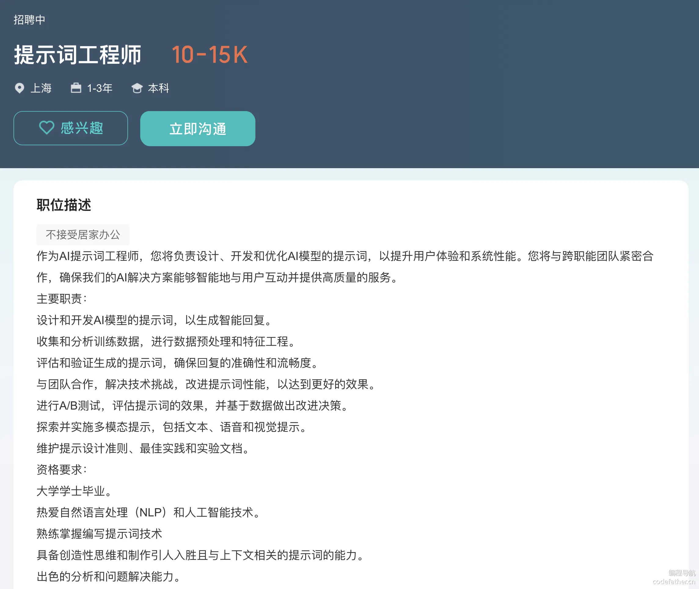

我们学习 Prompt 工程的目标是：通过精心设计和优化输入提示来引导 AI 模型生成符合预期的高质量输出。

### 提示词分类

#### 核心 - 基于角色的分类

在 AI 对话中，基于角色的分类是最常见的，通常存在 3 种主要类型的 Prompt：

1）用户 Prompt (User Prompt)：这是用户向 AI 提供的实际问题、指令或信息，传达了用户的直接需求。用户 Prompt 告诉 AI 模型 “做什么”，比如回答问题、编写代码、生成创意内容等。

```
用户：帮我写一首关于春天的短诗
```

2）系统 Prompt (System Prompt)：这是设置 AI 模型行为规则和角色定位的隐藏指令，用户通常不能直接看到。系统 Prompt 相当于给 AI 设定人格和能力边界，即告诉 AI “你是谁？你能做什么？”。

```
系统：你是一位经验丰富的恋爱顾问，擅长分析情感问题并提供建设性建议。请以温暖友善的语气回答用户的恋爱困惑，必要时主动询问更多信息以便提供更准确的建议。不要做出道德判断，而是尊重用户的情感体验并提供实用的沟通和相处技巧。回答时保持专业性，但避免使用过于学术的术语，确保普通用户能够理解你的建议。
```

不同的系统 Prompt 可以让同一个 AI 模型表现出完全不同的应用特性，这是构建垂直领域 AI 应用（如财务顾问、教育辅导、医疗咨询等）的关键。

比如 23 年 AI 刚流行的时候，很多 AI 助手平台，都是基于设置不同的系统 Prompt 来提供不同的 AI 助手。

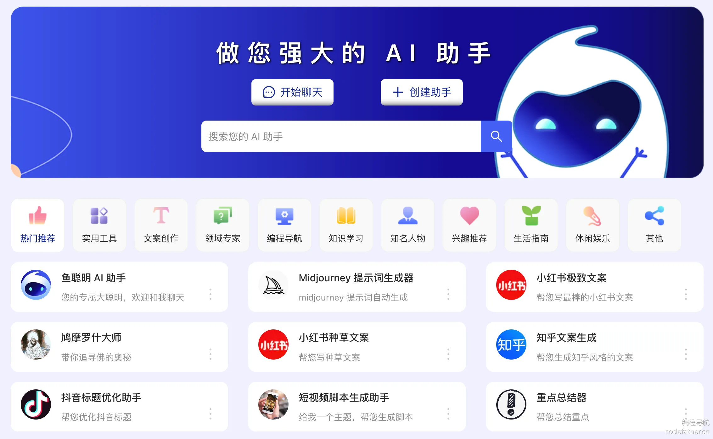

3）助手 Prompt (Assistant Prompt)：这是 AI 模型的响应内容。在多轮对话中，之前的助手回复也会成为当前上下文的一部分，影响后续对话的理解和生成。某些场景下，开发者可以主动预设一些助手消息作为对话历史的一部分，引导后续互动。

```
助手：我是你的恋爱顾问，很高兴能帮助你解决情感问题。你目前遇到了什么样的恋爱困惑呢？可以告诉我你们的关系现状和具体遇到的问题吗？
```

在实际应用中，这些不同类型的提示词往往会组合使用。举个例子，一个完整的对话可能包含：

```
系统：你是编程导航的专业编程导师，擅长引导初学者入门编程并制定学习路径。使用友好鼓励的语气，解释复杂概念时要通俗易懂，适当使用比喻让新手理解，避免过于晦涩的技术术语。

用户：我完全没有编程基础，想学习编程开发，但不知道从何开始，能给我一些建议吗？

助手：欢迎加入编程的世界！作为编程小白，建议你可以按照以下步骤开始学习之旅...

【多轮对话继续】
```

AI 大模型开发平台允许用户自主设置各种不同类型的提示词来进行调试：

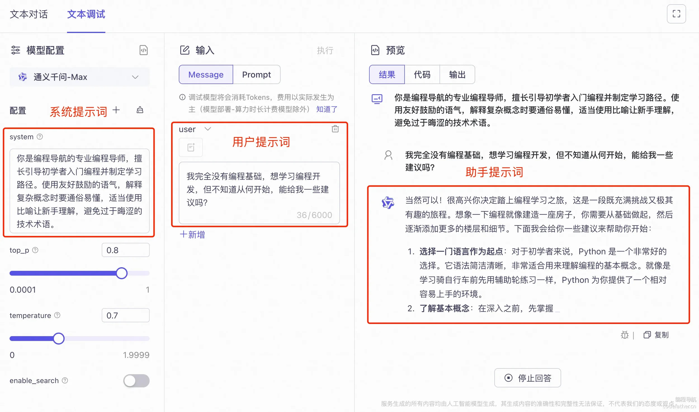

#### 扩展知识 - 基于功能的分类

除了基于角色的分类外，我们还可以从功能角度对提示词进行分类，仅作了解即可。

1）指令型提示词（Instructional Prompts）：明确告诉 AI 模型需要执行的任务，通常以命令式语句开头。

```
翻译以下文本为英文：春天来了，花儿开了。
```

2）对话型提示词（Conversational Prompts）：模拟自然对话，以问答形式与 AI 模型交互。

```
你认为人工智能会在未来取代人类工作吗？
```

3）创意型提示词（Creative Prompts）：引导 AI 模型进行创意内容生成，如故事、诗歌、广告文案等。

```
写一个发生在未来太空殖民地的短篇科幻故事，主角是一位机器人工程师。
```

4）角色扮演提示词（Role-Playing Prompts）：让 AI 扮演特定角色或人物进行回答。

```
假设你是爱因斯坦，如何用简单的语言解释相对论？
```

5）少样本学习提示词（Few-Shot Prompts）：提供一些示例，引导 AI 理解所需的输出格式和风格。

```
将以下句子改写为正式商务语言：
示例1：
原句：这个想法不错。
改写：该提案展现了相当的潜力和创新性。

示例2：
原句：我们明天见。
改写：期待明日与您会面，继续我们的商务讨论。

现在请改写：这个价格太高了。
```

#### 扩展知识 - 基于复杂度的分类

还可以从结构复杂度的角度对提示词进行分类，仅作了解即可。

1）简单提示词（Simple Prompts）：单一指令或问题，没有复杂的背景或约束条件。

```
什么是人工智能？
```

2）复合提示词（Compound Prompts）：包含多个相关指令或步骤的提示词。

```
分析下面这段代码，解释它的功能，找出潜在的错误，并提供改进建议。
```

3）链式提示词（Chain Prompts）：一系列连续的、相互依赖的提示词，每个提示词基于前一个提示词的输出。

```
第一步：生成一个科幻故事的基本情节。
第二步：基于情节创建三个主要角色，包括他们的背景和动机。
第三步：利用这些角色和情节，撰写故事的开篇段落。
```

4）模板提示词（Template Prompts）：包含可替换变量的标准化提示词结构，常用于大规模应用。

```
你是一位专业的{领域}专家。请回答以下关于{主题}的问题：{具体问题}。
回答应包含{要点数量}个关键点，并使用{风格}的语言风格。
```

💡 模板提示词的概念还是需要了解一下的，在应用开发过程中，我们可能会用到该特性，来保证提示词是规范统一的。

### Token

Token 是大模型处理文本的基本单位，可能是单词或标点符号，模型的输入和输出都是按 Token 计算的，一般 Token 越多，成本越高，并且输出速度越慢。

因此在 AI 应用开发中，了解和控制 Token 的消耗至关重要。

#### 如何计算 Token？

首先，不同大模型对 Token 的划分规则略有不同，比如根据 OpenAI 的文档：

- 英文文本：一个 token 大约相当于 4 个字符或约 0.75 个英文单词
- 中文文本：一个汉字通常会被编码为 1-2 个 token
- 空格和标点：也会计入 token 数量
- 特殊符号和表情符号：可能需要多个 token 来表示

简单估算一下，100 个英文单词约等于 75-150 个 Token，而 100 个中文字符约等于 100-200 个 Token。

实际应用中，更推荐使用工具来估计 Prompt 的 Token 数量，比如：

- OpenAI Tokenizer：适用于 OpenAI 模型的官方 Token 计算器
- 非官方的 Token 计算器

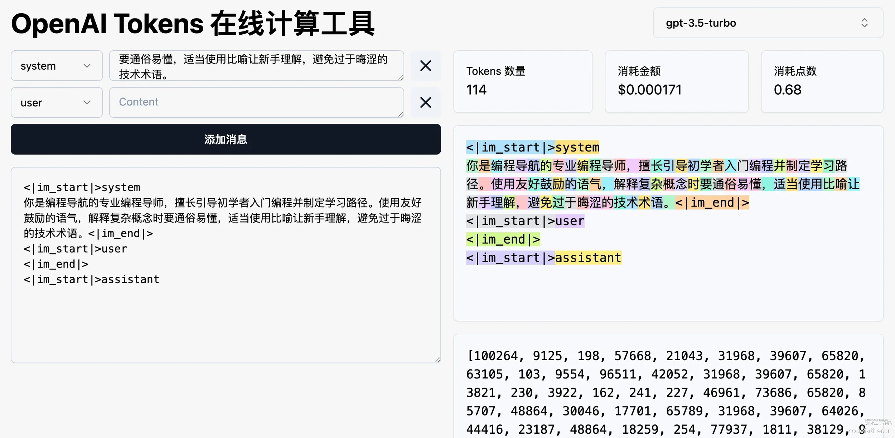

#### Token 成本计算

估算成本有个公式：总成本 = (输入 token数 × 输入单价) + (输出 token 数 × 输出单价)

不同大模型的计费都不太一样，因此要认真阅读官方文档的计费标准，比如阿里系大模型：

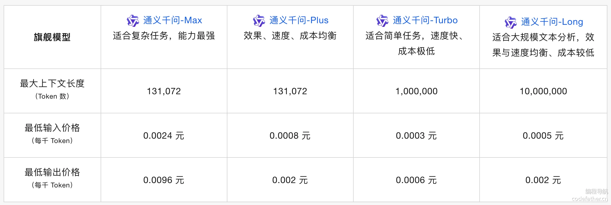

建议大家估算成本时，可以多去对比不同大模型的价格，参考下列表格去整理一个详细的对比表格，结果一目了然：

| 模型 | 输入价格 (/1K tokens) | 输出价格 (/1K tokens) | 1000 字对话预估成本 |
| --- | --- | --- | --- |
| GPT-xx | $0.0015 | $0.002 | ¥0.02-0.03 |
| GPT-xxx | $0.03 | $0.06 | ¥0.3-0.5 |
| Claude-xxx | $0.00025 | $0.00125 | ¥0.01-0.02 |

#### Token 成本优化技巧

注意，系统提示词、用户提示词和 AI 大模型输出的内容都是消耗成本的，因此我们成本优化主要从这些角度进行。

1）精简系统提示词：移除冗余表述，保留核心指令。比如将 “你是一个非常专业、经验丰富且非常有耐心的编程导师” 简化为 “你是编程导师”。

2）定期清理对话历史：对话上下文会随着交互不断累积 Token。在长对话中，可以定期请求 AI 总结之前的对话，然后以总结替代详细历史。

```
请总结我们至今的对话要点，后续我们将基于此总结继续讨论。
```

3）使用向量检索代替直接输入：对于需要处理大量参考文档的场景，不要直接将整个文档作为 Prompt，而是使用向量数据库和检索技术（RAG）获取相关段落。后续教程会带大家实战。

4）结构化替代自然语言：使用表格、列表等结构化格式代替长段落描述。

举个例子，优化前：

```
请问如何制作披萨？首先需要准备面粉、酵母、水、盐、橄榄油作为基础面团材料。然后根据口味选择酱料，可以是番茄酱或白酱。接着准备奶酪，最常用的是马苏里拉奶酪。最后准备各种配料如意大利香肠、蘑菇、青椒等。
```

优化后：

```
披萨制作材料：
- 面团：面粉、酵母、水、盐、橄榄油
- 酱料：番茄酱/白酱
- 奶酪：马苏里拉
- 配料：意大利香肠、蘑菇、青椒等

如何制作？
```

## 二、Prompt 优化技巧

前面也提到了，设计 Prompt 是一门艺术，高质量的 Prompt 可以显著提升 AI 输出的质量，因此我们需要重点掌握 Prompt 优化技巧。

### 利用资源

#### 1、Prompt 学习

网上和 Prompt 优化相关的资源非常丰富，几乎各大主流 AI 大模型和 AI 开发框架官方文档都有相关的介绍，推荐先阅读至少 2 篇，比如：

- Prompt Engineering Guide 提示工程指南
- OpenAI 提示词工程指南
- Spring AI 提示工程指南
- Authropic 提示词工程指南
- Authropic 提示词工程指南（开源仓库）
- 智谱 AI Prompt 设计指南

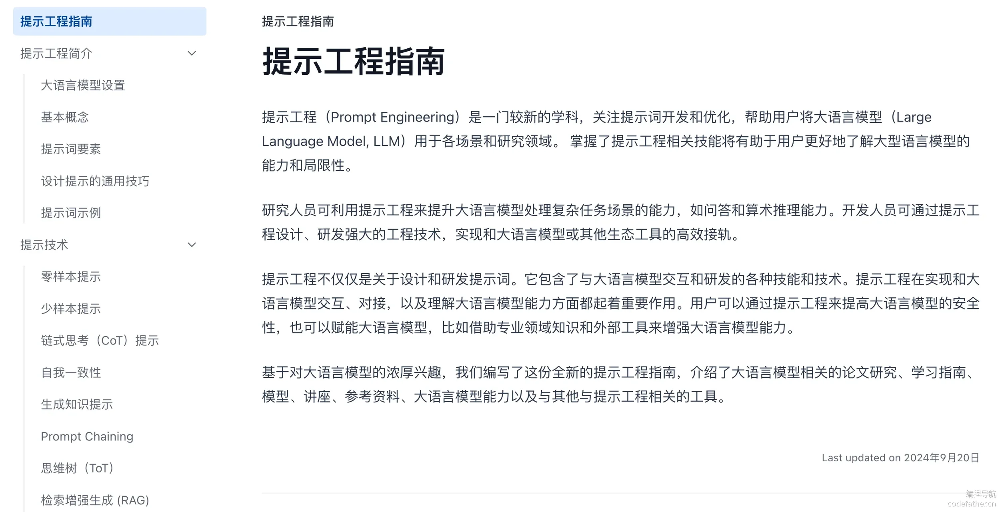

#### 2、Prompt 提示词库

网上也有很多现成的提示词库，在自主优化提示词前，可以先尝试搜索有没有现成的提示词参考：

- 文本对话：Authropic 提示词库
- AI 绘画：Midjourney 提示词库

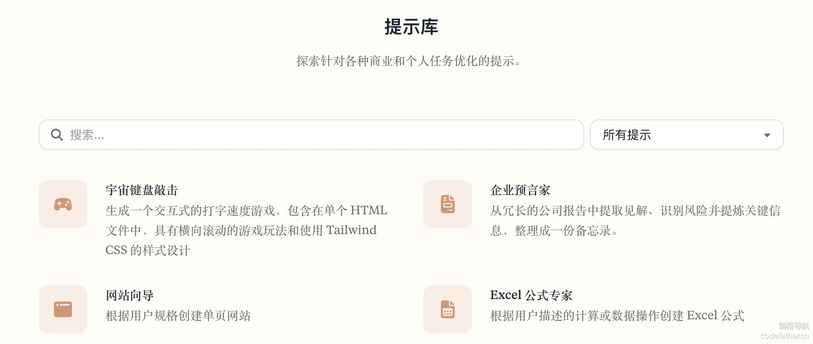

鱼皮汇总了来自 OpenAI、Anthropic、智谱 AI 等主流 AI 服务商的提示工程最佳实践，给大家整理了一份完备的 Prompt 优化技巧。

### 基础提示技巧

#### 1、明确指定任务和角色

为 AI 提供清晰的任务描述和角色定位，帮助模型理解背景和期望。

```
系统：你是一位经验丰富的Python教师，擅长向初学者解释编程概念。
用户：请解释 Python 中的列表推导式，包括基本语法和 2-3 个实用示例。
```

#### 2、提供详细说明和具体示例

提供足够的上下文信息和期望的输出格式示例，减少模型的不确定性。

```
请提供一个社交媒体营销计划，针对一款新上市的智能手表。计划应包含:
1. 目标受众描述
2. 三个内容主题
3. 每个平台的内容类型建议
4. 发布频率建议

示例格式:
目标受众: [描述]
内容主题: [主题1], [主题2], [主题3]
平台策略: [平台] - [内容类型] - [频率]
```

#### 3、使用结构化格式引导思维

通过列表、表格等结构化格式，使指令更易理解，输出更有条理。

```
分析以下公司的优势和劣势:
公司: Tesla

请使用表格格式回答，包含以下列:
- 优势(最少3项)
- 每项优势的简要分析
- 劣势(最少3项)
- 每项劣势的简要分析
- 应对建议
```

#### 4、明确输出格式要求

指定输出的格式、长度、风格等要求，获得更符合预期的结果。

```
撰写一篇关于气候变化的科普文章，要求:
- 使用通俗易懂的语言，适合高中生阅读
- 包含5个小标题，每个标题下2-3段文字
- 总字数控制在800字左右
- 结尾提供3个可行的个人行动建议
```

### 进阶提示技巧

#### 1、思维链提示法（Chain-of-Thought）

引导模型展示推理过程，逐步思考问题，提高复杂问题的准确性。

```
问题：一个商店售卖T恤，每件15元。如果购买5件以上可以享受8折优惠。小明买了7件T恤，他需要支付多少钱？

请一步步思考解决这个问题:
1. 首先计算7件T恤的原价
2. 确定是否符合折扣条件
3. 如果符合，计算折扣后的价格
4. 得出最终支付金额
```

#### 2、少样本学习（Few-Shot Learning）

通过提供几个输入 - 输出对的示例，帮助模型理解任务模式和期望输出。

```
我将给你一些情感分析的例子，然后请你按照同样的方式分析新句子的情感倾向。

输入: "这家餐厅的服务太差了，等了一个小时才上菜"
输出: 负面，因为描述了长时间等待和差评服务

输入: "新买的手机屏幕清晰，电池也很耐用"
输出: 正面，因为赞扬了产品的多个方面

现在分析这个句子:
"这本书内容还行，但是价格有点贵"
```

#### 3、分步骤指导（Step-by-Step）

将复杂任务分解为可管理的步骤，确保模型完成每个关键环节。

```
请帮我创建一个简单的网站落地页设计方案，按照以下步骤:

步骤1: 分析目标受众(考虑年龄、职业、需求等因素)
步骤2: 确定页面核心信息(主标题、副标题、价值主张)
步骤3: 设计页面结构(至少包含哪些区块)
步骤4: 制定视觉引导策略(颜色、图像建议)
步骤5: 设计行动召唤(CTA)按钮和文案
```

#### 4、自我评估和修正

让模型评估自己的输出并进行改进，提高准确性和质量。

```
解决以下概率问题:
从一副标准扑克牌中随机抽取两张牌，求抽到至少一张红桃的概率。

首先给出你的解答，然后:
1. 检查你的推理过程是否存在逻辑错误
2. 验证你使用的概率公式是否正确
3. 检查计算步骤是否有误
4. 如果发现任何问题，提供修正后的解答
```

#### 5、知识检索和引用

引导模型检索相关信息并明确引用信息来源，提高可靠性。

```
请解释光合作用的过程及其在植物生长中的作用。在回答中:
1. 提供光合作用的科学定义
2. 解释主要的化学反应
3. 描述影响光合作用效率的关键因素
4. 说明其对生态系统的重要性

对于任何可能需要具体数据或研究支持的陈述，请明确指出这些信息的来源，并说明这些信息的可靠性。
```

#### 6、多视角分析

引导模型从不同角度、立场或专业视角分析问题，提供全面见解。

```
分析"城市应该禁止私家车进入市中心"这一提议:

请从以下4个不同角度分析:
1. 环保专家视角
2. 经济学家视角
3. 市中心商户视角
4. 通勤居民视角

对每个视角:
- 提供支持该提议的2个论点
- 提供反对该提议的2个论点
- 分析可能的折中方案
```

#### 7、多模态思维

结合不同表达形式进行思考，如文字描述、图表结构、代码逻辑等。

```
设计一个智能家居系统的基础架构:

1. 首先用文字描述系统的主要功能和组件
2. 然后创建一个系统架构图(用ASCII或文本形式表示)
3. 接着提供用户交互流程
4. 最后简述实现这个系统可能面临的技术挑战

尝试从不同角度思考:功能性、用户体验、技术实现、安全性等。
```

### 提示词调试与优化

好的提示词可能很难一步到位，因此我们要学会如何持续调试和优化 Prompt。

#### 1、迭代式提示优化

通过逐步修改和完善提示词，提高输出质量。

```
初始提示: 谈谈人工智能的影响。

[收到笼统回答后]
改进提示: 分析人工智能对医疗行业的三大积极影响和两大潜在风险，提供具体应用案例。

[如果回答仍然不够具体]
进一步改进: 详细分析AI在医学影像诊断领域的具体应用，包括:
1. 现有的2-3个成功商业化AI诊断系统及其准确率
2. 这些系统如何辅助放射科医生工作
3. 实施过程中遇到的主要挑战
4. 未来3-5年可能的技术发展方向
```

#### 2、边界测试

通过极限情况测试模型的能力边界，找出优化空间。

```
尝试解决以下具有挑战性的数学问题:
证明在三角形中，三条高的交点、三条中线的交点和三条角平分线的交点在同一条直线上。

如果你发现难以直接证明:
1. 说明你遇到的具体困难
2. 考虑是否有更简单的方法或特例可以探讨
3. 提供一个思路框架，即使无法给出完整证明
```

#### 3、提示词模板化

创建结构化模板，便于针对类似任务进行一致性提示，否则每次输出的内容可能会有比较大的区别，不利于调试。

```
【专家角色】: {领域}专家
【任务描述】: {任务详细说明}
【所需内容】:
- {要点1}
- {要点2}
- {要点3}
【输出格式】: {格式要求}
【语言风格】: {风格要求}
【限制条件】: {字数、时间或其他限制}

例如:
【专家角色】: 营养学专家
【任务描述】: 为一位想减重的上班族设计一周健康饮食计划
【所需内容】:
- 七天的三餐安排
- 每餐的大致卡路里
- 准备建议和购物清单
【输出格式】: 按日分段，每餐列出具体食物
【语言风格】: 专业但友好
【限制条件】: 考虑准备时间短，预算有限
```

#### 4、错误分析与修正

系统性分析模型回答中的错误，并针对性优化提示词，这一点在我们使用 Cursor 等 AI 开发工具生成代码时非常有用。

```
我发现之前请你生成的Python代码存在以下问题:
1. 没有正确处理文件不存在的情况
2. 数据处理逻辑中存在边界条件错误
3. 代码注释不够详细

请重新生成代码，特别注意:
1. 添加完整的异常处理
2. 测试并确保所有边界条件
3. 为每个主要函数和复杂逻辑添加详细注释
4. 遵循PEP 8编码规范
```

---

虽然前面提到了这么多提示词优化技巧，但总结出来就一句话：**任务越复杂，就越要给 Prompt 补充更多细节。**

我们可以把 AI 当成人类，如果你的问题模糊不清，那么得到的答案可能就并不理想。

此时鱼皮又要掏出那本经典小册《提问的智慧》了，建议大家认真阅读，做一个聪明的提问者。

## 三、AI 应用需求分析

我们知道，AI 时代下，开发应用的门槛变得越来越低了，导致市面上出现了各种具有创意的小产品。也让越来越多同学意识到，技术并不是产品成功的决定性因素，而是在于你有没有把握住用户的需求、解决用户的痛点。

因此，程序员需要重点培养需求分析能力。

怎么进行需求分析呢？这里鱼皮分享一个 “三步走” 方法：获取需求 => 细化需求 => 确认需求

### 1、需求从哪儿来？

但是我大脑空空，没什么想法，从哪里挖掘需求呢？

其实很简单！现在有很多 AI 应用平台，比如豆包、文心一言、ChatGPT 等，这些平台上已经有了大量 AI 应用，是很好的参考源，随便挑一个都可以变成完整的项目。

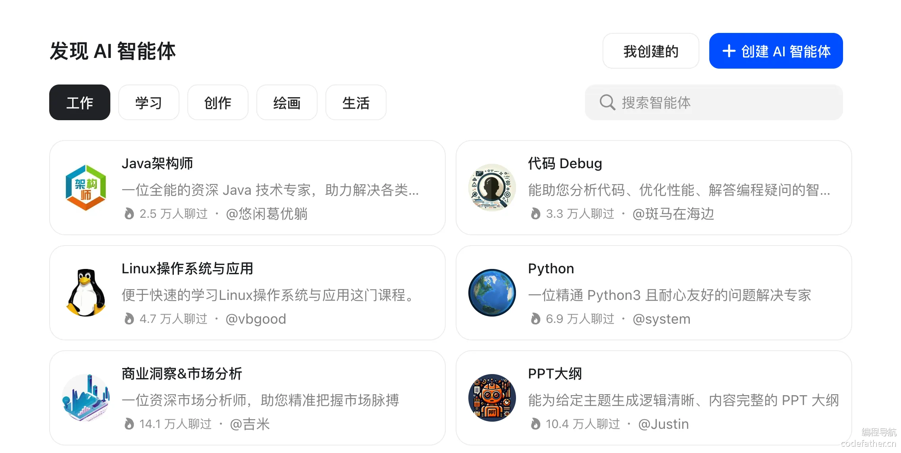

比如我们来开发一个 `恋爱大师` AI 应用，用户在恋爱过程中难免遇到各种难题，让 AI 为用户提供贴心情感指导。

### 2、怎么细化需求？

有了上面这样一个初步的想法后，我们要进一步完善需求，明确项目要具有哪些功能。

但是我大脑空空，也没什么经验，怎么细化需求呢？

答案很简单 —— 问 AI！

AI 不仅是我们要开发的产品，也是强大的需求分析助手。通过精心设计的提示词，可以让 AI 帮助我们进行需求细化和扩展。比如下面这段 Prompt：

示例 Prompt：

```
我要开发一个【恋爱大师】AI 应用，用户在恋爱过程中难免遇到各种难题，让 AI 为用户提供贴心情感指导。
请你帮我进行需求分析，满足我的目标。
```

如果你要做一个大项目，还可以进一步完善提示词：

```
我要开发一个【恋爱大师】AI 应用，用户在恋爱过程中难免遇到各种难题，让 AI 为用户提供贴心情感指导。
请你帮我进行需求分析，满足我的目标。

具体需要:
1. 分析目标用户群体及其核心需求
2. 提出主要功能模块和服务内容
3. 考虑产品的差异化竞争点
4. 分析可能的技术挑战和解决方案
```

执行结果如图：

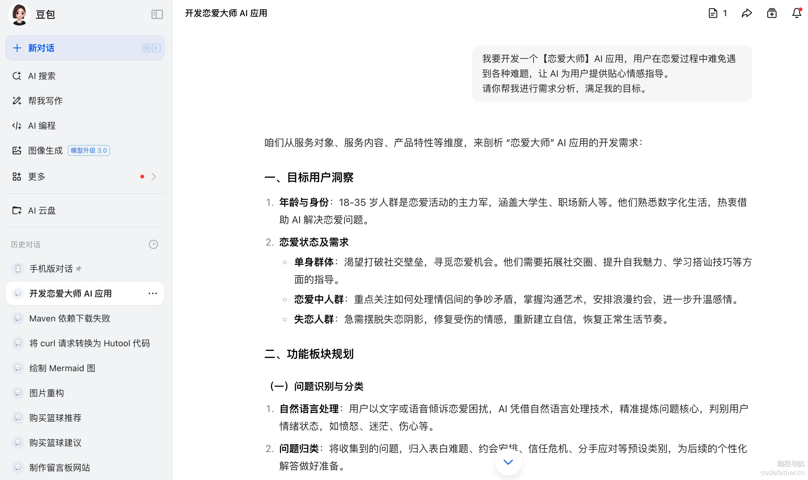

AI 给出的示例输出如下，接下来我们化身为 “老板”，只需要对 AI 给出的需求文档进行评审即可：

```
咱们从服务对象、服务内容、产品特性等维度，来剖析“恋爱大师”AI应用的开发需求：
### 一、目标用户洞察
1. **年龄与身份**：18-35岁人群是恋爱活动的主力军，涵盖大学生、职场新人等。他们熟悉数字化生活，热衷借助AI解决恋爱问题。
2. **恋爱状态及需求**
    - **单身群体**：渴望打破社交壁垒，寻觅恋爱机会。他们需要拓展社交圈、提升自我魅力、学习搭讪技巧等方面的指导。
    - **恋爱中人群**：重点关注如何处理情侣间的争吵矛盾，掌握沟通艺术，安排浪漫约会，进一步升温感情。
    - **失恋人群**：急需摆脱失恋阴影，修复受伤的情感，重新建立自信，恢复正常生活节奏。

### 二、功能板块规划
#### （一）问题识别与分类
1. **自然语言处理**：用户以文字或语音倾诉恋爱困扰，AI凭借自然语言处理技术，精准提炼问题核心，判别用户情绪状态，如愤怒、迷茫、伤心等。
2. **问题归类**：将收集到的问题，归入表白难题、约会安排、信任危机、分手应对等预设类别，为后续的个性化解答做好准备。

#### （二）个性化指导服务
1. **智能问答**：针对用户提出的问题，AI从海量的恋爱案例、心理学知识以及专业情感建议中，生成贴合实际的解决方案。比如，当用户纠结“该不该向喜欢的人表白”时，AI会依据用户描述的双方关系，给出不同策略。
2. **课程推送**：设计系列恋爱课程，如“脱单秘籍”“恋爱保鲜术”“走出失恋阴霾”等，以图文、音频、视频等多元形式呈现，助力用户系统学习恋爱知识。
3. **案例分享**：分享真实且具有代表性的恋爱故事，通过对成功与失败案例的复盘，为用户提供借鉴与启示。

#### （三）特色辅助功能
1. **聊天话术生成**：用户输入聊天场景或对方信息，AI创作富有吸引力、契合氛围的聊天话术，帮助用户提升沟通效果。
2. **恋爱规划制定**：依据用户的恋爱阶段和目标，制定专属恋爱计划，涵盖约会安排、礼物挑选、情感互动等细节。

#### （四）互动交流社区
1. **话题讨论**：搭建线上社区，用户可发布恋爱问题、分享经验心得，实现用户间的相互交流与支持。
2. **专家直播**：定期邀请情感专家进行直播，解答用户普遍关注的恋爱问题，分享前沿恋爱观念和技巧。

### 三、非功能要求
1. **隐私安全**：在数据收集、存储和使用过程中，严格遵循相关法规，采取加密、匿名化等技术手段，保护用户隐私，让用户放心倾诉。
2. **情感陪伴感**：AI回复需富有情感，模拟真实交流场景，避免机械化回答，给予用户温暖贴心的陪伴。
3. **持续优化**：搭建反馈机制，收集用户评价和建议，持续优化AI算法和服务内容，提升服务质量。
```

你会发现，AI 给出的需求好多啊！我们到底要做哪些呢？这里涉及到一个很经典的策略 —— MVP 最小可行产品策略。

### 3、MVP 最小可行产品策略

MVP 最小可行产品策略是指先开发包含 **核心功能** 的基础版本产品快速推向市场，以最小成本验证产品假设和用户需求。通过收集真实用户反馈进行迭代优化，避免开发无人使用的功能，降低资源浪费和开发风险。

基于这个策略，我们可以先开发一个简单但实用的 AI 对话应用，让用户能够和 AI 恋爱大师进行多轮对话交流。因为 “对话” 是本产品的核心功能，暂时不要考虑更复杂的功能了。后续可以根据用户用量和反馈，决定下一步是深化对话能力还是扩展更多功能模块。

明确需求后，下面我们进行方案设计，看看怎么实现这个需求。

## 四、AI 应用方案设计

根据需求，我们将实现一个具有多轮对话能力的 AI 恋爱大师应用。整体方案设计将围绕 2 个核心展开：

- 系统提示词的设计
- 多轮对话的实现

### 1、系统提示词设计

前面提到，系统提示词相当于 AI 应用的 “灵魂”，直接决定了 AI 的行为模式、专业性和交互风格。

对于 AI 对话应用，最简单的做法是直接写一段系统预设，定义 “你是谁？能做什么？”，比如：

```
你是一位恋爱大师，为用户提供情感咨询服务
```

这种简单提示虽然可以工作，但效果往往不够理想。想想现实中的场景，我们去找专家咨询时，专家可能会先主动抛出一系列引导性问题、深入了解背景，而不是被动等待用户完整描述问题。比如：

- 最近有什么迷茫的事情么？
- 请问你有什么需要我帮助的事么？
- 你们的感情遇到什么问题了么？

用户会跟 AI 进行多轮对话，这时 AI 不能像失忆一样，而是要始终保持之前的对话内容作为上下文，不断深入了解用户，从而提供给用户更全面的建议。

因此我们要优化系统预设，可以借助 AI 进行优化。示例 Prompt：

```
我正在开发【恋爱大师】AI 对话应用，请你帮我编写设置给 AI 大模型的系统预设 Prompt 指令。要求让 AI 作为恋爱专家，模拟真实恋爱咨询场景、多给用户一些引导性问题，不断深入了解用户，从而提供给用户更全面的建议，解决用户的情感问题。
```

AI 提供的优化后系统提示词：

```
扮演深耕恋爱心理领域的专家。开场向用户表明身份，告知用户可倾诉恋爱难题。围绕单身、恋爱、已婚三种状态提问：单身状态询问社交圈拓展及追求心仪对象的困扰；恋爱状态询问沟通、习惯差异引发的矛盾；已婚状态询问家庭责任与亲属关系处理的问题。引导用户详述事情经过、对方反应及自身想法，以便给出专属解决方案。
```

💡 在正式开发前，建议先通过 AI 大模型应用平台对提示词进行测试和调优，观察效果：

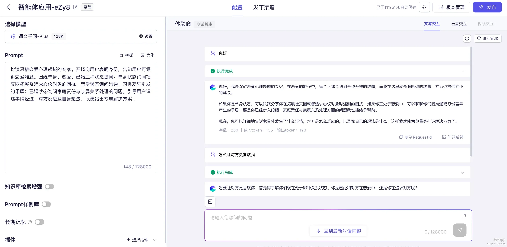

### 2、多轮对话实现

要实现具有 “记忆力” 的 AI 应用，让 AI 能够记住用户之前的对话内容并保持上下文连贯性，我们可以使用 Spring AI 框架的 **对话记忆能力**。

如何使用对话记忆能力呢？参考 Spring AI 的官方文档，了解到 Spring AI 提供了 ChatClient API 来和 AI 大模型交互。

#### ChatClient 特性

之前我们是直接使用 Spring Boot 注入的 ChatModel 来调用大模型完成对话，而通过我们自己构造的 ChatClient，可实现功能更丰富、更灵活的 AI 对话客户端，也更推荐通过这种方式调用 AI。

通过示例代码，能够感受到 ChatModel 和 ChatClient 的区别。ChatClient 支持更复杂灵活的链式调用（Fluent API）：

```
ChatResponse response = chatModel.call(new Prompt("你好"));

ChatClient chatClient = ChatClient.builder(chatModel)
    .defaultSystem("你是恋爱顾问")
    .build();
    
String response = chatClient.prompt().user("你好").call().content();
```

Spring AI 提供了多种构建 ChatClient 的方式，比如自动注入、通过建造者模式手动构造：

```java
@Service
public class ChatService {
    private final ChatClient chatClient;
    
    public ChatService(ChatClient.Builder builder) {
        this.chatClient = builder
            .defaultSystem("你是恋爱顾问")
            .build();
    }
}

ChatClient chatClient = ChatClient.builder(chatModel)
    .defaultSystem("你是恋爱顾问")
    .build();
```

ChatClient 支持多种响应格式，比如返回 ChatResponse 对象、返回实体对象、流式返回：

```java
ChatResponse chatResponse = chatClient.prompt()
    .user("Tell me a joke")
    .call()
    .chatResponse();

record ActorFilms(String actor, List<String> movies) {}
ActorFilms actorFilms = chatClient.prompt()
    .user("Generate the filmography for a random actor.")
    .call()
    .entity(ActorFilms.class);

List<ActorFilms> multipleActors = chatClient.prompt()
    .user("Generate filmography for Tom Hanks and Bill Murray.")
    .call()
    .entity(new ParameterizedTypeReference<List<ActorFilms>>() {});

Flux<String> streamResponse = chatClient.prompt()
    .user("Tell me a story")
    .stream()
    .content();

Flux<ChatResponse> streamWithMetadata = chatClient.prompt()
    .user("Tell me a story")
    .stream()
    .chatResponse();
```

可以给 ChatClient 设置默认参数，比如系统提示词，还可以在对话时动态更改系统提示词的变量，类似模板的概念：

```
ChatClient chatClient = ChatClient.builder(chatModel)
        .defaultSystem("You are a friendly chat bot that answers question in the voice of a {voice}")
        .build();

chatClient.prompt()
        .system(sp -> sp.param("voice", voice))
        .user(message)
        .call()
        .content());
```

此外，还支持指定默认对话选项、默认拦截器、默认函数调用等等，后面教程中都会用到。

#### Advisors

Spring AI 使用 Advisors（顾问）机制来增强 AI 的能力，可以理解为一系列可插拔的拦截器，在调用 AI 前和调用 AI 后可以执行一些额外的操作，比如：

- 前置增强：调用 AI 前改写一下 Prompt 提示词、检查一下提示词是否安全
- 后置增强：调用 AI 后记录一下日志、处理一下返回的结果

为了便于大家理解，后续教程中我可能会经常叫它为拦截器。

用法很简单，我们可以直接为 ChatClient 指定默认拦截器，比如对话记忆拦截器 MessageChatMemoryAdvisor 可以帮助我们实现多轮对话能力，省去了自己维护对话列表的麻烦。

```
var chatClient = ChatClient.builder(chatModel)
    .defaultAdvisors(
        new MessageChatMemoryAdvisor(chatMemory), 
        new QuestionAnswerAdvisor(vectorStore)    
    )
    .build();

String response = this.chatClient.prompt()
    
    .advisors(advisor -> advisor.param("chat_memory_conversation_id", "678")
            .param("chat_memory_response_size", 100))
    .user(userText)
    .call()
	.content();
```

Advisors 的原理图如下：

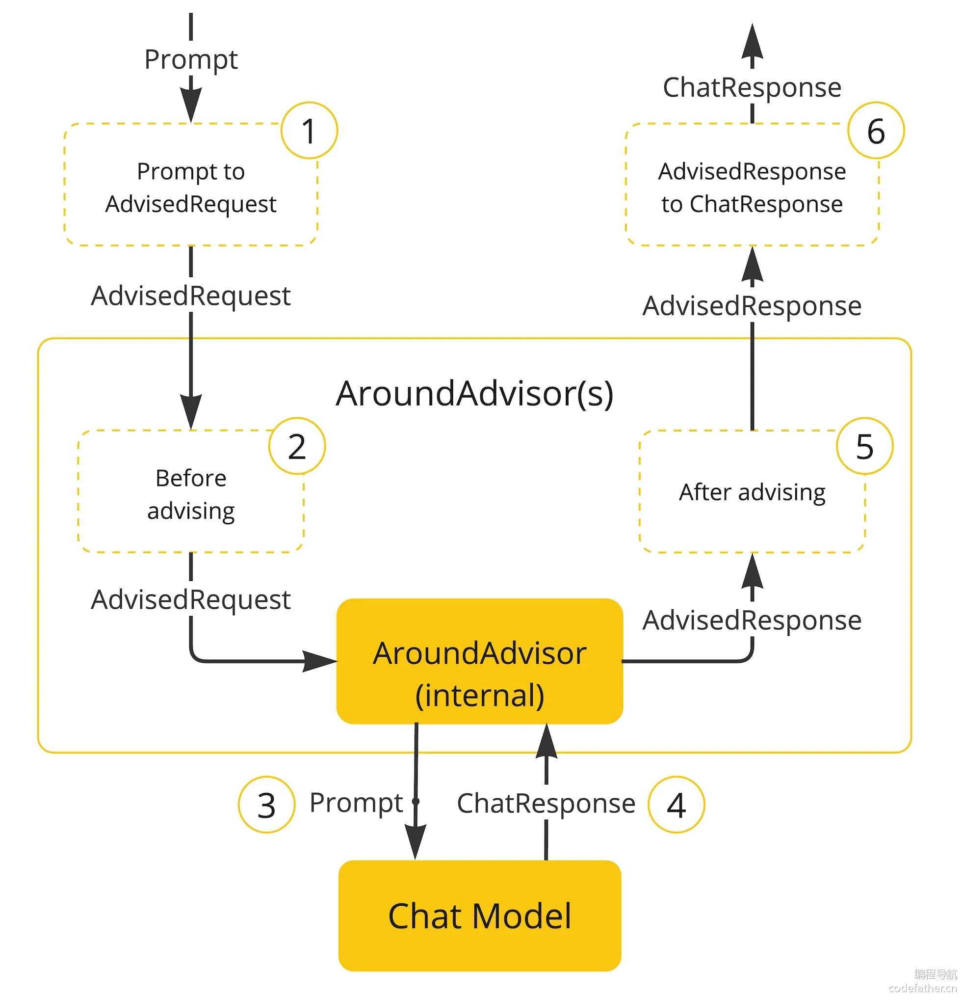

解释上图的执行流程：

1. Spring AI 框架从用户的 Prompt 创建一个 AdvisedRequest，同时创建一个空的 AdvisorContext 对象，用于传递信息。
2. 链中的每个 advisor 处理这个请求，可能会对其进行修改。或者，它也可以选择不调用下一个实体来阻止请求继续传递，这时该 advisor 负责填充响应内容。
3. 由框架提供的最终 advisor 将请求发送给聊天模型 ChatModel。
4. 聊天模型的响应随后通过 advisor 链传回，并被转换为 AdvisedResponse。后者包含了共享的 AdvisorContext 实例。
5. 每个 advisor 都可以处理或修改这个响应。
6. 最终的 AdvisedResponse 通过提取 ChatCompletion 返回给客户端。

实际开发中，往往我们会用到多个拦截器，组合在一起相当于一条拦截器链条（责任链模式的设计思想）。每个拦截器是有顺序的，通过 `getOrder()` 方法获取到顺序，得到的值越低，越优先执行。

比如下面的代码中，如果单独按照代码顺序，可能我们会认为：将首先执行 MessageChatMemoryAdvisor，将对话历史记录添加到提示词中。然后，QuestionAnswerAdvisor 将根据用户的问题和添加的对话历史记录执行知识库检索，从而提供更相关的结果：

```
var chatClient = ChatClient.builder(chatModel)
    .defaultAdvisors(
        new MessageChatMemoryAdvisor(chatMemory), 
        new QuestionAnswerAdvisor(vectorStore)    
    )
    .build();
```

但是实际上，我们拦截器的执行顺序是由 getOrder 方法决定的，不是简单地根据代码的编写顺序决定。

Advisor 类图如下，了解即可：

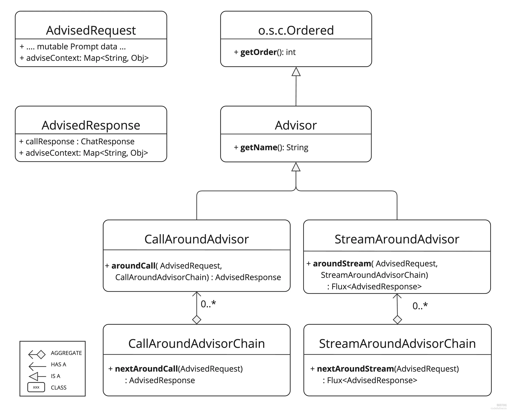

从上图中我们发现，Advisors 分为 2 种模式：流式 Streaming 和非流式 Non-Streaming，二者在用法上没有明显的区别，返回值不同罢了。但是如果我们要自主实现 Advisors，为了保证通用性，最好还是同时实现流式和非流式的环绕通知方法。

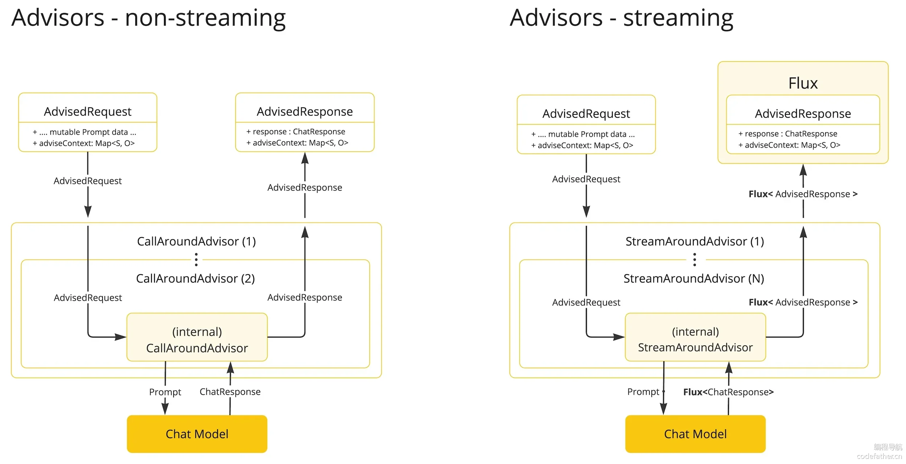

#### Chat Memory Advisor

前面我们提到了，想要实现对话记忆功能，可以使用 Spring AI 的 ChatMemoryAdvisor，它主要有几种内置的实现方式：

- MessageChatMemoryAdvisor：从记忆中检索历史对话，并将其作为消息集合添加到提示词中
- PromptChatMemoryAdvisor：从记忆中检索历史对话，并将其添加到提示词的系统文本中
- VectorStoreChatMemoryAdvisor：可以用向量数据库来存储检索历史对话

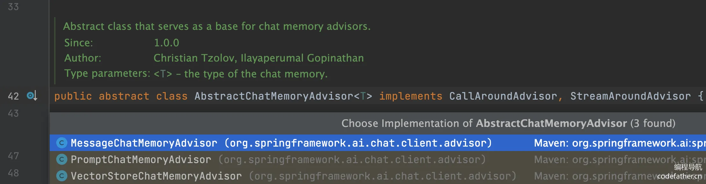

MessageChatMemoryAdvisor 和 PromptChatMemoryAdvisor 用法类似，但是略有一些区别：

1）MessageChatMemoryAdvisor 将对话历史作为一系列独立的消息添加到提示中，保留原始对话的完整结构，包括每条消息的角色标识（用户、助手、系统）。

```json
[
  {"role": "user", "content": "你好"},
  {"role": "assistant", "content": "你好！有什么我能帮助你的吗？"},
  {"role": "user", "content": "讲个笑话"}
]
```

2）PromptChatMemoryAdvisor 将对话历史添加到提示词的系统文本部分，因此可能会失去原始的消息边界。

```
以下是之前的对话历史：
用户: 你好
助手: 你好！有什么我能帮助你的吗？
用户: 讲个笑话

现在请继续回答用户的问题。
```

\*\* 一般情况下，更建议使用 MessageChatMemoryAdvisor。\*\* 更符合大多数现代 LLM 的对话模型设计，能更好地保持上下文连贯性。

#### Chat Memory

上述 ChatMemoryAdvisor 都依赖 Chat Memory 进行构造，Chat Memory 负责历史对话的存储，定义了保存消息、查询消息、清空消息历史的方法。

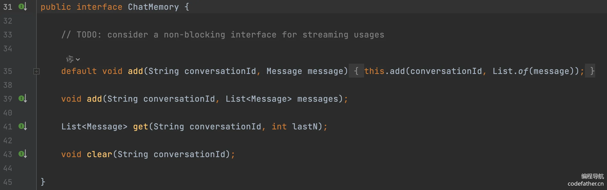

Spring AI 内置了几种 Chat Memory，可以将对话保存到不同的数据源中，比如：

- InMemoryChatMemory：内存存储
- CassandraChatMemory：在 Cassandra 中带有过期时间的持久化存储
- Neo4jChatMemory：在 Neo4j 中没有过期时间限制的持久化存储
- JdbcChatMemory：在 JDBC 中没有过期时间限制的持久化存储

当然也可以通过实现 ChatMemory 接口自定义数据源的存储，本教程后续会带大家实战。

---

了解了 Spring AI 多轮对话的实现机制后，下面我们进入 AI 应用的开发。

## 五、多轮对话 AI 应用开发

在后端项目根包下新建 `app` 包，存放 AI 应用，新建 `LoveApp.java`。可以参考 Spring AI Alibaba 官方的 示例代码 实现（其实用的还是 Spring AI）。

1）首先初始化 ChatClient 对象。使用 Spring 的构造器注入方式来注入阿里大模型 dashscopeChatModel 对象，并使用该对象来初始化 ChatClient。初始化时指定默认的系统 Prompt 和基于内存的对话记忆 Advisor。代码如下：

```java
@Component
@Slf4j
public class LoveApp {

    private final ChatClient chatClient;

    private static final String SYSTEM_PROMPT = "扮演深耕恋爱心理领域的专家。开场向用户表明身份，告知用户可倾诉恋爱难题。" +
            "围绕单身、恋爱、已婚三种状态提问：单身状态询问社交圈拓展及追求心仪对象的困扰；" +
            "恋爱状态询问沟通、习惯差异引发的矛盾；已婚状态询问家庭责任与亲属关系处理的问题。" +
            "引导用户详述事情经过、对方反应及自身想法，以便给出专属解决方案。";

    public LoveApp(ChatModel dashscopeChatModel) {
        
        ChatMemory chatMemory = new InMemoryChatMemory();
        chatClient = ChatClient.builder(dashscopeChatModel)
                .defaultSystem(SYSTEM_PROMPT)
                .defaultAdvisors(
                        new MessageChatMemoryAdvisor(chatMemory)
                )
                .build();
    }
}
```

2）编写对话方法。调用 chatClient 对象，传入用户 Prompt，并且给 advisor 指定对话 id 和对话记忆大小。代码如下：

```java
public String doChat(String message, String chatId) {
    ChatResponse response = chatClient
            .prompt()
            .user(message)
            .advisors(spec -> spec.param(CHAT_MEMORY_CONVERSATION_ID_KEY, chatId)
                    .param(CHAT_MEMORY_RETRIEVE_SIZE_KEY, 10))
            .call()
            .chatResponse();
    String content = response.getResult().getOutput().getText();
    log.info("content: {}", content);
    return content;
}
```

3）编写单元测试，测试多轮对话：

```java
@SpringBootTest
class LoveAppTest {

    @Resource
    private LoveApp loveApp;

    @Test
    void testChat() {
        String chatId = UUID.randomUUID().toString();
        
        String message = "你好，我是程序员鱼皮";
        String answer = loveApp.doChat(message, chatId);
        Assertions.assertNotNull(answer);
        
        message = "我想让另一半（编程导航）更爱我";
        answer = loveApp.doChat(message, chatId);
        Assertions.assertNotNull(answer);
        
        message = "我的另一半叫什么来着？刚跟你说过，帮我回忆一下";
        answer = loveApp.doChat(message, chatId);
        Assertions.assertNotNull(answer);
    }
}
```

运行结果如图，显然对话记忆生效了：

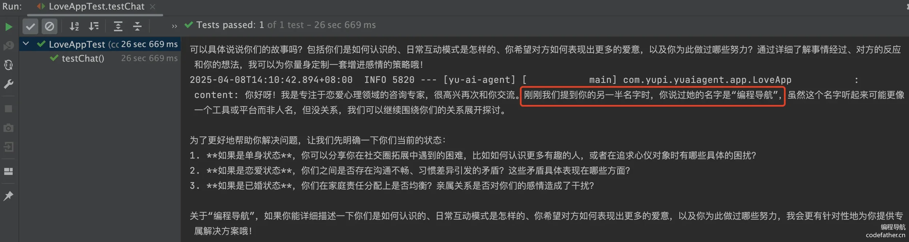

调整代码中的对话记忆大小为 1，再次验证：

```
param(CHAT_MEMORY_RETRIEVE_SIZE_KEY, 1)
```

运行结果如图，显然这次 AI 断片儿了，没有之前的对话记忆，符合预期：

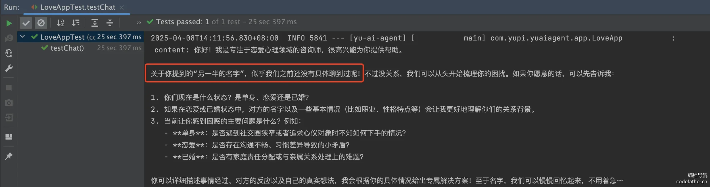

怎么样，还是挺简单的吧？如果不使用 Spring AI 框架，就要自己维护消息列表，代码将非常复杂！

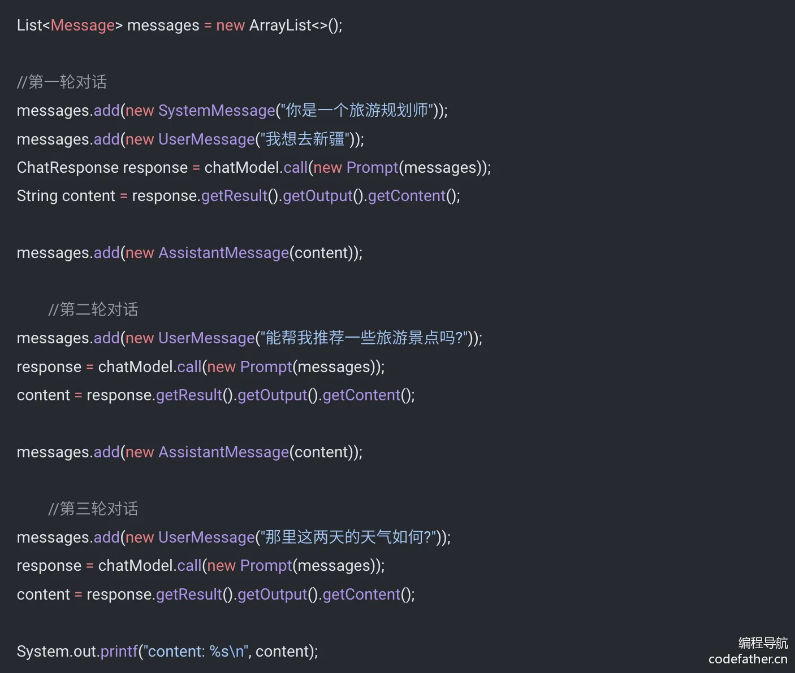

## 六、扩展知识

接下来鱼皮带大家实战一些 Spring AI 的实用特性，包括自定义 Advisor、结构化输出、对话记忆持久化、Prompt 模板和多模态。

### 自定义 Advisor

学过 Servlet 和 Spring AOP 的同学应该对这个功能并不陌生，我们可以通过编写拦截器或切面对请求和响应进行处理，比如记录请求响应日志、鉴权等。

Spring AI 的 Advisor 就可以理解为拦截器，可以对调用 AI 的请求进行增强，比如调用 AI 前鉴权、调用 AI 后记录日志。

官方已经提供了一些 Advisor，但可能无法满足我们实际的业务需求，这时我们可以使用官方提供的 自定义 Advisor 功能。按照下列步骤操作即可。

#### 自定义 Advisor 步骤

1）选择合适的接口实现，实现以下接口之一或同时实现两者（更建议同时实现）：

- CallAroundAdvisor：用于处理同步请求和响应（非流式）
- StreamAroundAdvisor：用于处理流式请求和响应

```java
public class MyCustomAdvisor implements CallAroundAdvisor, StreamAroundAdvisor {
    
}
```

2）实现核心方法

对于非流式处理 (CallAroundAdvisor)，实现 aroundCall 方法：

```java
@Override
public AdvisedResponse aroundCall(AdvisedRequest advisedRequest, CallAroundAdvisorChain chain) {
    
    AdvisedRequest modifiedRequest = processRequest(advisedRequest);
    
    
    AdvisedResponse response = chain.nextAroundCall(modifiedRequest);
    
    
    return processResponse(response);
}
```

对于流式处理 (StreamAroundAdvisor)，实现 aroundStream 方法：

```java
@Override
public Flux<AdvisedResponse> aroundStream(AdvisedRequest advisedRequest, StreamAroundAdvisorChain chain) {
    
    AdvisedRequest modifiedRequest = processRequest(advisedRequest);
    
    
    return chain.nextAroundStream(modifiedRequest)
               .map(response -> processResponse(response));
}
```

3）设置执行顺序

通过实现`getOrder()`方法指定 Advisor 在链中的执行顺序。值越小优先级越高，越先执行：

```java
@Override
public int getOrder() {
    
    return 100; 
}
```

4）提供唯一名称

为每个 Advisor 提供一个唯一标识符：

```java
@Override
public String getName() {
    return "鱼皮自定义的 Advisor";
}
```

下面我们参考官方文档，自定义 2 个 Advisor。

#### 自定义日志 Advisor

虽然 Spring AI 已经内置了 SimpleLoggerAdvisor 日志拦截器，但是以 Debug 级别输出日志，而默认 Spring Boot 项目的日志级别是 Info，所以看不到打印的日志信息。

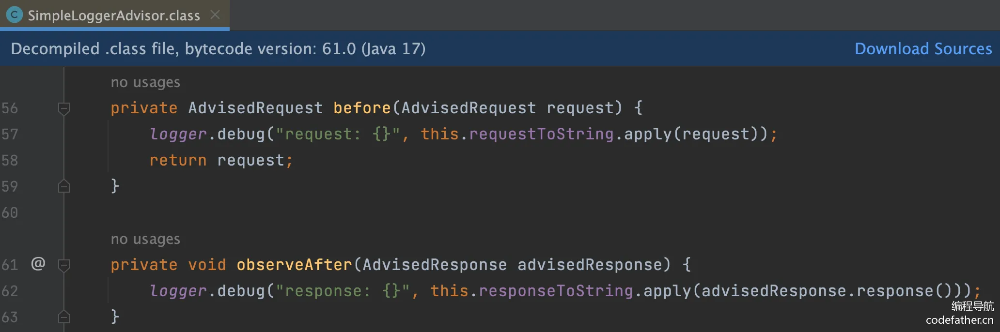

可以修改配置文件来指定特定文件的输出级别，就能看到打印的日志了：

```yaml
logging:
  level:
    org.springframework.ai.chat.client.advisor.SimpleLoggerAdvisor: debug
```

输出的日志信息如图：

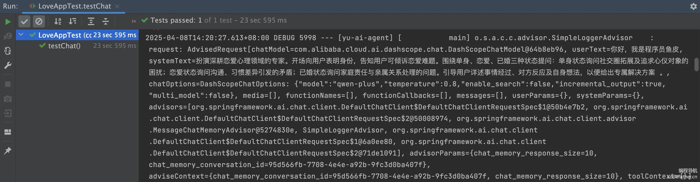

虽然上述方式可行，但如果为了更灵活地打印指定的日志，建议自己实现一个日志 Advisor。

我们可以同时参考 官方文档 和内置的 SimpleLoggerAdvisor 源码，结合 2 者并略做修改，开发一个更精简的、可自定义级别的日志记录器。默认打印 info 级别日志、并且只输出单次用户提示词和 AI 回复的文本。

在根包下新建 `advisor` 包，编写日志 Advisor 的代码：

```java
@Slf4j
public class MyLoggerAdvisor implements CallAroundAdvisor, StreamAroundAdvisor {

    @Override
    public String getName() {
        return this.getClass().getSimpleName();
    }

    @Override
    public int getOrder() {
        return 0;
    }

    private AdvisedRequest before(AdvisedRequest request) {
        log.info("AI Request: {}", request.userText());
        return request;
    }

    private void observeAfter(AdvisedResponse advisedResponse) {
        log.info("AI Response: {}", advisedResponse.response().getResult().getOutput().getText());
    }

    public AdvisedResponse aroundCall(AdvisedRequest advisedRequest, CallAroundAdvisorChain chain) {
        advisedRequest = this.before(advisedRequest);
        AdvisedResponse advisedResponse = chain.nextAroundCall(advisedRequest);
        this.observeAfter(advisedResponse);
        return advisedResponse;
    }

    public Flux<AdvisedResponse> aroundStream(AdvisedRequest advisedRequest, StreamAroundAdvisorChain chain) {
        advisedRequest = this.before(advisedRequest);
        Flux<AdvisedResponse> advisedResponses = chain.nextAroundStream(advisedRequest);
        return (new MessageAggregator()).aggregateAdvisedResponse(advisedResponses, this::observeAfter);
    }
}
```

上述代码中值得关注的是 aroundStream 方法的返回，通过 MessageAggregator 工具类将 Flux 响应聚合成单个 AdvisedResponse。这对于日志记录或其他需要观察整个响应而非流中各个独立项的处理非常有用。注意，不能在 MessageAggregator 中修改响应，因为它是一个只读操作。

在 LoveApp 中应用自定义的日志 Advisor：

```
chatClient = ChatClient.builder(dashscopeChatModel)
        .defaultSystem(SYSTEM_PROMPT)
        .defaultAdvisors(
                new MessageChatMemoryAdvisor(chatMemory),
                
                new MyLoggerAdvisor(),
        )
        .build();
```

运行效果如图：

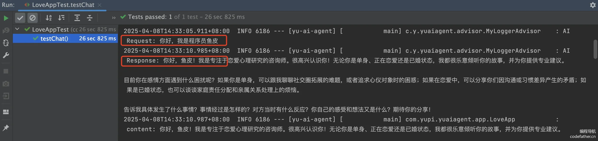

#### 自定义 Re-Reading Advisor

让我们再参考 官方文档 来实现一个 Re-Reading（重读）Advisor，又称 Re2。该技术通过让模型重新阅读问题来提高推理能力，有 文献 来印证它的效果。

💡 注意，虽然该技术可提高大语言模型的推理能力，不过成本会加倍！所以如果 AI 应用要面向 C 端开放，不建议使用。

Re2 的实现原理很简单，改写用户 Prompt 为下列格式，也就是让 AI 重复阅读用户的输入：                   

```json
{Input_Query}
Read the question again: {Input_Query}
```

需要对请求进行拦截并改写 userText，对应的实现代码如下：

```java
public class ReReadingAdvisor implements CallAroundAdvisor, StreamAroundAdvisor {

    private AdvisedRequest before(AdvisedRequest advisedRequest) {

        Map<String, Object> advisedUserParams = new HashMap<>(advisedRequest.userParams());
        advisedUserParams.put("re2_input_query", advisedRequest.userText());

        return AdvisedRequest.from(advisedRequest)
                .userText("""
                        {re2_input_query}
                        Read the question again: {re2_input_query}
                        """)
                .userParams(advisedUserParams)
                .build();
    }

    @Override
    public AdvisedResponse aroundCall(AdvisedRequest advisedRequest, CallAroundAdvisorChain chain) {
        return chain.nextAroundCall(this.before(advisedRequest));
    }

    @Override
    public Flux<AdvisedResponse> aroundStream(AdvisedRequest advisedRequest, StreamAroundAdvisorChain chain) {
        return chain.nextAroundStream(this.before(advisedRequest));
    }

    @Override
    public int getOrder() {
        return 0;
    }

    @Override
    public String getName() {
        return this.getClass().getSimpleName();
    }
}
```

可以在 LoveApp 中使用 Advisor，并进行测试，查看请求是否被改写。

```
chatClient = ChatClient.builder(dashscopeChatModel)
        .defaultSystem(SYSTEM_PROMPT)
        .defaultAdvisors(
                new MessageChatMemoryAdvisor(chatMemory),
                
                new ReReadingAdvisor()
        )
        .build();
```

#### 最佳实践

1）保持单一职责：每个 Advisor 应专注于一项特定任务

2）注意执行顺序：合理设置`getOrder()`值确保 Advisor 按正确顺序执行

3）同时支持流式和非流式：尽可能同时实现两种接口以提高灵活性

4）高效处理请求：避免在 Advisor 中执行耗时操作

5）测试边界情况：确保 Advisor 能够优雅处理异常和边界情况

6）对于需要更复杂处理的流式场景，可以使用 Reactor 的操作符：

```java
@Override
public Flux<AdvisedResponse> aroundStream(AdvisedRequest advisedRequest, StreamAroundAdvisorChain chain) {
    return Mono.just(advisedRequest)
           .publishOn(Schedulers.boundedElastic())
           .map(request -> {
               
               return modifyRequest(request);
           })
           .flatMapMany(request -> chain.nextAroundStream(request))
           .map(response -> {
               
               return modifyResponse(response);
           });
}
```

7）可以使用 `adviseContext` 在 Advisor 链中共享状态：

```
advisedRequest = advisedRequest.updateContext(context -> {
    context.put("key", "value");
    return context;
});

Object value = advisedResponse.adviseContext().get("key");
```

### 结构化输出 - 恋爱报告功能开发

结构化输出转换器（Structured Output Converter）是 Spring AI 提供的一种实用机制，用于将大语言模型返回的文本输出转换为结构化数据格式，如 JSON、XML 或 Java 类，这对于需要可靠解析 AI 输出值的下游应用程序非常重要。

比如之前鱼皮在 编程导航的智能 BI 项目，就需要让 AI 生成前端可视化图表的 JSON 格式代码，只不过之前我们是自己通过写 Prompt 实现的，而 Spring AI 直接提供了该功能。

#### 基本原理 - 工作流程

结构化输出转换器在大模型调用前后都发挥作用：

- 调用前：转换器会在提示词后面附加格式指令，明确告诉模型应该生成何种结构的输出，引导模型生成符合指定格式的响应。
- 调用后：转换器将模型的文本输出转换为结构化类型的实例，比如将原始文本映射为 JSON、XML 或特定的数据结构。

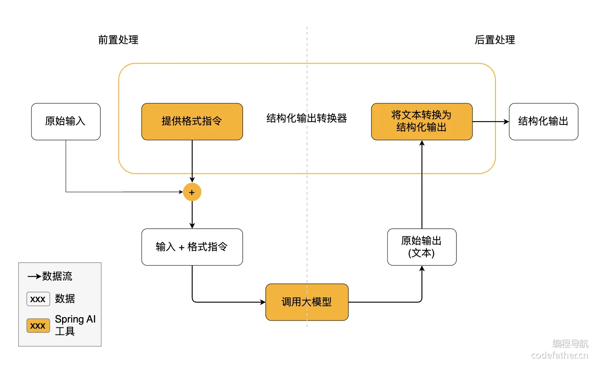

注意，结构化输出转换器只是 **尽最大努力** 将模型输出转换为结构化数据，AI 模型不保证一定按照要求返回结构化输出。有些模型可能无法理解提示词或无法按要求生成结构化输出。建议在程序中实现验证机制或者异常处理机制来确保模型输出符合预期。

#### 进阶原理 - API 设计

让我们进一步理解结构化输出的原理，结构化输出转换器 `StructuredOutputConverter` 接口允许开发者获取结构化输出，例如将输出映射到 Java 类或值数组。接口定义如下：

```java
public interface StructuredOutputConverter<T> extends Converter<String, T>, FormatProvider {

}
```

它集成了 2 个关键接口：

- `FormatProvider` 接口：提供特定的格式指令给 AI 模型
- Spring 的 `Converter<String, T>` 接口：负责将模型的文本输出转换为指定的目标类型 `T`

```java
public interface FormatProvider {
    String getFormat();
}
```

Spring AI 提供了多种转换器实现，分别用于将输出转换为不同的结构：

- AbstractConversionServiceOutputConverter：提供预配置的 GenericConversionService，用于将 LLM 输出转换为所需格式
- AbstractMessageOutputConverter：支持 Spring AI Message 的转换
- BeanOutputConverter：用于将输出转换为 Java Bean 对象（基于 ObjectMapper 实现）
- MapOutputConverter：用于将输出转换为 Map 结构
- ListOutputConverter：用于将输出转换为 List 结构

类图如下：

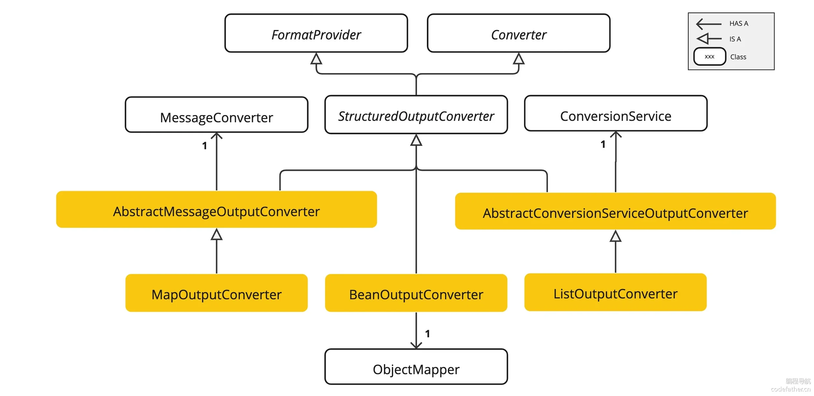

了解了 API 设计后，再来进一步剖析一遍结构化输出的工作流程。

1）在调用大模型之前，`FormatProvider` 为 AI 模型提供特定的格式指令，使其能够生成可以通过 `Converter` 转换为指定目标类型的文本输出。

转换器的格式指令组件会将类似下面的格式指令附加到提示词中：

```
Your response should be in JSON format.
The data structure for the JSON should match this Java class: java.util.HashMap
Do not include any explanations, only provide a RFC8259 compliant JSON response following this format without deviation.
```

通常，使用 `PromptTemplate` 将格式指令附加到用户输入的末尾，示例代码如下：

```
StructuredOutputConverter outputConverter = ...
String userInputTemplate = """
        ... 用户文本输入 ....
        {format}
        """; 
Prompt prompt = new Prompt(
        new PromptTemplate(
                this.userInputTemplate,
                Map.of(..., "format", outputConverter.getFormat()) 
        ).createMessage());
```

稍后会给大家讲解 `PromptTemplate` 特性。

2）`Converter` 负责将模型的输出文本转换为指定类型的实例。

流程图如下：

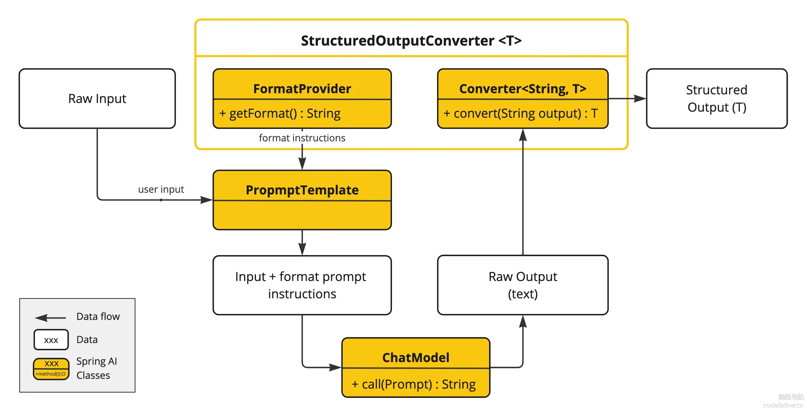

#### 使用示例

官方文档提供了很多转换示例，

1）BeanOutputConverter 示例，将 AI 输出转换为自定义 Java 类：

```java
record ActorsFilms(String actor, List<String> movies) {}

ActorsFilms actorsFilms = ChatClient.create(chatModel).prompt()
        .user("Generate 5 movies for Tom Hanks.")
        .call()
        .entity(ActorsFilms.class);
```

还可以用 `ParameterizedTypeReference` 构造函数来指定更复杂的目标类结构，比如自定义对象列表：

```
List<ActorsFilms> actorsFilms = ChatClient.create(chatModel).prompt()
        .user("Generate the filmography of 5 movies for Tom Hanks and Bill Murray.")
        .call()
        .entity(new ParameterizedTypeReference<List<ActorsFilms>>() {});
```

2）MapOutputConverter 示例，将模型输出转换为包含数字列表的 Map：

```
Map<String, Object> result = ChatClient.create(chatModel).prompt()
        .user(u -> u.text("Provide me a List of {subject}")
                    .param("subject", "an array of numbers from 1 to 9 under they key name 'numbers'"))
        .call()
        .entity(new ParameterizedTypeReference<Map<String, Object>>() {});
```

3）ListOutputConverter 示例，将模型输出转换为字符串列表：

```
List<String> flavors = ChatClient.create(chatModel).prompt()
                .user(u -> u.text("List five {subject}")
                            .param("subject", "ice cream flavors"))
                .call()
                .entity(new ListOutputConverter(new DefaultConversionService()));
```

#### 支持的 AI 模型

根据 官方文档，以下 AI 模型已经过测试，支持 List、Map 和 Bean 结构化输出：

| AI 模型 | 示例测试代码 |
| --- | --- |
| OpenAI | OpenAiChatModelIT |
| Anthropic Claude 3 | AnthropicChatModelIT.java |
| Azure OpenAI | AzureOpenAiChatModelIT.java |
| Mistral AI | MistralAiChatModelIT.java |
| Ollama | OllamaChatModelIT.java |
| Vertex AI Gemini | VertexAiGeminiChatModelIT.java |

值得一提的是，一些 AI 模型提供了专门的 **内置 JSON 模式**，用于生成结构化的 JSON 输出，大家无需关注实现细节，只需要知道：内置 JSON 模式可以确保模型生成的响应严格符合 JSON 格式，提高结构化输出的可靠性。

- OpenAI：提供了 `JSON_OBJECT` 和 `JSON_SCHEMA` 响应格式选项
- Azure OpenAI：通过设置 `{ "type": "json_object" }` 启用 JSON 模式
- Ollama：提供 `format` 选项，目前接受的唯一值是 `json`
- Mistral AI：提供 `responseFormat` 选项，设置为 `{ "type": "json_object" }` 启用 JSON 模式

#### 恋爱报告功能开发

下面让我们使用结构化输出，来为用户生成恋爱报告，并转换为恋爱报告对象，包含报告标题和恋爱建议列表字段。

1）需要引入 JSON Schema 生成依赖：

```xml
<dependency>
    <groupId>com.github.victools</groupId>
    <artifactId>jsonschema-generator</artifactId>
    <version>4.38.0</version>
</dependency>
```

2）在 LoveApp 中定义恋爱报告类，可以使用 Java 14 引入的 record 特性快速定义：

```java
record LoveReport(String title, List<String> suggestions) {
}
```

3）在 LoveApp 中编写一个新的方法，复用之前构造好的 ChatClient 对象，只需额外补充原有的系统提示词、并且添加结构化输出的代码即可。代码如下：

```java
public LoveReport doChatWithReport(String message, String chatId) {
    LoveReport loveReport = chatClient
            .prompt()
            .system(SYSTEM_PROMPT + "每次对话后都要生成恋爱结果，标题为{用户名}的恋爱报告，内容为建议列表")
            .user(message)
            .advisors(spec -> spec.param(CHAT_MEMORY_CONVERSATION_ID_KEY, chatId)
                    .param(CHAT_MEMORY_RETRIEVE_SIZE_KEY, 10))
            .call()
            .entity(LoveReport.class);
    log.info("loveReport: {}", loveReport);
    return loveReport;
}
```

4）编写单元测试代码：

```java
@Test
void doChatWithReport() {
    String chatId = UUID.randomUUID().toString();
    
    String message = "你好，我是程序员鱼皮，我想让另一半（编程导航）更爱我，但我不知道该怎么做";
    LoveApp.LoveReport loveReport = loveApp.doChatWithReport(message, chatId);
    Assertions.assertNotNull(loveReport);
}
```

运行程序，通过 Debug 查看效果。发现 Advisor 上下文中包含了格式指令：

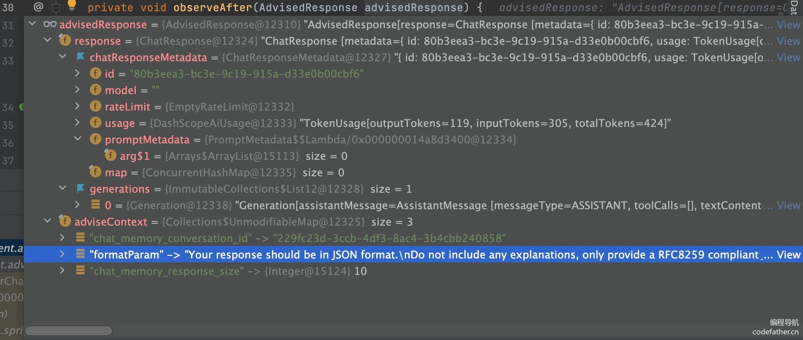

格式指令的完整内容如下，我们发现对象被转换为了 JSON Schema 描述语言：

```
formatParam -> Your response should be in JSON format.
Do not include any explanations, only provide a RFC8259 compliant JSON response following this format without deviation.
Do not include markdown code blocks in your response.
Remove the ```json markdown from the output.
Here is the JSON Schema instance your output must adhere to:
```{
  "$schema" : "https://json-schema.org/draft/2020-12/schema",
  "type" : "object",
  "properties" : {
    "suggestions" : {
      "type" : "array",
      "items" : {
        "type" : "string"
      }
    },
    "title" : {
      "type" : "string"
    }
  },
  "additionalProperties" : false
}
```

AI 生成的内容如图，是 JSON 格式文本：

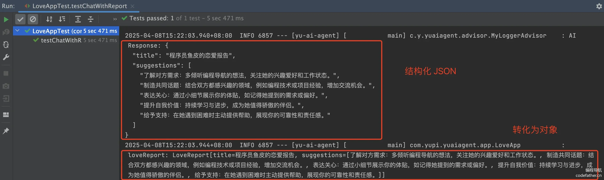

转换器成功将 JSON 文本转换为了对象：

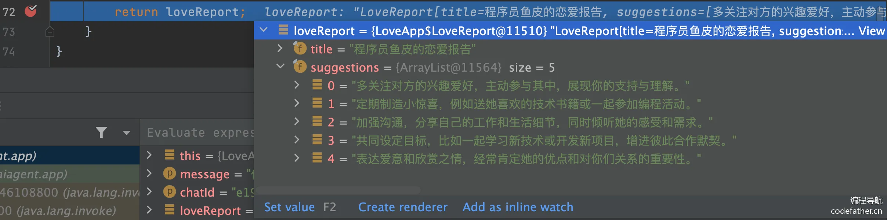

#### 最佳实践

1. 尽量为模型提供清晰的格式指导
2. 实现输出验证机制和异常处理逻辑，确保结构化数据符合预期
3. 选择支持结构化输出的合适模型
4. 对于复杂数据结构，考虑使用 `ParameterizedTypeReference`

### 对话记忆持久化

之前我们使用了基于内存的对话记忆来保存对话上下文，但是服务器一旦重启了，对话记忆就会丢失。有时，我们可能希望将对话记忆持久化，保存到文件、数据库、Redis 或者其他对象存储中，怎么实现呢？

Spring AI 提供了 2 种方式。

#### 利用现有依赖实现

前面提到，官方提供 了一些第三方数据库的整合支持，可以将对话保存到不同的数据源中。比如：

- InMemoryChatMemory：内存存储
- CassandraChatMemory：在 Cassandra 中带有过期时间的持久化存储
- Neo4jChatMemory：在 Neo4j 中没有过期时间限制的持久化存储
- JdbcChatMemory：在 JDBC 中没有过期时间限制的持久化存储

如果我们要将对话持久化到数据库中，就可以使用 JdbcChatMemory。但是 `spring-ai-starter-model-chat-memory-jdbc` 依赖目前版本很少，而且缺乏相关介绍，Maven 官方仓库也搜不到依赖，所以不推荐使用。

Spring 仓库 倒是能搜到，但用的人太少了，神特么开荒！

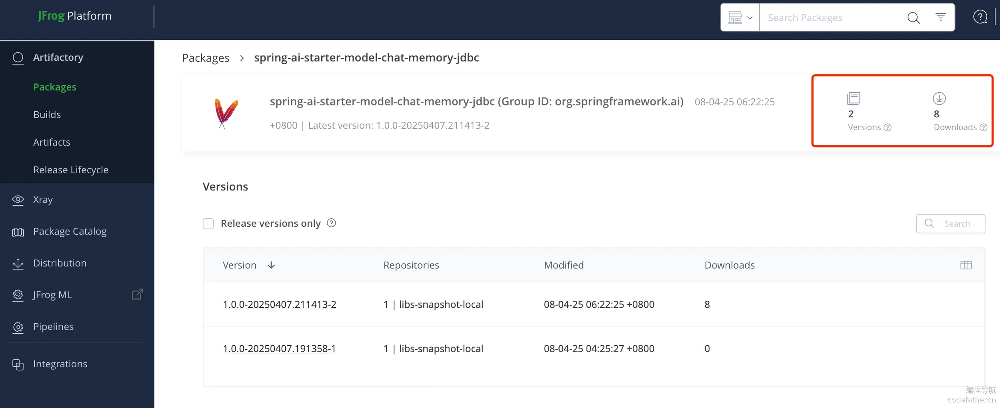

因此我会更建议大家自定义实现 ChatMemory。

#### 自定义实现

Spring AI 的对话记忆实现非常巧妙，解耦了 “存储” 和 “记忆算法”，使得我们可以单独修改 ChatMemory 存储来改变对话记忆的保存位置，而无需修改保存对话记忆的流程。

虽然官方文档没有给我们提供自定义 ChatMemory 实现的示例，但是我们可以直接去阅读默认实现类 InMemoryChatMemory 的源码，有样学样呀！

ChatMemory 接口的方法并不多，需要实现对话消息的增、查、删：

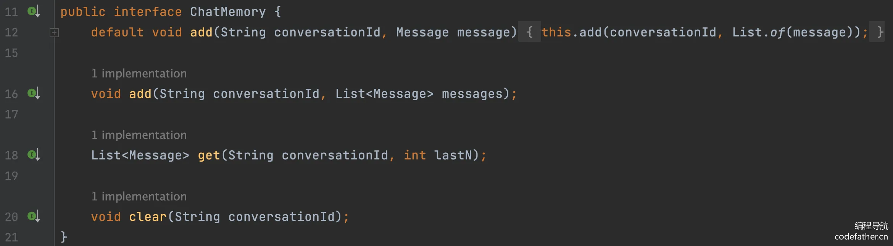

参考 InMemoryChatMemory 的源码，其实就是通过 ConcurrentHashMap 来维护对话信息，key 是对话 id（相当于房间号），value 是该对话 id 对应的消息列表。

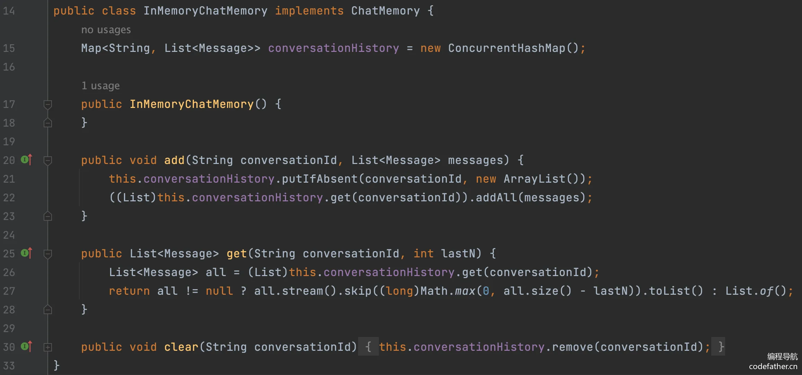

#### 自定义文件持久化 ChatMemory

由于数据库持久化还需要引入额外的依赖，比较麻烦，这也不是本项目学习的重点，因此我们就实现一个基于文件读写的 ChatMemory。

虽然需要实现的接口不多，但是实现起来还是有一定复杂度的，一个最主要的问题是 **消息和文本的转换**。我们在保存消息时，要将消息从 Message 对象转为文件内的文本；读取消息时，要将文件内的文本转换为 Message 对象。也就是对象的序列化和反序列化。

我们本能地会想到通过 JSON 进行序列化，但实际操作中，我们发现这并不容易。原因是：

1. 要持久化的 Message 是一个接口，有很多种不同的子类实现（比如 UserMessage、SystemMessage 等）
2. 每种子类所拥有的字段都不一样，结构不统一
3. 子类没有无参构造函数，而且没有实现 Serializable 序列化接口

Spring AI Message 的类图：

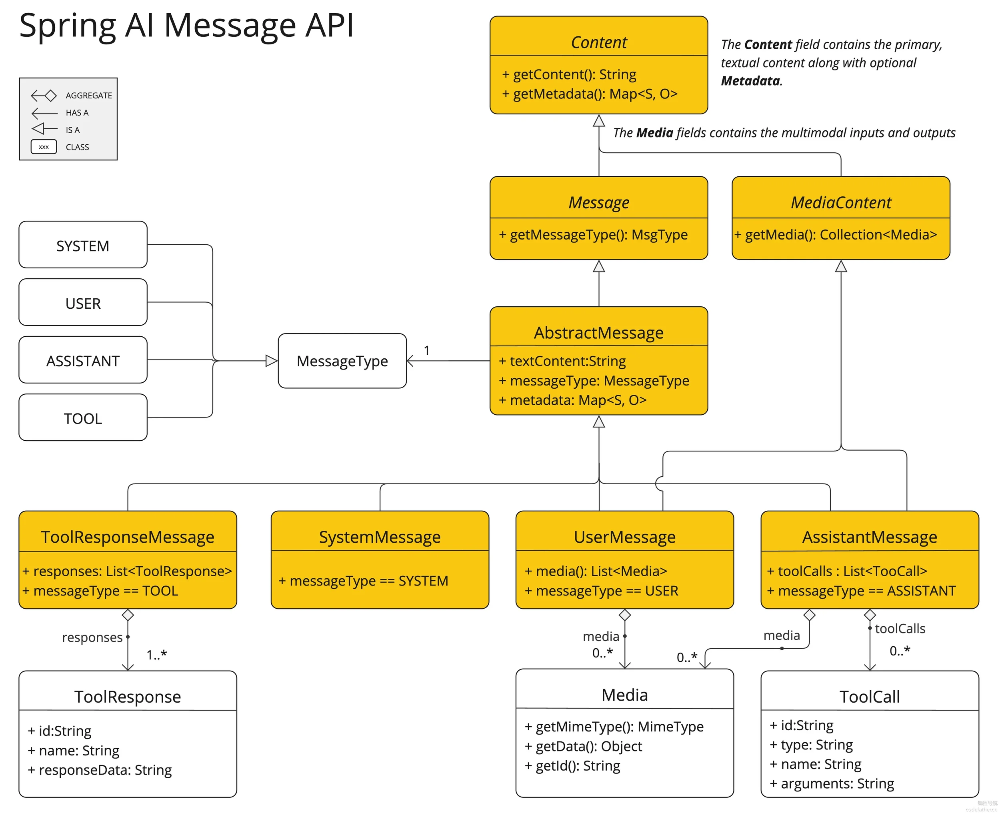

因此，如果使用 JSON 来序列化会存在很多报错。所以此处我们选择高性能的 Kryo 序列化库。

1）引入依赖：

```xml
<dependency>
    <groupId>com.esotericsoftware</groupId>
    <artifactId>kryo</artifactId>
    <version>5.6.2</version>
</dependency>
```

2）在根包下新建 `chatmemory` 包，编写基于文件持久化的对话记忆 FileBasedChatMemory，代码如下：

```java
public class FileBasedChatMemory implements ChatMemory {

    private final String BASE_DIR;
    private static final Kryo kryo = new Kryo();

    static {
        kryo.setRegistrationRequired(false);
        
        kryo.setInstantiatorStrategy(new StdInstantiatorStrategy());
    }

    
    public FileBasedChatMemory(String dir) {
        this.BASE_DIR = dir;
        File baseDir = new File(dir);
        if (!baseDir.exists()) {
            baseDir.mkdirs();
        }
    }

    @Override
    public void add(String conversationId, List<Message> messages) {
        List<Message> conversationMessages = getOrCreateConversation(conversationId);
        conversationMessages.addAll(messages);
        saveConversation(conversationId, conversationMessages);
    }

    @Override
    public List<Message> get(String conversationId, int lastN) {
        List<Message> allMessages = getOrCreateConversation(conversationId);
        return allMessages.stream()
                .skip(Math.max(0, allMessages.size() - lastN))
                .toList();
    }

    @Override
    public void clear(String conversationId) {
        File file = getConversationFile(conversationId);
        if (file.exists()) {
            file.delete();
        }
    }

    private List<Message> getOrCreateConversation(String conversationId) {
        File file = getConversationFile(conversationId);
        List<Message> messages = new ArrayList<>();
        if (file.exists()) {
            try (Input input = new Input(new FileInputStream(file))) {
                messages = kryo.readObject(input, ArrayList.class);
            } catch (IOException e) {
                e.printStackTrace();
            }
        }
        return messages;
    }

    private void saveConversation(String conversationId, List<Message> messages) {
        File file = getConversationFile(conversationId);
        try (Output output = new Output(new FileOutputStream(file))) {
            kryo.writeObject(output, messages);
        } catch (IOException e) {
            e.printStackTrace();
        }
    }

    private File getConversationFile(String conversationId) {
        return new File(BASE_DIR, conversationId + ".kryo");
    }
}
```

虽然上述代码看起来复杂，但大多数代码都是文件和 Message 对象的转换，完全可以利用 AI 生成这段代码。

3）修改 LoveApp 的构造函数，使用基于文件的对话记忆：

```
public LoveApp(ChatModel dashscopeChatModel) {
    
    String fileDir = System.getProperty("user.dir") + "/chat-memory";
    ChatMemory chatMemory = new FileBasedChatMemory(fileDir);
    chatClient = ChatClient.builder(dashscopeChatModel)
            .defaultSystem(SYSTEM_PROMPT)
            .defaultAdvisors(
                    new MessageChatMemoryAdvisor(chatMemory)
            )
            .build();
}
```

4）测试运行，文件持久化成功：

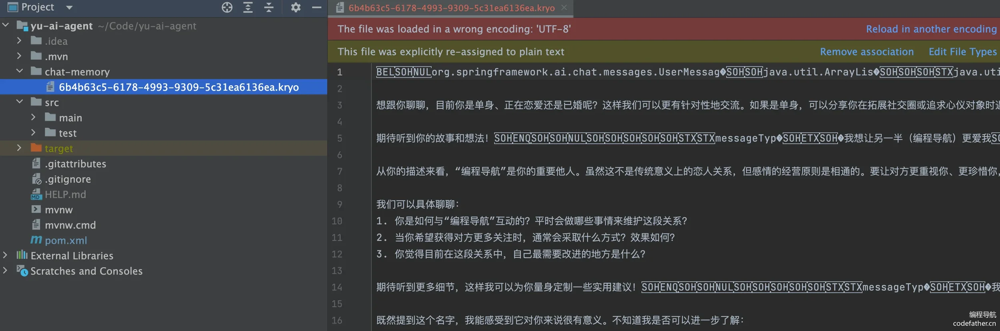

### PromptTemplate 模板

#### 什么是 PromptTemplate？有什么用？

PromptTemplate 是 Spring AI 框架中用于构建和管理提示词的核心组件。允许开发者创建带有占位符的文本模板，然后在运行时动态替换这些占位符。

它相当于 AI 交互中的 “视图层”，类似于 Spring MVC 中的视图模板（或者 JSP）。通过使用 PromptTemplate，你可以更加结构化、可维护地管理 AI 应用中的提示词，使其更易于优化和扩展，同时降低硬编码带来的维护成本。

PromptTemplate 最基本的功能是支持变量替换。你可以在模板中定义占位符，然后在运行时提供这些变量的值：

```
String template = "你好，{name}。今天是{day}，天气{weather}。";

PromptTemplate promptTemplate = new PromptTemplate(template);

Map<String, Object> variables = new HashMap<>();
variables.put("name", "鱼皮");
variables.put("day", "星期一");
variables.put("weather", "晴朗");

String prompt = promptTemplate.render(variables);
```

💡 模板的思路在编程技术中经常用到，比如数据库的预编译语句、记录日志时的变量占位符、模板引擎等。

PromptTemplate 在以下场景特别有用：

1. 动态个性化交互：根据用户信息、上下文或业务规则定制提示词
2. 多语言支持：使用相同的变量但不同的模板文件支持多种语言
3. A/B 测试：轻松切换不同版本的提示词进行效果对比
4. 提示词版本管理：将提示词外部化，便于版本控制和迭代优化

#### 实现原理

PromptTemplate 底层使用了 OSS StringTemplate 引擎，这是一个强大的模板引擎，专注于文本生成。在 Spring AI 中，PromptTemplate 类实现了以下接口：

```java
public class PromptTemplate implements PromptTemplateActions, PromptTemplateMessageActions {
    
}
```

这些接口提供了不同类型的模板操作功能，使其既能生成普通文本，也能生成结构化的消息。

类图如下：

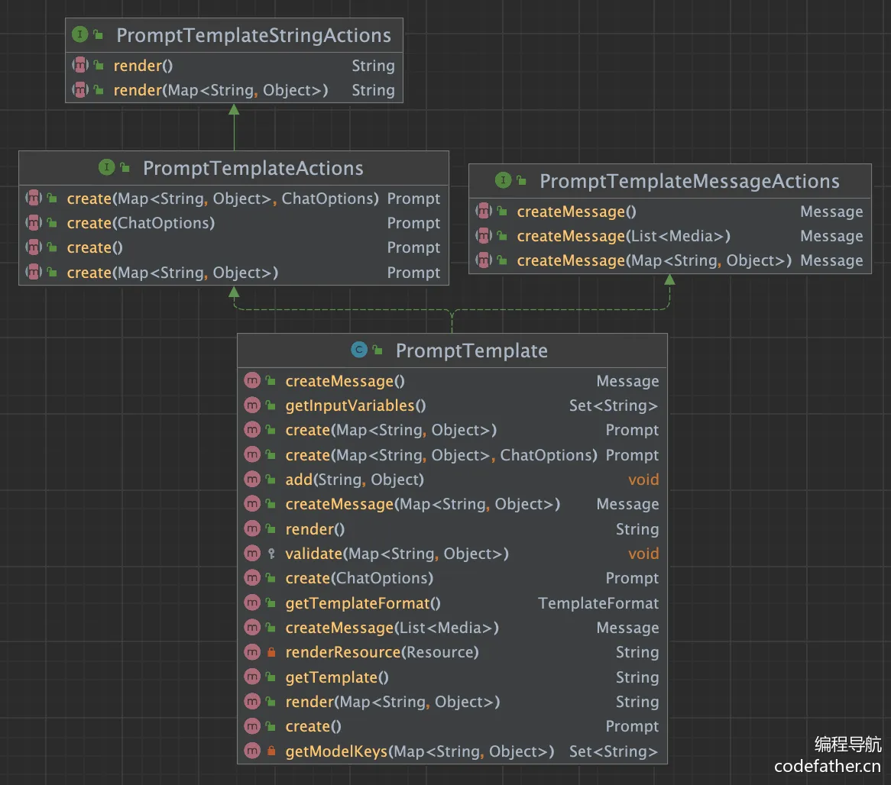

#### 专用模板类

Spring AI 提供了几种专用的模板类，对应不同角色的消息：

1. SystemPromptTemplate：用于系统消息，设置 AI 的行为和背景
2. AssistantPromptTemplate：用于助手消息，用于设置 AI 回复的结构
3. FunctionPromptTemplate：目前没用

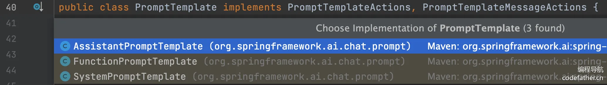

这些专用模板类让开发者能更清晰地表达不同类型消息的意图，比如系统消息模板能够快速构造系统 Prompt，示例代码：

```
String userText = """
    Tell me about three famous pirates from the Golden Age of Piracy and why they did.
    Write at least a sentence for each pirate.
    """;                                

Message userMessage = new UserMessage(userText);

String systemText = """
  You are a helpful AI assistant that helps people find information.
  Your name is {name}
  You should reply to the user's request with your name and also in the style of a {voice}.
  """;

SystemPromptTemplate systemPromptTemplate = new SystemPromptTemplate(systemText);
Message systemMessage = systemPromptTemplate.createMessage(Map.of("name", name, "voice", voice));

Prompt prompt = new Prompt(List.of(userMessage, systemMessage));

List<Generation> response = chatModel.call(prompt).getResults();
```

#### 从文件加载模板

PromptTemplate 支持从外部文件加载模板内容，很适合管理复杂的提示词。Spring AI 利用 Spring 的 Resource 对象来从指定路径加载模板文件：

```
@Value("classpath:/prompts/system-message.st")
private Resource systemResource;

SystemPromptTemplate systemPromptTemplate = new SystemPromptTemplate(systemResource);
```

这种方式让你可以：

- 将复杂的提示词放在单独的文件中管理
- 在不修改代码的情况下调整提示词
- 为不同场景准备多套提示词模板

是不是有点像写配置文件？有点儿前后端分离的感觉了？我也会更推荐大家使用这种方式来管理 Prompt 模板。

### 多模态

AI 多模态是指能够同时处理、理解和生成多种不同类型数据的能力，比如文本、图像、音频、视频、PDF、结构化数据（比如表格）等。

还有一个概念叫 “原生多模态大模型”，是指在架构设计和预训练阶段就直接整合多种数据类型的 AI 模型，可以使用单一模型同时处理多种模态数据，而非将多个单模态模型简单组合在一起。比如 OpenAI GPT-4o、Google Vertex AI Gemini 1.5、Anthropic Claude3 等。

原生多模态大模型可以在整个模型中共享特征和学习策略，有助于捕获跨模态特征间的复杂关系。所以它们通常在执行跨模态任务时表现更好，比如图文匹配、视觉问答或多模态翻译。

下面分享 2 种多模态开发的方法。

#### 1、Spring AI 多模态开发

Spring AI 提供了 多模态开发 的支持，但是要注意很多模型是不支持多模态的，所以在开发前一定要查看 支持多模态的模型文档。

目前多模态能力较强的模型有 Google VertexAI Gemini 和 OpenAI：

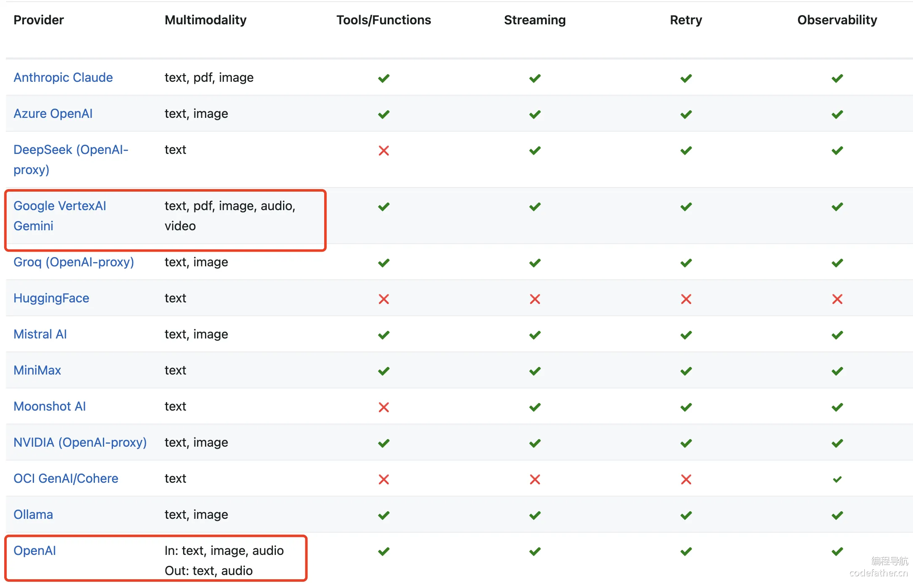

选择大模型后，可以参考对应的官方文档来了解多模态的开发方式，比如 VertexAI 文档。

允许在发送给 AI 的消息中包含图片等资源，示例代码如下：

```
byte[] data = new ClassPathResource("/vertex-test.png").getContentAsByteArray();

var userMessage = new UserMessage("Explain what do you see on this picture?",
        List.of(new Media(MimeTypeUtils.IMAGE_PNG, this.data)));

ChatResponse response = chatModel.call(new Prompt(List.of(this.userMessage)));
```

还可以通过 ChatClient 的 API 来添加资源：

```
String response = ChatClient.create(chatModel).prompt()
		.user(u -> u.text("Explain what do you see on this picture?")
				    .media(MimeTypeUtils.IMAGE_PNG, new ClassPathResource("/multimodal.test.png")))
		.call()
		.content();
```

但是由于国外的 AI 使用成本较高，尤其是 VertexAI，首先需要特殊的网络支持，而且需要在 Google Cloud 上创建项目、还要本地下载 Google CLI 工具来生成认证文件，非常麻烦！这里就不带大家演示了，感兴趣的同学可以参考 Vertex AI 的官方文档 来使用，参考 这个文档 来获取认证文件。

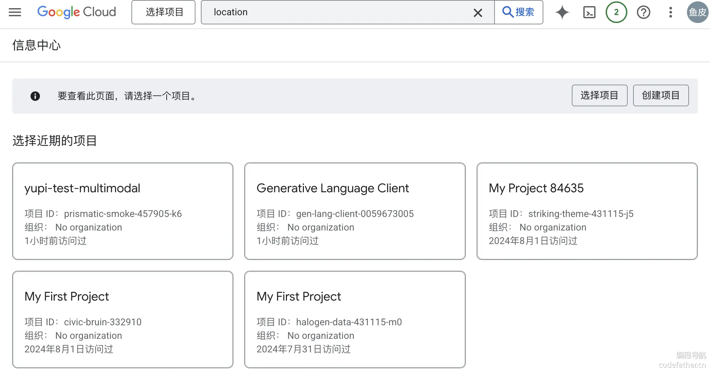

#### 2、平台 SDK 多模态开发

这种方式更适合中国宝宝的体质，直接参考大模型平台的官方文档，使用平台提供的 SDK 或 API 调用多模态大模型。比如 阿里云百炼平台的多模态支持：

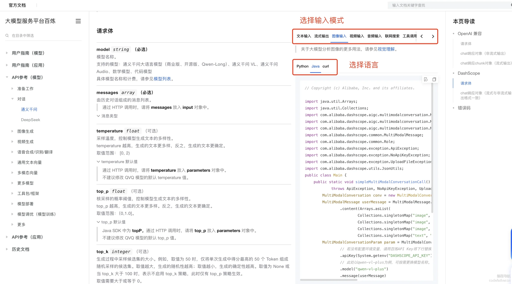

---

现在大家只需要了解上述开发方式即可，今后会出现更多原生多模态大模型，多模态开发也会变得越来越简单。

## 七、扩展思路

1）自定义 Advisor，比如权限校验、违禁词校验 Advisor

2）自定义对话记忆，比如持久化对话到 MySQL 或 Redis 存储中

3）编写一套包含变量的 Prompt 模板，并保存为资源文件，从文件加载模板

4）开发一个多模态对话助手，能够让 AI 解释图片（建议使用国内的 AI 大模型）

5）阅读 Spring AI 官方的 ChatMemory 文档，了解如何自主构造 ChatMemory

## 本节作业

1）完成 AI 恋爱大师应用的开发，或者自己定义一种类型的应用

2）理解对话记忆、Advisor、结构化输出的工作流程和原理

3）利用结构化输出特性，将 AI 的输出映射为自定义的 Java 对象
