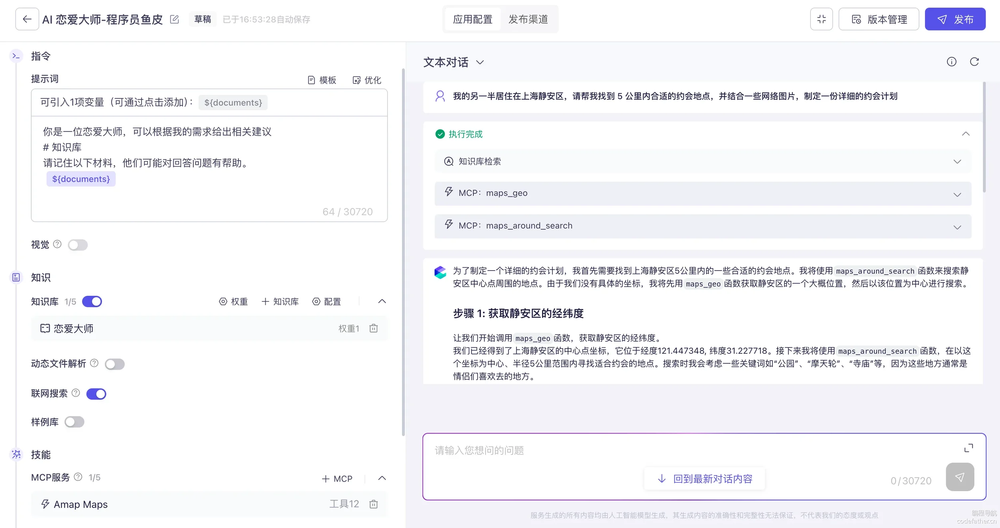
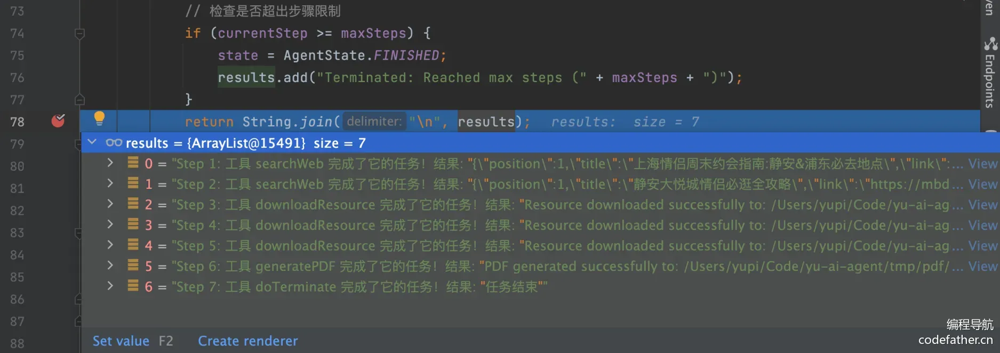
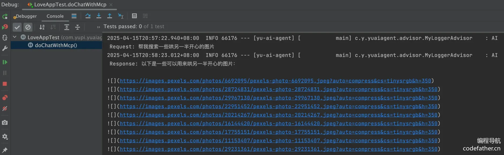
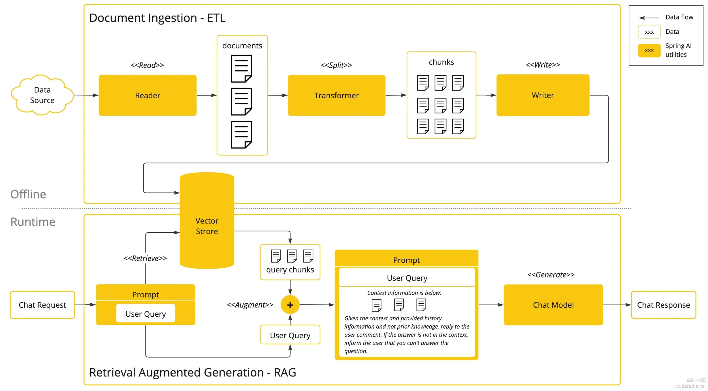
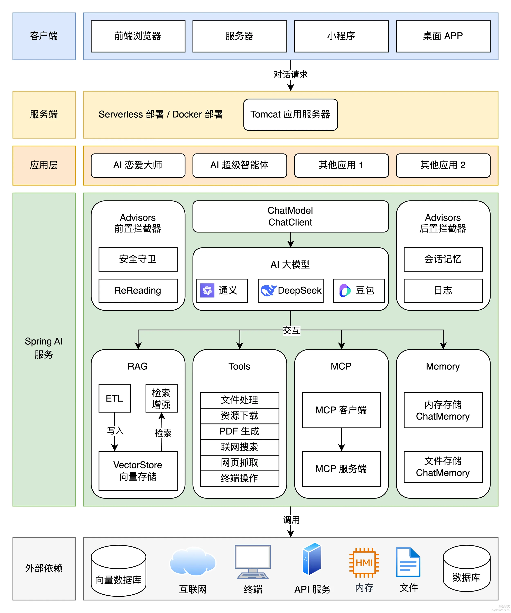
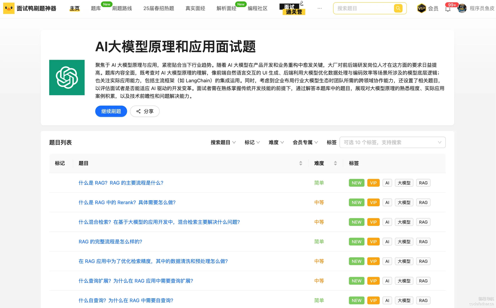
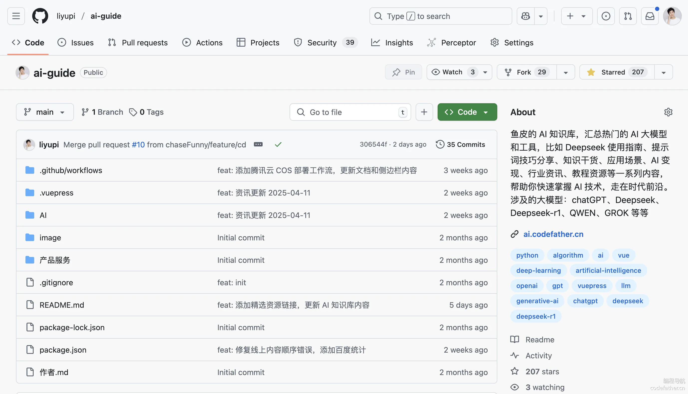

+++
title = "项目总览"
date = "2026-10-07T12:00:00+08:00"
weight = 1
summary = "AI 超级智能体项目总览：项目介绍、项目优势、学习路线与技术选型。"
+++

## 一、项目介绍

这是一套以 AI 开发实战为核心的项目教程，将通过开发 **AI 恋爱大师应用 + 拥有自主规划能力的超级智能体**，带大家掌握新时代程序员必知必会的 AI 核心概念、AI 实用工具和 AI 编程技术，大幅增加求职的竞争力！

AI 恋爱大师应用可以依赖 AI 大模型解决用户的情感问题，支持多轮对话、基于自定义知识库进行问答、自主调用工具和 MCP 服务完成任务，比如调用地图服务获取附近地点并制定约会计划。

此外，还会手把手带大家完成基于 ReAct 模式的自主规划智能体 YuManus，可以利用网页搜索、资源下载和 PDF 生成工具，帮用户制定完整的约会计划并生成文档：

当然，学会这个项目后，你不仅能开发 AI 恋爱大师，而是能灵活开发各种复杂的 AI 应用，尽情发挥自己的想象力吧！

## 二、项目优势

### 项目收获

本项目选题新颖、业务真实，用一套实战教程将程序员必知必会的 AI 技术一网打尽，帮你成为 AI 时代企业的香饽饽，给你的简历和求职大幅增加竞争力              

你将掌握下面的知识：

- AI 应用平台的使用
- 接入 AI 大模型
- AI 开发框架（Spring AI + LangChain4j）
- AI 大模型本地部署
- Prompt 工程和优化技巧
- 多模态特性
- Spring AI 核心特性：如自定义拦截器、上下文持久化、结构化输出
- RAG 知识库和向量数据库
- Tool Calling ️工具调用
- MCP 模型上下文协议和服务开发
- AI 智能体 Manus 原理和自主开发
- AI 服务化和 Serverless 部署

项目还有其他优势：

- AI 云平台和编程双端实战，不仅会用 AI 服务，还会自己写！
- 基于官方文档讲解最新的 AI 技术，细致入微，手撕文档和源码！
- 分享大量 AI 扩展知识和编程技巧，掌握最佳实践！

此外，还能学会很多作图、思考问题、对比方案的方法，提升排查问题、自主解决 Bug 的能力。

### 鱼皮系列项目优势

鱼皮原创项目系列以 **实战** 为主，用 **全程直播** 的方式，**从 0 到 ** 带大家学习技术知识，并立即实践运用到项目中，做到学以致用。

此外，还提供如下服务：                                

- 详细的文字教程或直播笔记
- 完整的项目源码
- 1 对 1 答疑解惑
- 专属项目交流群
- ⭐️ 现成的简历写法（直接写满简历）
- ⭐️ 项目的扩展思路（拉开和其他人的差距）
- ⭐️ 项目相关面试题、题解和真实面经（提前准备，面试不懵逼）
- ⭐️ 前端 + Java 后端万用项目模板（快速创建项目）

比起看网上的教程学习，鱼皮项目系列的优势：从学知识 => 实践项目 => 复习笔记 => 项目答疑 => 简历写法 => 面试题解的一条龙服务

从需求分析、技术选型、项目设计、项目初始化、Demo 编写、前后端开发实现、项目优化、部署上线等，每个环节我都 **从理论到实践** 给大家讲的明明白白、每个细节都不放过！

| 对比维度 | 跟学鱼皮项目 | 自学网上免费项目 | ⭐️ 鱼皮项目优势 |
| --- | --- | --- | --- |
| 项目选题 | ✅ 选题新颖，刻意避开网上热门项目 | 传统项目场景（博客、商城、管理系统） | 增加区分度，提高简历通过率 |
| 学习人数 | ✅ 少，不容易撞车 | 百万以上，烂大街 | 增加区分度，提高简历通过率 |
| 教学方式 | ✅ 全程直播，带你敲每一行代码、带你踩坑和解决 Bug，不漏过每一个细节 | 录制课程，视频虽然看起来简短、一帆风顺，但你遇到错误无从下手 | 降低学习门槛，减少学习时长 |
| 直播笔记 | ✅ 详细的官方笔记 + 精选学员优质笔记 | 有笔记，但未经筛选 | 学到更多知识细节 |
| 视频内容 | ✅ 项目教程 + 经验分享 | 项目教程 | 学到更多编程经验 |
| 项目源码 | ✅ 完整源码仓库 + 每章的提交记录 + 定期更新 | 只有代码包、不更新 | 节省时间，避免踩坑 |
| 项目答疑 | ✅ 各项目交流群 + 答疑解惑 + 常见问题整理 | 无免费的答疑服务，遇到问题自行解决 | 节省时间 |
| 简历写法 | ✅ 现成的简历写法 | 无 | 节省时间、提高简历通过率 |
| 项目扩展 | ✅ 给出扩展思路 + 学员作品共享 | 无 | 开拓思路、拉开和其他人的差距 |
| 项目面试 | ✅ 项目相关面试题、题解和真实面经 | 无 | 提前准备，面试不懵逼 |

编程导航已有 \*\*10 多套项目教程！\*\* 每个项目的学习重点不同，几乎全都是前端 + 后端的 **全栈项目**。

详细请见：https://codefather.cn/course（在该页面右侧有教程推荐和学习建议）

往期项目介绍视频：https://bilibili.

## 三、项目功能梳理

项目中，我们将开发一个 AI 恋爱大师应用、一个拥有自主规划能力的超级智能体，以及一系列工具和 MCP 服务。

具体需求如下：

- AI 恋爱大师应用：用户在恋爱过程中难免遇到各种难题，让 AI 为用户提供贴心情感指导。支持多轮对话、对话记忆持久化、RAG 知识库检索、工具调用、MCP 服务调用。
- AI 超级智能体：可以根据用户的需求，自主推理和行动，直到完成目标。
- 提供给 AI 的工具：包括联网搜索、文件操作、网页抓取、资源下载、终端操作、PDF 生成。
- AI MCP 服务：可以从特定网站搜索图片。

## 四、技术选型

项目以 Spring AI 开发框架实战为核心，涉及到多种主流 AI 客户端和工具库的运用。

- Java 21 + Spring Boot 3 框架
- ⭐️ Spring AI + LangChain4j
- ⭐️ RAG 知识库
- ⭐️ PGvector 向量数据库
- ⭐ Tool Calling ️工具调用
- ⭐️ MCP 模型上下文协议
- ⭐️ ReAct Agent 智能体构建
- ⭐️ Serverless 计算服务
- ⭐️ AI 大模型开发平台百炼
- ⭐️ Cursor AI 代码生成 + MCP
- 第三方接口：如 SearchAPI / Pexels API
- Ollama 大模型部署
- Kryo 高性能序列化
- Jsoup 网页抓取
- iText PDF 生成
- Knife4j 接口文档

## 五、架构设计

从客户端发送请求开始，自上而下经过一系列处理，最终得到响应结果。架构图如下：

## 六、准备工作

### AI 基础知识

请先观看《程序员鱼皮 AI 指南》，了解 AI 基础知识和学习路线，后续在项目中实战时会有个大致的印象，便于学习理解。

⭐️ 推荐观看视频版：https://www.bilibili.

文字版：https://www.codefather.

### 新建代码仓库

利用 GitHub 搭建开源代码仓库，点 star 的都是精神股东

代码仓库：https://github.com/liyupi/yu-ai-

### AI 学习资源

建议大家在学习 AI 项目的过程中，持续阅读 AI 大模型相关的面试题，巩固知识点。这块鱼皮已经帮大家拿捏了，我们的程序员面试刷题神器面试鸭搞了个 AI 大模型面试题库，建议没事就阅读一些题目来学习学习。

而且由于 AI 技术日新月异，建议大家平时多关注 AI 相关的资讯动态，比如 鱼皮开源的 AI 知识库，汇总了热门的 AI 大模型和工具，比如 Deepseek 使用指南、提示词技巧分享、知识干货、应用场景、AI 变现、行业资讯、教程资源等一系列内容，帮助你快速掌握 AI 技术，走在时代前沿。

## 七、学习大纲

第 1 期：项目总览

- 项目介绍
- 项目优势
- 项目功能梳理
- 技术选型
- 架构设计
- AI 学习路线
- AI 应用平台的使用（Dify）
- AI 常用工具
- AI 编程技巧
- AI 编程技术
- 学习大纲

第 2 期：AI 大模型接入                                

- AI 大模型概念
- 接入 AI 大模型（3 种方式）
- 后端项目初始化
- 程序调用 AI 大模型（4 种方式）
- 本地部署 AI 大模型
- Spring AI 调用本地大模型

第 3 期：AI 应用开发

- Prompt 工程概念
- Prompt 优化技巧
- AI 恋爱大师应用需求分析
- AI 恋爱大师应用方案设计
- Spring AI ChatClient / Advisor / ChatMemory 特性
- 多轮对话 AI 应用开发
- Spring AI 自定义 Advisor
- Spring AI 结构化输出 - 恋爱报告功能
- Spring AI 对话记忆持久化
- Spring AI Prompt 模板特性
- 多模态概念和开发

第 4 期：RAG 知识库基础

- AI 恋爱知识问答需求分析
- RAG 概念（重点理解核心步骤）
- RAG 实战：Spring AI + 本地知识库
- RAG 实战：Spring AI + 云知识库服务

第 5 期：RAG 知识库进阶 

- RAG 核心特性
- 文档收集和切割（ETL）
- 向量转换和存储（向量数据库）
- 文档过滤和检索（文档检索器）
- 查询增强和关联（上下文查询增强器）
- RAG 最佳实践和调优
- 检索策略
- 大模型幻觉

第 6 期：工具调用

- 工具概念
- Spring AI 工具开发
- 主流工具开发
- 文件操作
- 联网搜索
- 网页抓取
- 终端操作
- 资源下载
- PDF 生成
- 工具进阶知识（原理和高级特性）

第 7 期：MCP

- MCP 概念
- 使用 MCP（3 种方式）
- Spring AI MCP 开发模式
- Spring AI MCP 开发实战 - 图片搜索 MCP
- MCP 开发最佳实践
- 部署 MCP
- MCP 安全问题

第 8 期：AI 智能体构建 

- AI 智能体概念
- 智能体实现关键
- 使用 AI 智能体（2 种方式）
- 自主规划智能体介绍
- OpenManus 实现原理
- 自主实现 Manus 智能体
- 智能体工作流

第 9 期：AI 服务化

- AI 应用接口开发（SSE）
- AI 智能体接口开发
- AI 生成前端代码
- AI 服务 Serverless 部署
