+++
title = "RAG 知识库基础"
date = "2026-10-07T12:00:00+08:00"
weight = 1
summary = "RAG 知识库基础：文档加载、切分、向量化、检索与 QuestionAnswerAdvisor。"
+++

## 本节重点

通过为 AI 恋爱大师应用添加知识问答功能，入门并实战企业主流的 AI 开发场景 —— RAG 知识库，掌握基于 Spring AI 框架实现 RAG 的两种方式。

具体内容包括：

- AI 恋爱知识问答需求分析
- RAG 概念（重点理解核心步骤）
- RAG 实战：Spring AI + 本地知识库
- RAG 实战：Spring AI + 云知识库服务

友情提示：由于 AI 的更新速度飞快，随着平台 / 工具 / 技术 / 软件的更新，教程的部分细节可能会失效，所以请大家重点学习思路和方法，不要因为实操和教程不一致就过于担心，而是要学会自己阅读官方文档并查阅资料，多锻炼自己解决问题的能力。

## 一、AI 知识问答需求分析

### AI 知识问答应用场景

随着 AI 技术的快速发展，越来越多的公司开始利用 AI 重构传统业务，打造全新的用户体验和商业价值。其中，AI 知识问答是一个典型应用场景，广泛运用到教育、电商、咨询等行业，比如：

- 教育场景：AI 针对学生的薄弱环节提供个性化辅导
- 电商场景：AI 根据用户肤质推荐适合的护肤方案
- 法律咨询：AI 能解答法律疑问，节省律师时间
- 金融场景：AI 为客户提供个性化理财建议
- 医疗场景：AI 辅助医生进行初步诊断咨询

说白了，就是让 AI 利用特定行业的知识来服务客户，实现降本增效。其中，知识的来源可能来源于网络，也可能是自己公司私有的数据，从而让 AI 提供更精准的服务。

比如我们编程导航的 AI 问答机器人 - 小智，就可以在人工问答前先给用户一波建议，也能解决一些问题：

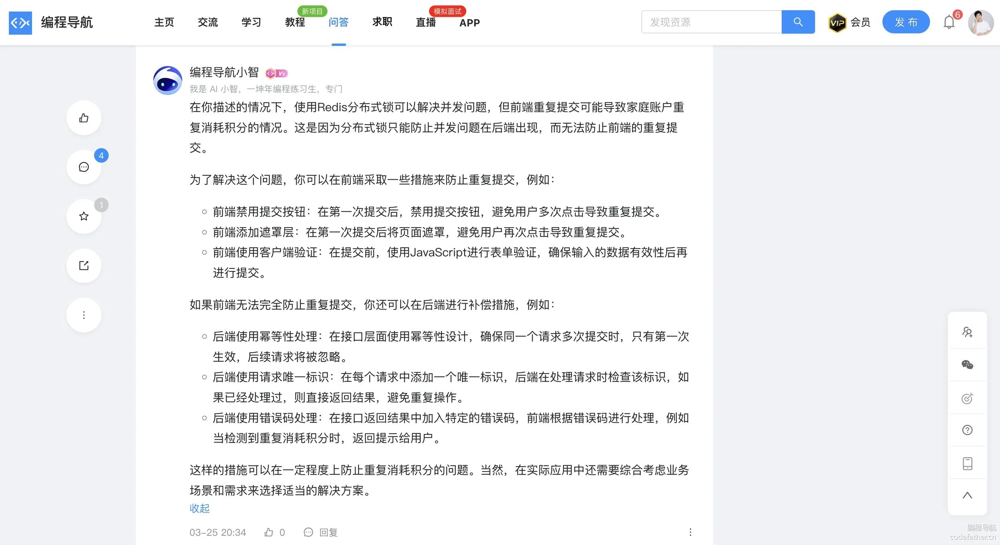

### 恋爱大师应用的潜在需求

对于我们的 AI 恋爱大师，同样可以利用 AI 知识问答满足很多需求。如果自己想不到需求的话，我们可以利用 AI 来挖掘一些需求，得到的结果如下：

#### 1、恋爱问题咨询

用户在恋爱过程中遇到各种问题，如表白方式、约会安排、处理矛盾等，都可以向恋爱大师 AI 应用提问。应用能提供准确、有针对性的解答和建议，帮助用户解决实际问题。

场景示例：用户询问 "第一次约会该如何安排才能给对方留下好印象？"，系统能根据用户的具体情况（年龄、性别、对方偏好等）提供个性化建议，并推荐相关的约会攻略课程。

#### 2、恋爱知识学习与培训

将恋爱知识以课程、文章、问答等形式呈现给用户，开展恋爱知识学习与培训服务。用户可以系统地学习恋爱技巧、情感沟通等知识，提升自己在恋爱方面的素养和能力。

场景示例：根据用户的学习进度和兴趣点，推荐 "高情商沟通技巧"、"如何建立稳定的亲密关系" 等专题内容，并提供互动练习。

#### 3、恋爱社区与互动

在应用中建立社区，用户分享恋爱经验、问题和心得。AI 可以对用户生成的内容进行分析整理，同时根据知识库引导讨论，促进用户互动。

场景示例：当用户在社区发布 "如何处理异地恋" 的话题时，系统能自动汇总相关经验分享，同时提供专业建议和成功案例分析。

#### 4. 恋爱交友匹配                           

基于用户的性格特点、兴趣爱好和恋爱观念，帮助匹配潜在的恋爱对象，提供交流建议。

场景示例：系统分析用户的交流方式和情感需求，推荐性格互补、价值观相近的潜在恋爱对象，并提供破冰话题建议。

### 本项目的具体需求

其实上述需求的实现方式几乎是一致的，所以我们项目将挑选其中一个实现，重点实现 **定制化恋爱知识问答** 功能，让 AI 恋爱大师不仅能回答用户的情感困惑，还能推荐自己出品的相关课程和服务，帮用户解决恋爱难题的同时，实现一波变现。

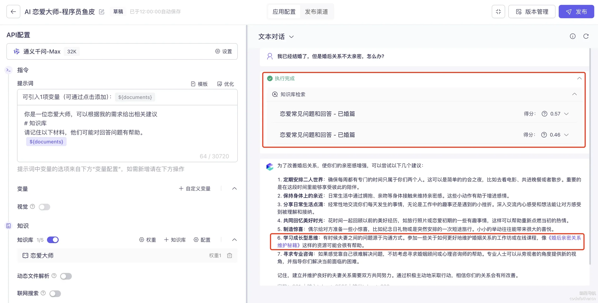

### 如何让 AI 获取知识？

在实现这个需求前，我们需要思考一个关键问题：**恋爱知识从哪里获取呢？**

首先 AI 原本就拥有一些通用的知识，对于不会的知识，还可以利用互联网搜索。但是这些都是从网络获取的、公开的知识。对于企业来说，数据是命脉，也是自己独特的价值，随着业务的发展，企业肯定会积累一波自己的知识库，比如往期用户的恋爱咨询和成功案例、以及自家的恋爱课程，如果让 AI 能够利用这些知识库进行问答，效果可能会更好，而且更加个性化。

如果不给 AI 提供特定领域的知识库，AI 可能会面临这些问题：

1. 知识有限：AI 不知道你的最新课程和内容
2. 编故事：当 AI 不知道答案时，它可能会 “自圆其说” 编造内容
3. 无法个性化：不了解你的特色服务和回答风格
4. 不会推销：不知道该在什么时候推荐你的付费课程和服务

那么如何让 AI 利用自己的知识库进行问答呢？这就需要用到 AI 主流的技术 —— RAG。

## 二、RAG 概念

### 什么是 RAG？

RAG（Retrieval-Augmented Generation，检索增强生成）是一种结合信息检索技术和 AI 内容生成的混合架构，可以解决大模型的知识时效性限制和幻觉问题。

简单来说，RAG 就像给 AI 配了一个 “小抄本”，让 AI 回答问题前先查一查特定的知识库来获取知识，确保回答是基于真实资料而不是凭空想象。

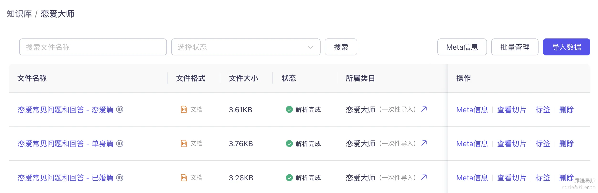

从技术角度看，RAG 在大语言模型生成回答之前，会先从外部知识库中检索相关信息，然后将这些检索到的内容作为额外上下文提供给模型，引导其生成更准确、更相关的回答。

通过 RAG 技术改造后，AI 就能：

- 准确回答关于特定内容的问题
- 在合适的时机推荐相关课程和服务
- 用特定的语气和用户交流
- 提供更新、更准确的建议

可以简单了解下 RAG 和传统 AI 模型的区别：

| 特性 | 传统大语言模型 | RAG 增强模型 |
| --- | --- | --- |
| 知识时效性 | 受训练数据截止日期限制 | 可接入最新知识库 |
| 领域专业性 | 泛化知识，专业深度有限 | 可接入专业领域知识 |
| 响应准确性 | 可能产生 “幻觉” | 基于检索的事实依据 |
| 可控性 | 依赖原始训练 | 可通过知识库定制输出 |
| 资源消耗 | 较高（需要大模型参数） | 模型可更小，结合外部知识 |

### RAG 工作流程

RAG 技术实现主要包含以下 4 个核心步骤，让我们分步来学习：

- 文档收集和切割
- 向量转换和存储
- 文档过滤和检索
- 查询增强和关联

#### 1、文档收集和切割

文档收集：从各种来源（网页、PDF、数据库等）收集原始文档

文档预处理：清洗、标准化文本格式

文档切割：将长文档分割成适当大小的片段（俗称 chunks）

- 基于固定大小（如 512 个 token）
- 基于语义边界（如段落、章节）
- 基于递归分割策略（如递归字符 n-gram 切割）

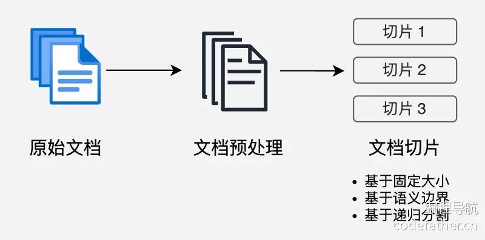

#### 2、向量转换和存储

向量转换：使用 Embedding 模型将文本块转换为高维向量表示，可以捕获到文本的语义特征

向量存储：将生成的向量和对应文本存入向量数据库，支持高效的相似性搜索

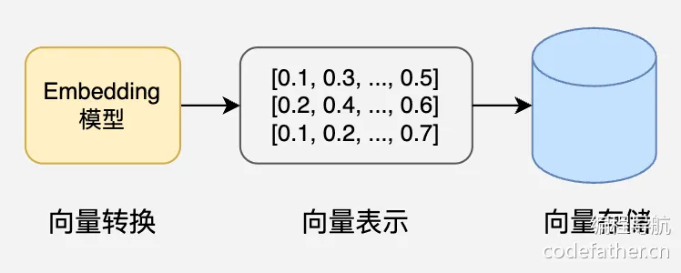

#### 3、文档过滤和检索

查询处理：将用户问题也转换为向量表示

过滤机制：基于元数据、关键词或自定义规则进行过滤

相似度搜索：在向量数据库中查找与问题向量最相似的文档块，常用的相似度搜索算法有余弦相似度、欧氏距离等

上下文组装：将检索到的多个文档块组装成连贯上下文

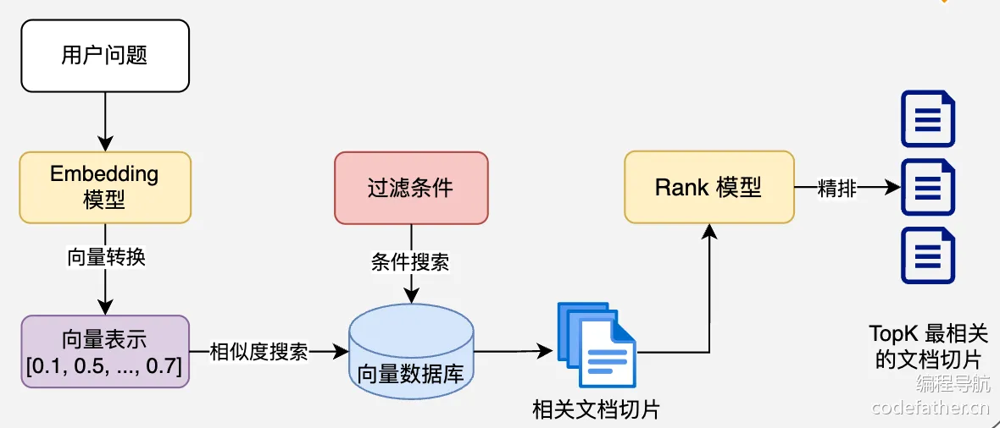

#### 4、查询增强和关联

提示词组装：将检索到的相关文档与用户问题组合成增强提示

上下文融合：大模型基于增强提示生成回答

源引用：在回答中添加信息来源引用

后处理：格式化、摘要或其他处理以优化最终输出

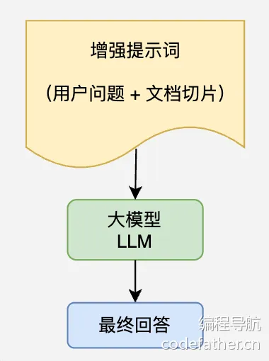

#### 完整工作流程

分别理解上述 4 个步骤后，我们可以将它们组合起来，形成完整的 RAG 检索增强生成工作流程：

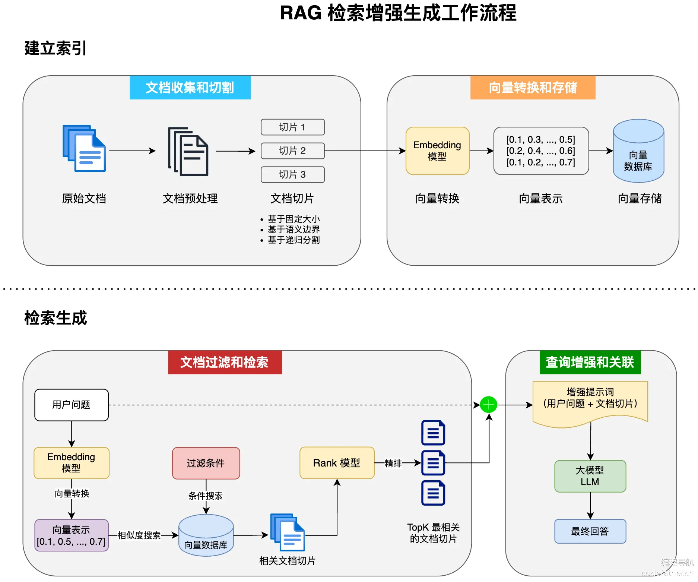

上述工作流程中涉及了很多技术名词，让我们分别进行解释。

### RAG 相关技术

#### Embedding 和 Embedding 模型

Embedding 嵌入是将高维离散数据（如文字、图片）转换为低维连续向量的过程。这些向量能在数学空间中表示原始数据的语义特征，使计算机能够理解数据间的相似性。

Embedding 模型是执行这种转换算法的机器学习模型，如 Word2Vec（文本）、ResNet（图像）等。不同的 Embedding 模型产生的向量表示和维度数不同，一般维度越高表达能力更强，可以捕获更丰富的语义信息和更细微的差别，但同样占用更多存储空间。

举个例子，“鱼皮” 和 “鱼肉” 的 Embedding 向量在空间中较接近，而 “鱼皮” 和 “帅哥” 则相距较远，反映了语义关系。

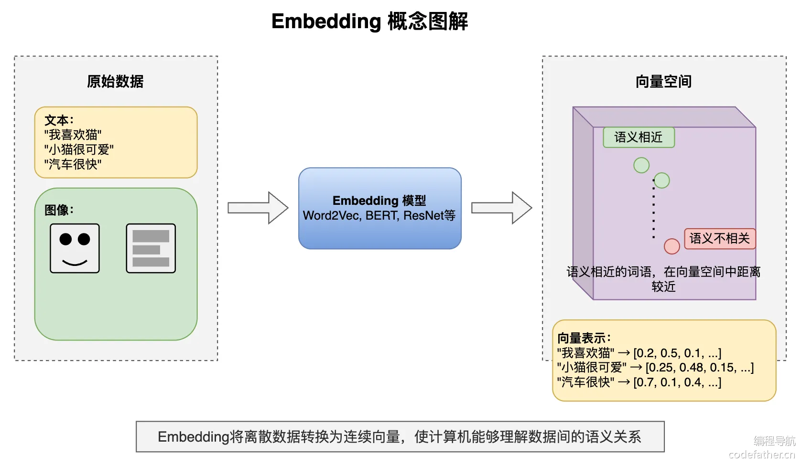

#### 向量数据库

向量数据库是专门存储和检索向量数据的数据库系统。通过高效索引算法实现快速相似性搜索，支持 K 近邻查询等操作。

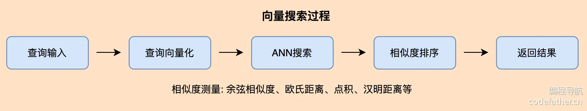

注意，并不是只有向量数据库才能存储向量数据，只不过与传统数据库不同，向量数据库优化了高维向量的存储和检索。

AI 的流行带火了一波向量数据库和向量存储，比如 Milvus、Pinecone 等。此外，一些传统数据库也可以通过安装插件实现向量存储和检索，比如 PGVector、Redis Stack 的 RediSearch 等。

用一张图来了解向量数据库的分类：

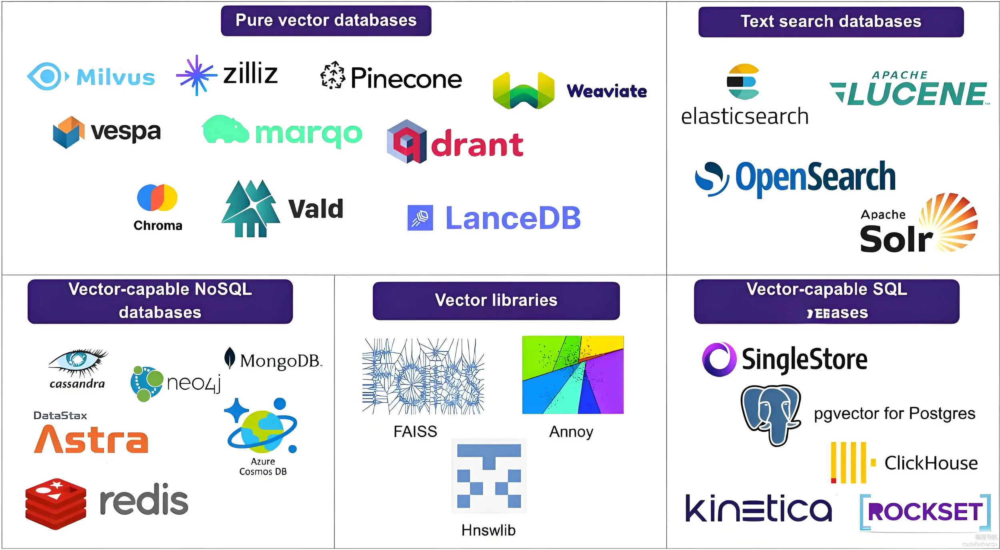

#### 召回

召回是信息检索中的第一阶段，目标是从大规模数据集中快速筛选出可能相关的候选项子集。**强调速度和广度，而非精确度。**

举个例子，我们要从搜索引擎查询 “编程导航 - 程序员一站式编程学习交流社区” 时，召回阶段会从数十亿网页中快速筛选出数千个含有 “编程”、“导航”、“程序员” 等相关内容的页面，为后续粗略排序和精细排序提供候选集。

#### 精排和 Rank 模型

精排（精确排序）是搜索 / 推荐系统的最后阶段，使用计算复杂度更高的算法，考虑更多特征和业务规则，对少量候选项进行更复杂、精细的排序。

比如，短视频推荐先通过召回获取数万个可能相关视频，再通过粗排缩减至数百条，最后精排阶段会考虑用户最近的互动、视频热度、内容多样性等复杂因素，确定最终展示的 10 个视频及顺序。

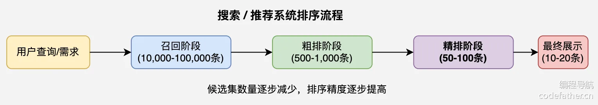

Rank 模型（排序模型）负责对召回阶段筛选出的候选集进行精确排序，考虑多种特征评估相关性。

现代 Rank 模型通常基于深度学习，如 BERT、LambdaMART 等，综合考虑查询与候选项的相关性、用户历史行为等因素。举个例子，电商推荐系统会根据商品特征、用户偏好、点击率等给每个候选商品打分并排序。

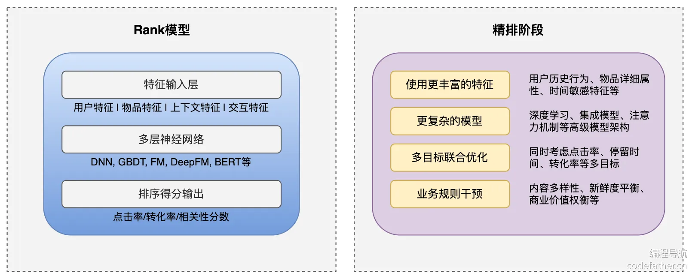

#### 混合检索策略

混合检索策略结合多种检索方法的优势，提高搜索效果。常见组合包括关键词检索、语义检索、知识图谱等。

比如在 AI 大模型开发平台 Dify 中，就为用户提供了 “基于全文检索的关键词搜索 + 基于向量检索的语义检索” 的混合检索策略，用户还可以自己设置不同检索方式的权重。

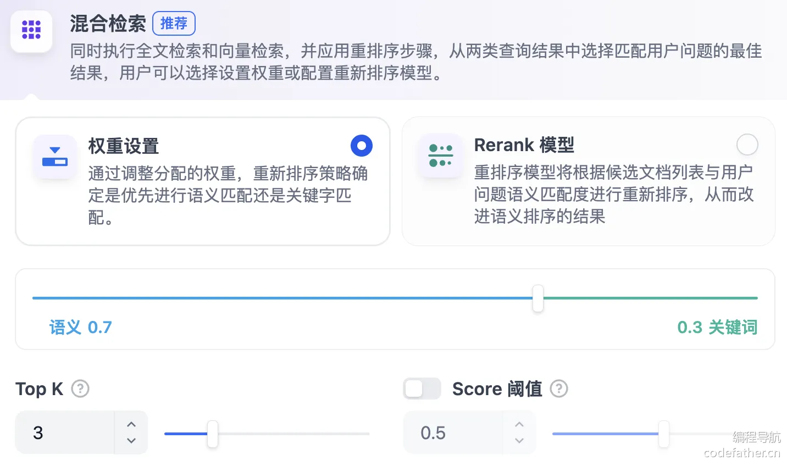

💡 RAG 的工作流程和相关技术是面试时的重点，更多细节大家可以在 面试鸭最新的 AI 大模型题库 中学习：


了解了 RAG 概念后，我们来学习如何利用编程开发实现 RAG。想要在程序中让 AI 使用知识库，首先建议利用一个 AI 开发框架，比如 Spring AI；然后可以通过 2 种模式进行开发 —— 基于本地知识库或云知识库服务实现 RAG。下面分别讲解这 2 种模式。

## 三、RAG 实战：Spring AI + 本地知识库

Spring AI 框架为我们实现 RAG 提供了全流程的支持，参考 Spring AI 和 Spring AI Alibaba 的官方文档。

由于是第一个 RAG 程序，我们参考标准的 RAG 开发步骤并进行一定的简化，来实现基于本地知识库的 AI 恋爱知识问答应用。

标准的 RAG 开发步骤：

1. 文档收集和切割
2. 向量转换和存储
3. 切片过滤和检索
4. 查询增强和关联

简化后的 RAG 开发步骤：

1. 文档准备
2. 文档读取
3. 向量转换和存储
4. 查询增强

### 1、文档准备

首先准备用于给 AI 知识库提供知识的文档，推荐 Markdown 格式，尽量结构化。

这里鱼皮为大家准备了 3 篇《恋爱常见问题和回答》文档，可以在本项目的代码仓库中获取到，保存到资源目录下即可：

- 📎恋爱常见问题和回答 - 单身篇
- 📎恋爱常见问题和回答 - 已婚篇
- 📎恋爱常见问题和回答 - 恋爱篇

网盘链接: https://pan.baidu.com/s/1fpiWAF9\_25ToEBBmir6SwQ
提取码: n4pc

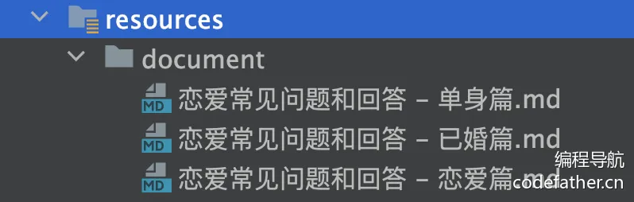

💡 大家在学习 RAG 的过程中，可以利用 AI 来生成文档，提供一段示例 Prompt：

```
帮我生成 3 篇 Markdown 文章，主题是【恋爱常见问题和回答】，3 篇文章的问题分别针对单身、恋爱、已婚的状态，内容形式为 1 问 1 答，每个问题标题使用 4 级标题，每篇内容需要有至少 5 个问题，要求每个问题中推荐一个相关的课程，课程链接都是 https://www.codefather.cn
```

### 2、文档读取

首先，我们要对自己准备好的知识库文档进行处理，然后保存到向量数据库中。这个过程俗称 ETL（抽取、转换、加载），Spring AI 提供了对 ETL 的支持，参考 官方文档。

ETL 的 3 大核心组件，按照顺序执行：

- DocumentReader：读取文档，得到文档列表
- DocumentTransformer：转换文档，得到处理后的文档列表
- DocumentWriter：将文档列表保存到存储中（可以是向量数据库，也可以是其他存储）

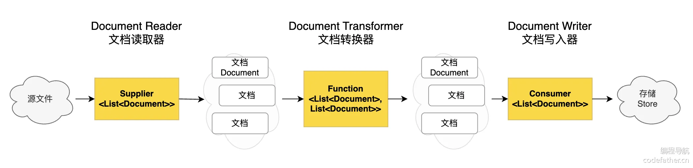

刚开始学习 RAG，我们不需要关注太多 ETL 的细节、也不用对文档进行特殊处理，下面我们就先用 Spring AI 读取准备好的 Markdown 文档，为写入到向量数据库做准备。

1）引入依赖

Spring AI 提供了很多种 DocumentReaders，用于加载不同类型的文件。

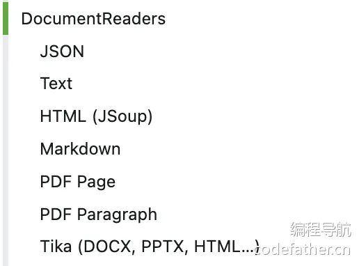

我们可以使用 MarkdownDocumentReader 来读取 Markdown 文档。需要先引入依赖，可以在 Maven 中央仓库 找到（官方都没有提）。

```xml
<dependency>
    <groupId>org.springframework.ai</groupId>
    <artifactId>spring-ai-markdown-document-reader</artifactId>
    <version>1.0.0-M6</version>
</dependency>
```

2）在根目录下新建 `rag` 包，编写文档加载器类 LoveAppDocumentLoader，负责读取所有 Markdown 文档并转换为 Document 列表。代码如下：

```java
@Component
@Slf4j
class LoveAppDocumentLoader {

    private final ResourcePatternResolver resourcePatternResolver;

    LoveAppDocumentLoader(ResourcePatternResolver resourcePatternResolver) {
        this.resourcePatternResolver = resourcePatternResolver;
    }

    public List<Document> loadMarkdowns() {
        List<Document> allDocuments = new ArrayList<>();
        try {
            
            Resource[] resources = resourcePatternResolver.getResources("classpath:document/*.md");
            for (Resource resource : resources) {
                String fileName = resource.getFilename();
                MarkdownDocumentReaderConfig config = MarkdownDocumentReaderConfig.builder()
                        .withHorizontalRuleCreateDocument(true)
                        .withIncludeCodeBlock(false)
                        .withIncludeBlockquote(false)
                        .withAdditionalMetadata("filename", fileName)
                        .build();
                MarkdownDocumentReader reader = new MarkdownDocumentReader(resource, config);
                allDocuments.addAll(reader.get());
            }
        } catch (IOException e) {
            log.error("Markdown 文档加载失败", e);
        }
        return allDocuments;
    }
}
```

上述代码中，我们通过 MarkdownDocumentReaderConfig 文档加载配置来指定读取文档的细节，比如是否读取代码块、引用块等。特别需要注意的是，我们还指定了额外的元信息配置，提取文档的文件名（fileName）作为文档的元信息，可以便于后续知识库实现更精确的检索。

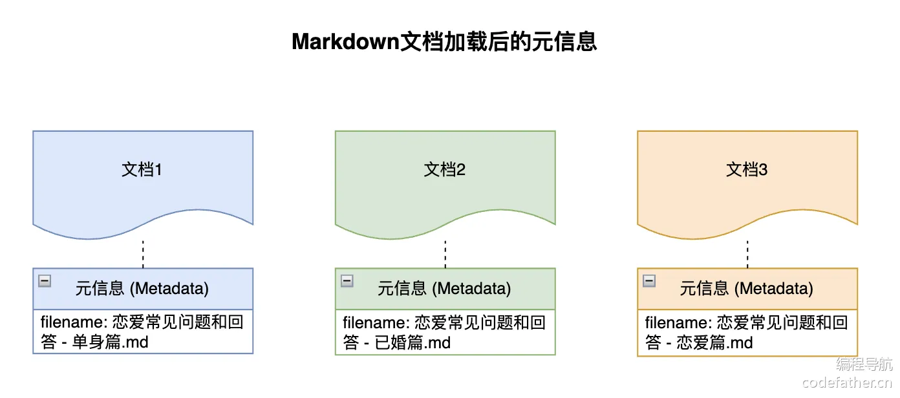

### 3、向量转换和存储

为了实现方便，我们先使用 Spring AI 内置的、基于内存读写的向量数据库 SimpleVectorStore 来保存文档。

SimpleVectorStore 实现了 VectorStore 接口，而 VectorStore 接口集成了 DocumentWriter，所以具备文档写入能力。如图：

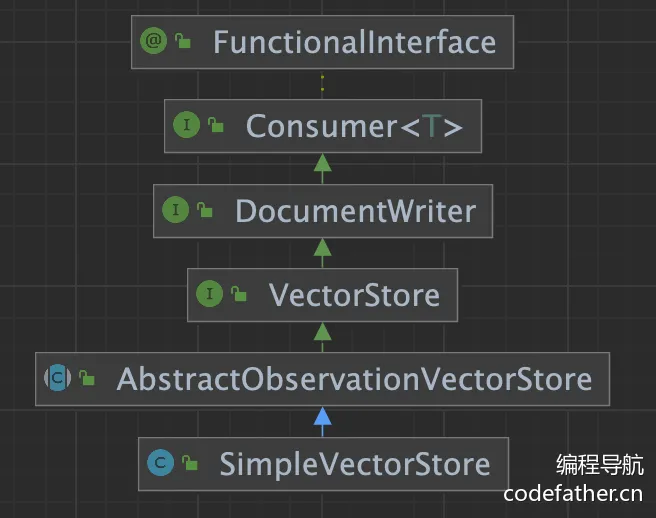

简单了解下源码，在将文档写入到数据库前，会先调用 Embedding 大模型将文档转换为向量，实际保存到数据库中的是向量类型的数据。

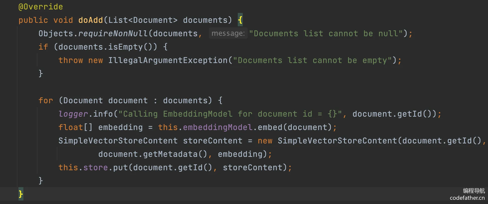

在 `rag` 包下新建 LoveAppVectorStoreConfig 类，实现初始化向量数据库并且保存文档的方法。代码如下：

```java
@Configuration
public class LoveAppVectorStoreConfig {

    @Resource
    private LoveAppDocumentLoader loveAppDocumentLoader;
    
    @Bean
    VectorStore loveAppVectorStore(EmbeddingModel dashscopeEmbeddingModel) {
        SimpleVectorStore simpleVectorStore = SimpleVectorStore.builder(dashscopeEmbeddingModel)
                .build();
        
        List<Document> documents = loveAppDocumentLoader.loadMarkdowns();
        simpleVectorStore.add(documents);
        return simpleVectorStore;
    }
}
```

### 4、查询增强

Spring AI 通过 Advisor 特性提供了开箱即用的 RAG 功能。主要是 QuestionAnswerAdvisor 问答拦截器和 RetrievalAugmentationAdvisor 检索增强拦截器，前者更简单易用、后者更灵活强大。

查询增强的原理其实很简单。向量数据库存储着 AI 模型本身不知道的数据，当用户问题发送给 AI 模型时，QuestionAnswerAdvisor 会查询向量数据库，获取与用户问题相关的文档。然后从向量数据库返回的响应会被附加到用户文本中，为 AI 模型提供上下文，帮助其生成回答。

查看 QuestionAnswerAdvisor 源码，可以看到让 AI 基于知识库进行问答的 Prompt：

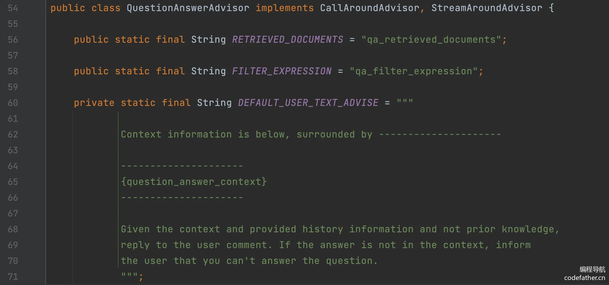

根据 官方文档，需要先引入依赖（但鱼皮操作过程中发现，不引入也可以正常使用）：

```xml
<dependency>
   <groupId>org.springframework.ai</groupId>
   <artifactId>spring-ai-advisors-vector-store</artifactId>
</dependency>
```

此处我们就选用更简单易用的 QuestionAnswerAdvisor 问答拦截器，在 `LoveApp` 中新增和 RAG 知识库进行对话的方法。代码如下：

```java
@Resource
private VectorStore loveAppVectorStore;

public String doChatWithRag(String message, String chatId) {
    ChatResponse chatResponse = chatClient
            .prompt()
            .user(message)
            .advisors(spec -> spec.param(CHAT_MEMORY_CONVERSATION_ID_KEY, chatId)
                    .param(CHAT_MEMORY_RETRIEVE_SIZE_KEY, 10))
            
            .advisors(new MyLoggerAdvisor())
            
            .advisors(new QuestionAnswerAdvisor(loveAppVectorStore))
            .call()
            .chatResponse();
    String content = chatResponse.getResult().getOutput().getText();
    log.info("content: {}", content);
    return content;
}
```

### 测试

编写单元测试代码，故意提问一个文档内有回答的问题：

```java
@Test
void doChatWithRag() {
    String chatId = UUID.randomUUID().toString();
    String message = "我已经结婚了，但是婚后关系不太亲密，怎么办？";
    String answer =  loveApp.doChatWithRag(message, chatId);
    Assertions.assertNotNull(answer);
}
```

运行程序，通过 Debug 发现，加载的文档被自动按照小标题拆分，并且补充了 metadata 元信息：

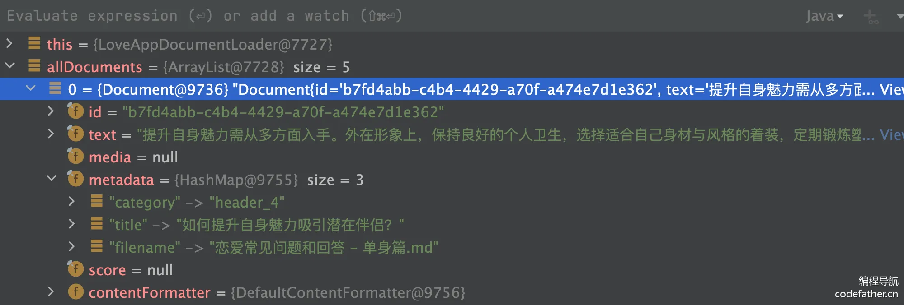

查看请求，发现根据用户的问题检索到了 4 个文档切片，每个切片有对应的分数和元信息：

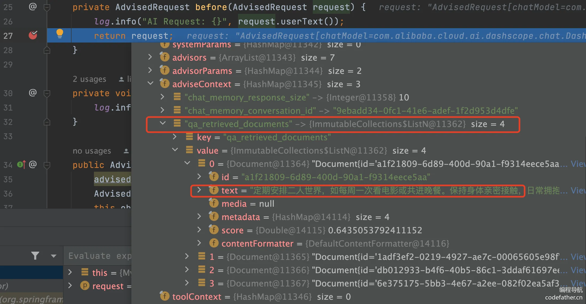

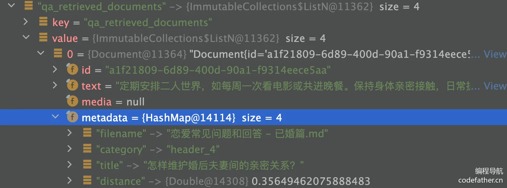

查看请求，发现用户的提示词被修改了，让 AI 检索知识库：

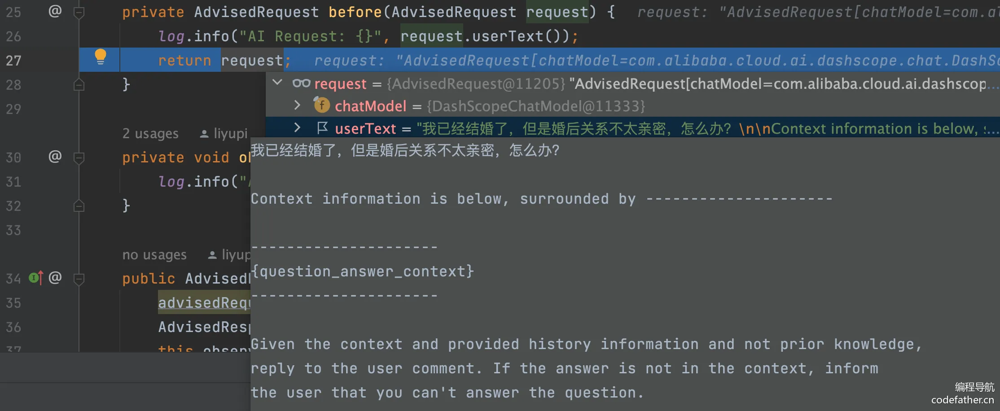

查看响应结果，AI 的回复成功包含了知识库里的内容：

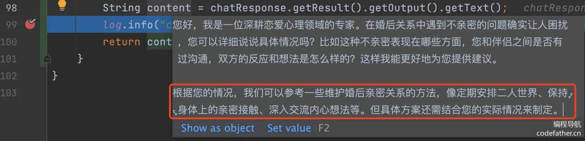

## 四、RAG 实战：Spring AI + 云知识库服务

在上一小节中，我们文档读取、文档加载、向量数据库是在本地通过编程的方式实现的。其实还有另外一种模式，直接使用别人提供的云知识库服务来简化 RAG 的开发。但缺点是额外的费用、以及数据隐私问题。

很多 AI 大模型应用开发平台都提供了云知识库服务，这里我们还是选择 阿里云百炼，因为 Spring AI Alibaba 可以和它轻松集成，简化 RAG 开发。

### 1、准备云知识库

首先我们可以利用云知识库完成文档读取、文档处理、文档加载、保存到向量数据库、知识库管理等操作。

1）准备数据。在 应用数据 模块中，上传原始文档数据到平台，由平台来帮忙解析文档中的内容和结构：

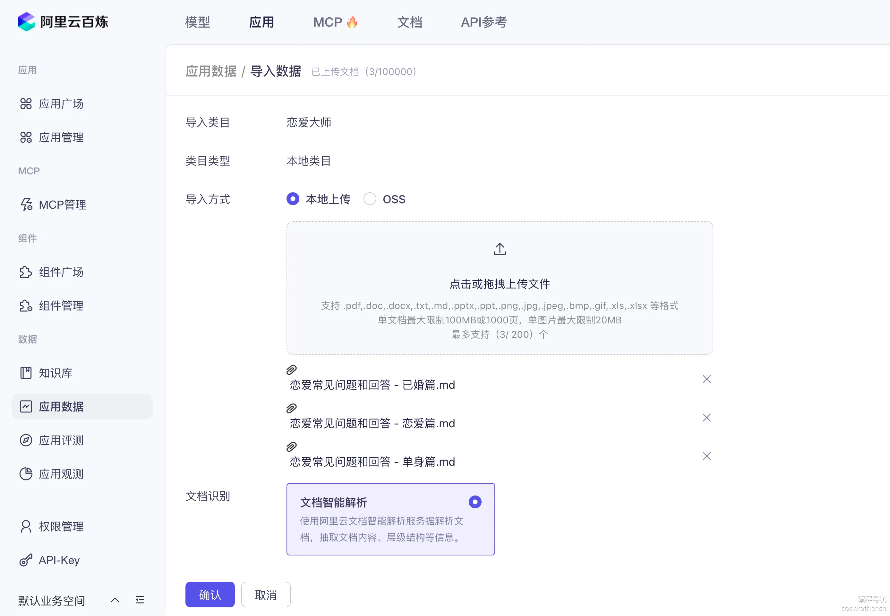

2）进入阿里云百炼平台的 知识库，创建一个知识库，选择推荐配置即可：

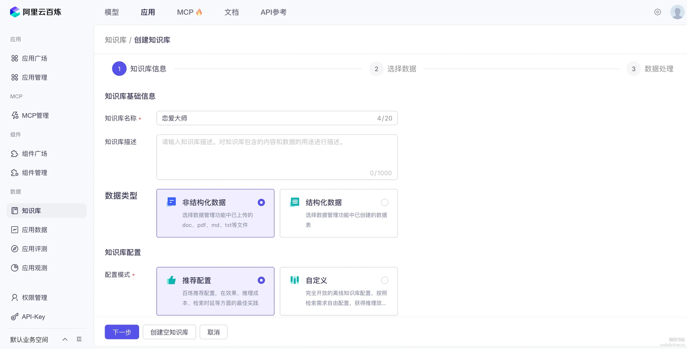

3）导入数据到知识库中，先选择要导入的数据：

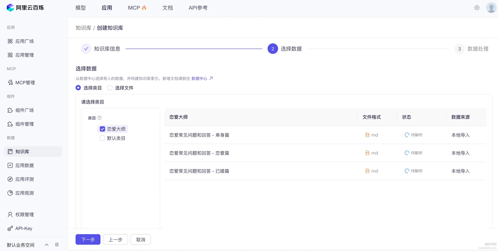

导入数据时，可以设置数据预处理规则，智能切分文档为文档切片（一部分文档）：

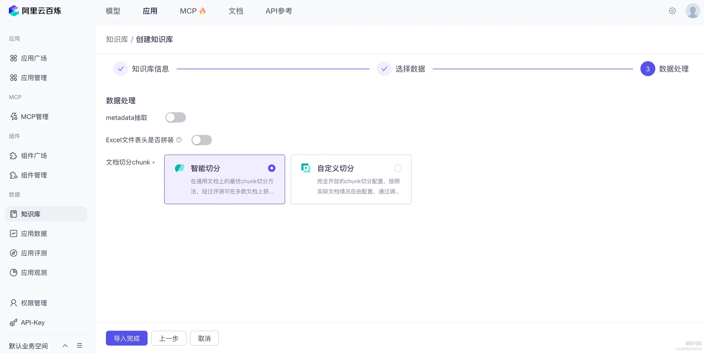

创建好知识库后，进入知识库查看文档和切片：

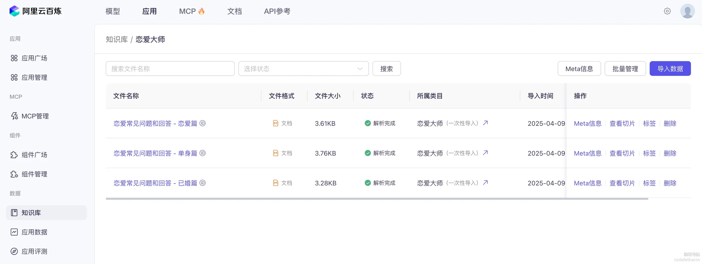

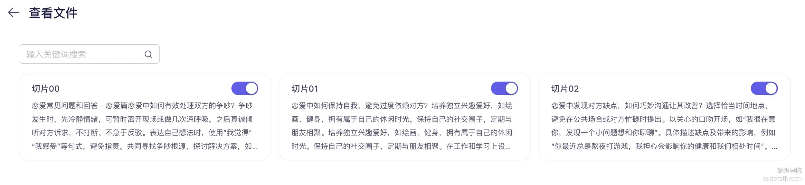

如果你觉得智能切分得到的切片不合理，可以手动编辑切片内容：                     

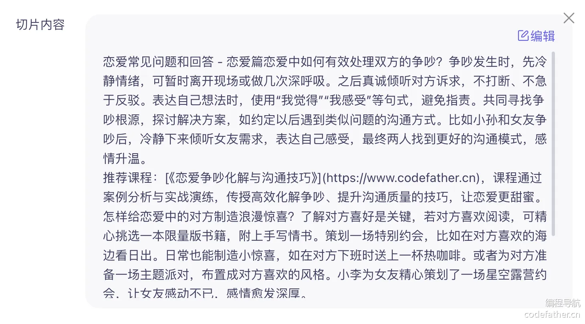

### 2、RAG 开发

有了知识库后，我们就可以用程序来对接了。开发过程很简单，可以参考 Spring AI Alibaba 的官方文档 来学习。

Spring AI Alibaba 利用了 Spring AI 提供的文档检索特性（DocumentRetriever），自定义了一套文档检索的方法，使得程序会调用阿里灵积大模型 API 来从云知识库中检索文档，而不是从内存中检索。

使用下列代码就可以创建一个文档检索器并发起查询：

```
var dashScopeApi = new DashScopeApi("DASHSCOPE_API_KEY");

DocumentRetriever retriever = new DashScopeDocumentRetriever(dashScopeApi,
        DashScopeDocumentRetrieverOptions.builder()
                .withIndexName("你的知识库名称")
                .build());

List<Document> documentList = retriever.retrieve(new Query("谁是鱼皮"));
```

如何使用这个文档检索器，让 AI 从云知识库查询文档呢？

这就需要使用 Spring AI 提供的另一个 RAG Advisor —— RetrievalAugmentationAdvisor 检索增强顾问，可以绑定文档检索器、查询转换器和查询增强器，更灵活地构造查询。

示例代码如下，先仅作了解即可，后面章节中会带大家实战检索增强顾问的更多特性：

```
Advisor retrievalAugmentationAdvisor = RetrievalAugmentationAdvisor.builder()
        .queryTransformers(RewriteQueryTransformer.builder()
                .chatClientBuilder(chatClientBuilder.build().mutate())
                .build())
        .documentRetriever(VectorStoreDocumentRetriever.builder()
                .similarityThreshold(0.50)
                .vectorStore(vectorStore)
                .build())
        .build();

String answer = chatClient.prompt()
        .advisors(retrievalAugmentationAdvisor)
        .user(question)
        .call()
        .content();
```

1）回归到我们的项目中，先编写一个配置类，用于初始化基于云知识库的检索增强顾问 Bean：

```java
@Configuration
@Slf4j
class LoveAppRagCloudAdvisorConfig {

    @Value("${spring.ai.dashscope.api-key}")
    private String dashScopeApiKey;

    @Bean
    public Advisor loveAppRagCloudAdvisor() {
        DashScopeApi dashScopeApi = new DashScopeApi(dashScopeApiKey);
        final String KNOWLEDGE_INDEX = "恋爱大师";
        DocumentRetriever documentRetriever = new DashScopeDocumentRetriever(dashScopeApi,
                DashScopeDocumentRetrieverOptions.builder()
                        .withIndexName(KNOWLEDGE_INDEX)
                        .build());
        return RetrievalAugmentationAdvisor.builder()
                .documentRetriever(documentRetriever)
                .build();
    }
}
```

注意上述代码中指定知识库要 **使用名称**（而不是 id）。

2）然后在 `LoveApp` 中使用该 Advisor：

```java
@Resource
private Advisor loveAppRagCloudAdvisor;

public String doChatWithRag(String message, String chatId) {
    ChatResponse chatResponse = chatClient
            .prompt()
            .user(message)
            .advisors(spec -> spec.param(CHAT_MEMORY_CONVERSATION_ID_KEY, chatId)
                    .param(CHAT_MEMORY_RETRIEVE_SIZE_KEY, 10))
            
            .advisors(new MyLoggerAdvisor())
            
            .advisors(loveAppRagCloudAdvisor)
            .call()
            .chatResponse();
    String content = chatResponse.getResult().getOutput().getText();
    log.info("content: {}", content);
    return content;
}
```

3）测试一下。通过 Debug 查看请求，能发现检索到了多个文档切片，每个切片有对应的元信息：

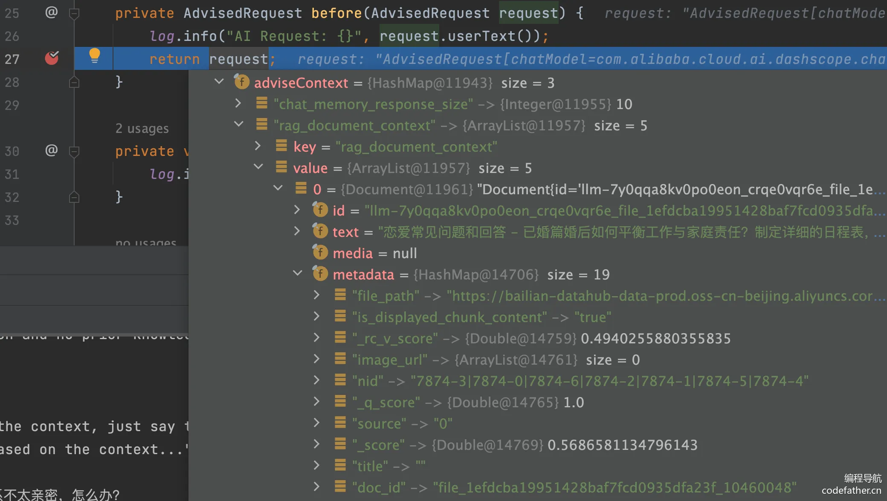

查看请求，发现用户提示词被改写，查询到的关联文档已经作为上下文拼接到了用户提示词中：

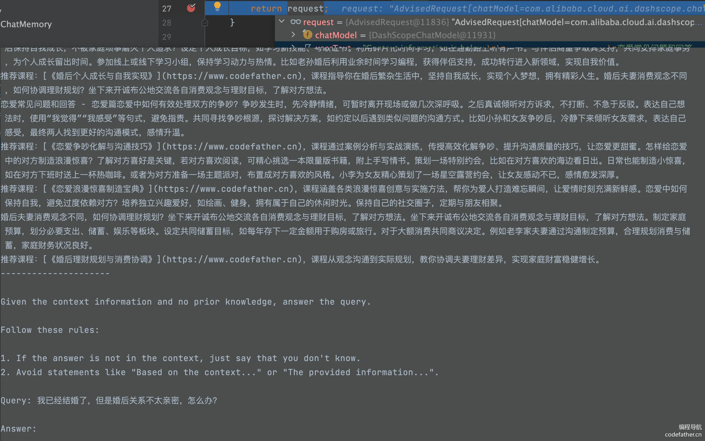

查看响应结果，成功包含了知识库里的内容：

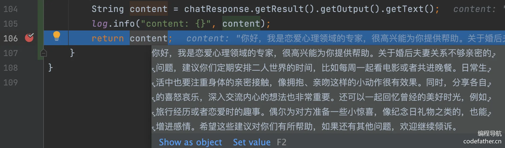

---

至此，我们就学完了 RAG 知识库的基本开发，在下一章中，会带大家实战更多 RAG 的高级特性和最佳实践，满足更复杂的 AI 知识库开发需求。

## 扩展思路

1）利用 RAG 知识库，实现 “通过用户的问题推荐可能的恋爱对象” 功能。

参考思路：新建一个恋爱对象文档，每行数据包含一位用户的基本信息（比如年龄、星座、职业）。

## 本节作业

1）理解 RAG 的工作流程和原理

2）实战基于 Spring AI + 本地知识库实现 RAG

3）实战基于 Spring AI + 云知识库实现 RAG
