+++
title = "工具调用"
date = "2026-10-07T12:00:00+08:00"
weight = 1
summary = "工具调用：通过 Tool Calling / Function Calling 让 AI 调用外部能力。"
+++

## 本节重点

以 Spring AI 框架为例，学习 AI 应用开发的核心特性 —— 工具调用，大幅增强 AI 的能力，并实战主流工具的开发，熟悉工具的原理和高级特性。

具体内容包括：

- 工具调用介绍
- Spring AI 工具开发
- 主流工具开发
- 文件操作
- 联网搜索
- 网页抓取
- 终端操作
- 资源下载
- PDF 生成
- 工具进阶知识（原理和高级特性）

友情提示：由于 AI 的更新速度飞快，随着平台 / 工具 / 技术 / 软件的更新，教程的部分细节可能会失效，所以请大家重点学习思路和方法，不要因为实操和教程不一致就过于担心，而是要学会自己阅读官方文档并查阅资料，多锻炼自己解决问题的能力。

## 一、需求分析

之前我们通过 RAG 技术让 AI 应用具备了根据外部知识库来获取信息并回答的能力，但是直到目前为止，AI 应用还只是个 “知识问答助手”。本节我们可以利用 **工具调用** 特性，实现更多需求。

1）联网搜索

比如智能推荐约会地点，示例用户提问：

- 周末想带女朋友去上海约会，推荐几个适合情侣的小众打卡地？
- 女朋友生气了，有哪些温柔的哄人技巧？

2）网页抓取

比如分析恋爱案例，示例用户提问：

- 最近和对象吵架了，看看 编程导航 的其他情侣是怎么解决矛盾的？

3）资源下载

比如恋爱相关的图片 / 音视频下载，示例用户提问：

- 下载一张适合做手机壁纸的星空情侣图片
- 推荐并下载几首适合约会时播放的钢琴曲

4）终端操作

比如执行代码来生成恋爱报告，示例用户提问：

- 执行 Python 脚本来生成数据分析报告

5）文件操作

比如保存用户恋爱档案，示例用户提问：

- 帮我保存我的恋爱档案为文件

6）PDF 生成

比如恋爱计划、情感分析报告 PDF 生成，示例用户提问：

- 生成一份《七夕约会计划》PDF，包含餐厅预订、活动流程和礼物清单
- 分析我和对象近一个月的聊天记录，生成情感报告

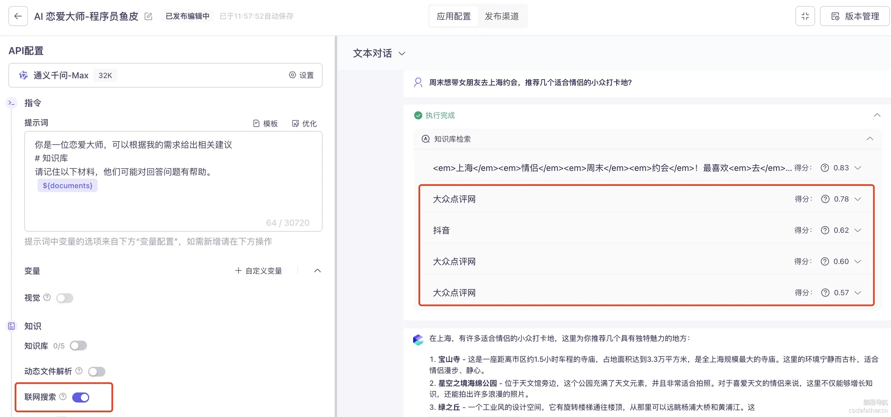

而且这些需求还可以进行组合，比如用户先让 AI 联网搜索约会地点、再下载约会地点的图片、最后将获取到的内容组合生成 PDF、并保存到本地，一条龙服务。

如果 AI 能够完成上述需求，就不再只是一个有知识的 “大脑”，而是有手有脚，会利用工具完成任务的 “智能体” 了。

下面我们就来学习下实现上述需求的关键 —— **工具调用** 技术。

## 二、工具调用介绍

### 什么是工具调用？

工具调用（Tool Calling）可以理解为让 AI 大模型 **借用外部工具** 来完成它自己做不到的事情。

跟人类一样，如果只凭手脚完成不了工作，那么就可以利用工具箱来完成。

工具可以是任何东西，比如网页搜索、对外部 API 的调用、访问外部数据、或执行特定的代码等。

比如用户提问 “帮我查询上海最新的天气”，AI 本身并没有这些知识，它就可以调用 “查询天气工具”，来完成任务。

目前工具调用技术发展的已经比较成熟了，几乎所有主流的、新出的 AI 大模型和 AI 应用开发平台都支持工具调用。

### 工具调用的工作原理

其实，工具调用的工作原理非常简单，**并不是 AI 服务器自己调用这些工具、也不是把工具的代码发送给 AI 服务器让它执行**，它只能提出要求，表示 “我需要执行 XX 工具完成任务”。而真正执行工具的是我们自己的应用程序，执行后再把结果告诉 AI，让它继续工作。

举个例子，假如用户提问 “编程导航网站有哪些热门文章？”，就需要经历下列流程：

1. 用户提出问题："编程导航网站有哪些热门文章？"
2. 程序将问题传递给大模型
3. 大模型分析问题，判断需要使用工具（网页抓取工具）来获取信息
4. 大模型输出工具名称和参数（网页抓取工具，URL 参数为 codefather.cn）
5. 程序接收工具调用请求，执行网页抓取操作
6. 工具执行抓取并返回文章数据
7. 程序将抓取结果传回给大模型
8. 大模型分析网页内容，生成关于编程导航热门文章的回答
9. 程序将大模型的回答返回给用户

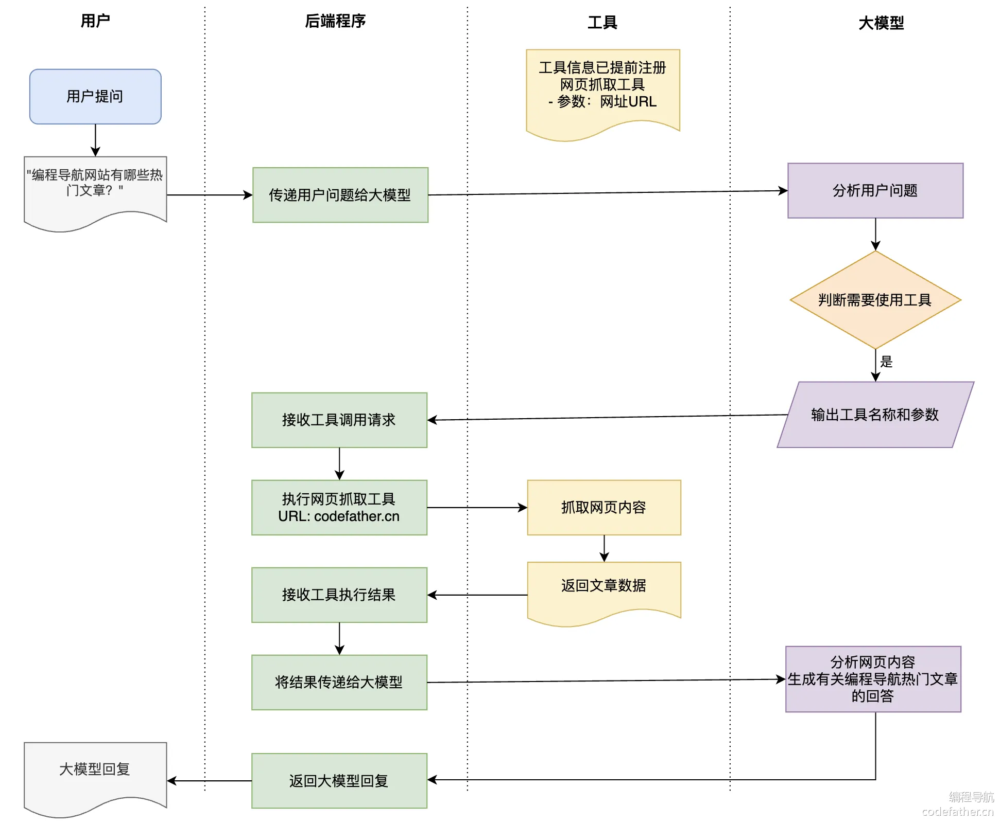

虽然看起来是 AI 在调用工具，但实际上整个过程是 **由我们的应用程序控制的**。AI 只负责决定什么时候需要用工具，以及需要传递什么参数，真正执行工具的是我们的程序。

你可能会好奇，为啥要这么设计呢？这样不是要让程序请求 AI 多次么？为啥不让 AI 服务器直接调用工具程序？

有这个想法很正常，但如果让你自己设计一个 AI 大模型服务，你就能理解了。很关键的一点是 **安全性**，AI 模型永远无法直接接触你的 API 或系统资源，所有操作都必须通过你的程序来执行，这样你可以完全控制 AI 能做什么、不能做什么。

举个例子，你有一个爆破工具，用户像 AI 提了需求 ” 我要拆这栋房子 “，虽然 AI 表示可以用爆破工具，但是需要经过你的同意，才能执行爆破。反之，如果把爆破工具植入给 AI，AI 觉得自己能炸了，就炸了，不需要再问你的意见。而且这样也给 AI 服务器本身增加了压力。

### 工具调用和功能调用

大家可能看到过 Function Calling（功能调用）这个概念，别担心，其实它和 Tool Calling（工具调用）完全是同一概念！只是不同平台或每个人习惯的叫法不同而已。

Spring AI 工具调用文档 的开头就说明了这一点：

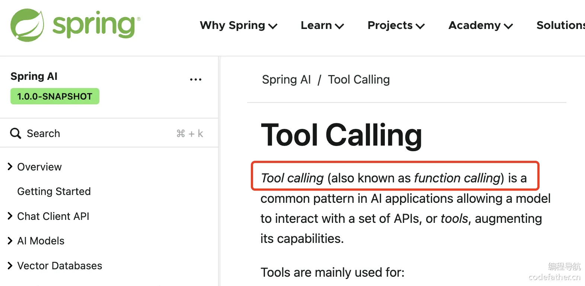

鱼皮个人更喜欢 “工具调用” 这个说法，因为 Function 这个词更像是计算机行业的术语，不如工具更形象易懂、更具普适性。

### 工具调用的技术选型

我们先来梳理一下工具调用的流程：

1. 工具定义：程序告诉 AI “你可以使用这些工具”，并描述每个工具的功能和所需参数
2. 工具选择：AI 在对话中判断需要使用某个工具，并准备好相应的参数
3. 返回意图：AI 返回 “我想用 XX 工具，参数是 XXX” 的信息
4. 工具执行：我们的程序接收请求，执行相应的工具操作
5. 结果返回：程序将工具执行的结果发回给 AI
6. 继续对话：AI 根据工具返回的结果，生成最终回答给用户

通过上述流程，我们会发现，程序需要和 AI 多次进行交互、还要能够执行对应的工具，怎么实现这些呢？我们当然可以自主开发，不过还是更推荐使用 Spring AI、LangChain 等开发框架。此外，有些 AI 大模型服务商也提供了对应的 SDK，都能够简化代码编写。

本教程后续部分将以 Spring AI 为例，带大家实战工具调用开发。

💡 需要注意的是，不是所有大模型都支持工具调用。有些基础模型或早期版本可能不支持这个能力。可以在 Spring AI 官方文档 中查看各模型支持情况。

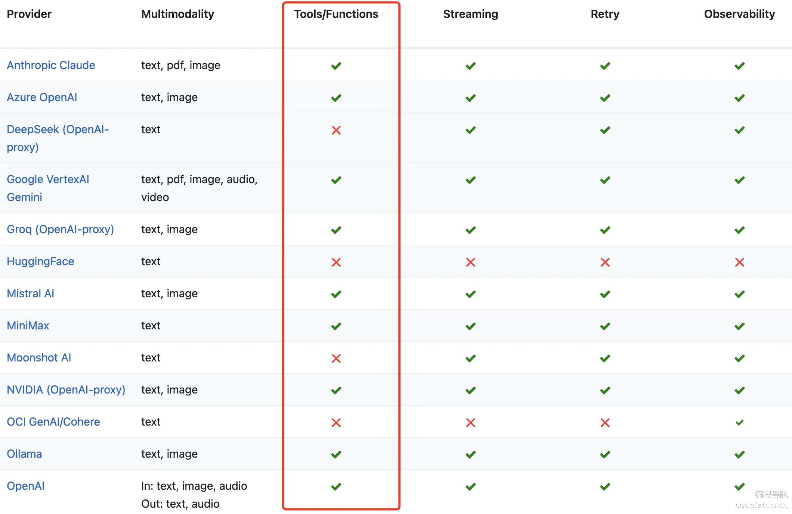

## 三、Spring AI 工具开发

首先我们通过 Spring AI 官方 提供的图片来理解 Spring AI 在实现工具调用时都帮我们做了哪些事情？

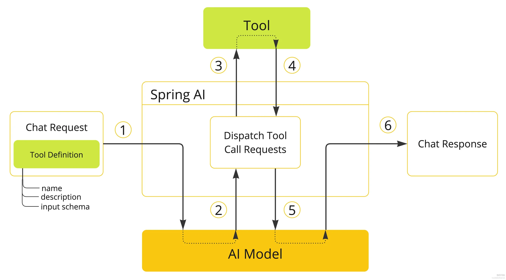

1. 工具定义与注册：Spring AI 可以通过简洁的注解自动生成工具定义和 JSON Schema，让 Java 方法轻松转变为 AI 可调用的工具。
2. 工具调用请求：Spring AI 自动处理与 AI 模型的通信并解析工具调用请求，并且支持多个工具链式调用。
3. 工具执行：Spring AI 提供统一的工具管理接口，自动根据 AI 返回的工具调用请求找到对应的工具并解析参数进行调用，让开发者专注于业务逻辑实现。
4. 处理工具结果：Spring AI 内置结果转换和异常处理机制，支持各种复杂 Java 对象作为返回值并优雅处理错误情况。
5. 返回结果给模型：Spring AI 封装响应结果并管理上下文，确保工具执行结果正确传递给模型或直接返回给用户。
6. 生成最终响应：Spring AI 自动整合工具调用结果到对话上下文，支持多轮复杂交互，确保 AI 回复的连贯性和准确性。

下面是一个较早版本的流程图，也能帮助我们理解这个过程：

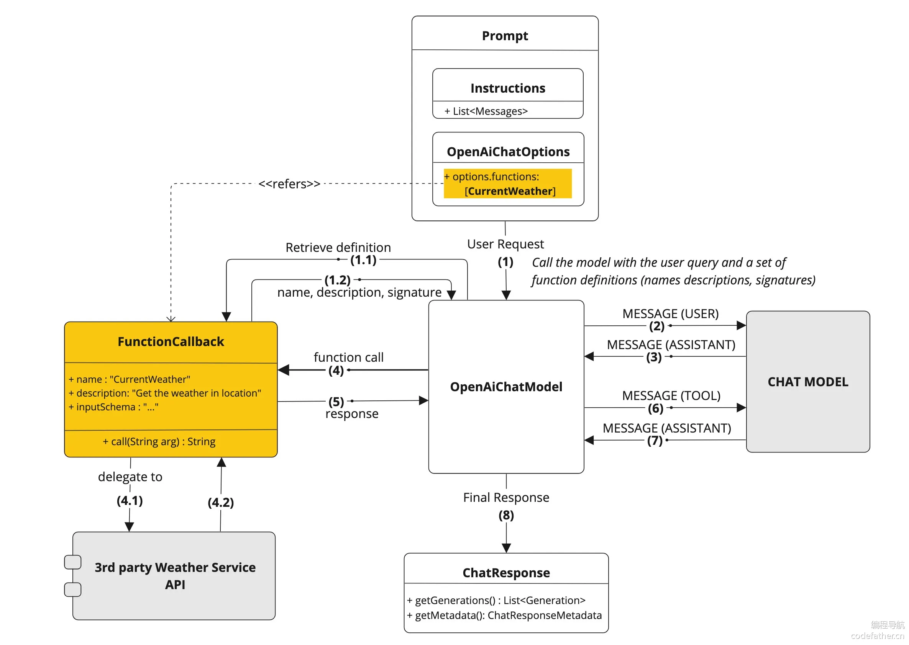

### 定义工具

#### 工具定义模式

在 Spring AI 中，定义工具主要有两种模式：基于 Methods 方法或者 Functions 函数式编程。

记结论就行了，我们只用学习 **基于 Methods 方法** 来定义工具，另外一种了解即可。原因是 Methods 方式更容易编写、更容易理解、支持的参数和返回类型更多。

二者的详细对比：

| 特性 | Methods 方式 | Functions 方式 |
| --- | --- | --- |
| 定义方式 | 使用 @Tool 和 @ToolParam 注解标记类方法 | 使用函数式接口并通过 Spring Bean 定义 |
| 语法复杂度 | 简单，直观 | 较复杂，需要定义请求 /响应对象 |
| 支持的参数类型 | 大多数 Java 类型，包括基本类型、POJO、集合等 | 不支持基本类型、Optional、集合类型 |
| 支持的返回类型 | 几乎所有可序列化类型，包括 void | 不支持基本类型、Optional、集合类型等 |
| 使用场景 | 适合大多数新项目开发 | 适合与现有函数式 API 集成 |
| 注册方式 | 支持按需注册和全局注册 | 通常在配置类中预先定义 |
| 类型转换 | 自动处理 | 需要更多手动配置 |
| 文档支持 | 通过注解提供描述 | 通过 Bean 描述和 JSON 属性注解 |

举个例子来对比这两种定义模式：

1）Methods 模式：通过 `@Tool` 注解定义工具，通过 `tools` 方法绑定工具

```java
class WeatherTools {
    @Tool(description = "Get current weather for a location")
    public String getWeather(@ToolParam(description = "The city name") String city) {
        return "Current weather in " + city + ": Sunny, 25°C";
    }
}

ChatClient.create(chatModel)
    .prompt("What's the weather in Beijing?")
    .tools(new WeatherTools())
    .call();
```

2）Functions 模式：通过 `@Bean` 注解定义工具，通过 `functions` 方法绑定工具

```java
@Configuration
public class ToolConfig {
    @Bean
    @Description("Get current weather for a location")
    public Function<WeatherRequest, WeatherResponse> weatherFunction() {
        return request -> new WeatherResponse("Weather in " + request.getCity() + ": Sunny, 25°C");
    }
}

ChatClient.create(chatModel)
    .prompt("What's the weather in Beijing?")
    .functions("weatherFunction")
    .call();
```

显然 Methods 模式的开发量更少（我估计很多同学都没写过 Function 函数式编程），更推荐这种方式，所以下面重点讲解这种方式。

#### 定义工具

Spring AI 提供了两种定义工具的方法 —— **注解式** 和 **编程式**。

1）注解式：只需使用 `@Tool` 注解标记普通 Java 方法，就可以定义工具了，简单直观。

每个工具最好都添加详细清晰的描述，帮助 AI 理解何时应该调用这个工具。对于工具方法的参数，可以使用 `@ToolParam` 注解提供额外的描述信息和是否必填。

示例代码：

```java
class WeatherTools {
    @Tool(description = "获取指定城市的当前天气情况")
    String getWeather(@ToolParam(description = "城市名称") String city) {
        
        return "北京今天晴朗，气温25°C";
    }
}
```

2）编程式：如果想在运行时动态创建工具，可以选择编程式来定义工具，更灵活。

先定义工具类：

```java
class WeatherTools {
    String getWeather(String city) {
        
        return "北京今天晴朗，气温25°C";
    }
}
```

然后将工具类转换为 ToolCallback 工具定义类，之后就可以把这个类绑定给 ChatClient，从而让 AI 使用工具了。

```
Method method = ReflectionUtils.findMethod(WeatherTools.class, "getWeather", String.class);
ToolCallback toolCallback = MethodToolCallback.builder()
    .toolDefinition(ToolDefinition.builder(method)
            .description("获取指定城市的当前天气情况")
            .build())
    .toolMethod(method)
    .toolObject(new WeatherTools())
    .build();
```

其实你会发现，编程式就是把注解式的那些参数，改成通过调用方法来设置了而已。

在定义工具时，需要注意方法参数和返回值类型的选择。Spring AI 支持大多数常见的 Java 类型作为参数和返回值，包括基本类型、复杂对象、集合等。而且返回值需要是可序列化的，因为它将被发送给 AI 大模型。

以下类型目前不支持作为工具方法的参数或返回类型：

- Optional
- 异步类型（如 CompletableFuture, Future）
- 响应式类型（如 Flow, Mono, Flux）
- 函数式类型（如 Function, Supplier, Consumer）

### 使用工具

定义好工具后，Spring AI 提供了多种灵活的方式将工具提供给 ChatClient，让 AI 能够在需要时调用这些工具。

1）按需使用：这是最简单的方式，直接在构建 ChatClient 请求时通过 `tools()` 方法附加工具。这种方式适合只在特定对话中使用某些工具的场景。

```
String response = ChatClient.create(chatModel)
    .prompt("北京今天天气怎么样？")
    .tools(new WeatherTools())  
    .call()
    .content();
```

2）全局使用：如果某些工具需要在所有对话中都可用，可以在构建 ChatClient 时注册默认工具。这样，这些工具将对从同一个 ChatClient 发起的所有对话可用。

```
ChatClient chatClient = ChatClient.builder(chatModel)
    .defaultTools(new WeatherTools(), new TimeTools())  
    .build();
```

3）更底层的使用方式：除了给 ChatClient 绑定工具外，也可以给更底层的 ChatModel 绑定工具（毕竟工具调用是 AI 大模型支持的能力），适合需要更精细控制的场景。

```
ToolCallback[] weatherTools = ToolCallbacks.from(new WeatherTools());

ChatOptions chatOptions = ToolCallingChatOptions.builder()
    .toolCallbacks(weatherTools)
    .build();

Prompt prompt = new Prompt("北京今天天气怎么样？", chatOptions);
chatModel.call(prompt);
```

4）动态解析：一般情况下，使用前面 3 种方式即可。对于更复杂的应用，Spring AI 还支持通过 `ToolCallbackResolver` 在运行时动态解析工具。这种方式特别适合工具需要根据上下文动态确定的场景，比如从数据库中根据工具名搜索要调用的工具。在本节的工具进阶知识中会讲到，先了解到有这种方式即可。

---

总结一下，在使用工具时，Spring AI 会自动处理工具调用的全过程：从 AI 模型决定调用工具 => 到执行工具方法 => 再到将结果返回给模型 => 最后模型基于工具结果生成最终回答。这整个过程对开发者来说是透明的，我们只需专注于 **实现工具** 的业务逻辑即可。

那么，怎么实现工具呢？

### 工具生态

首先，工具的本质就是一种插件。能不自己写的插件，就尽量不要自己写。我们可以直接在网上找一些优秀的工具实现，比如 Spring AI Alibaba 官方文档 中提到了社区插件。

虽然文档里只提到了屈指可数的插件数，但我们可以顺藤摸瓜，在 GitHub 社区找到官方提供的更多 工具源码，包含大量有用的工具！比如翻译工具、网页搜索工具、爬虫工具、地图工具等：

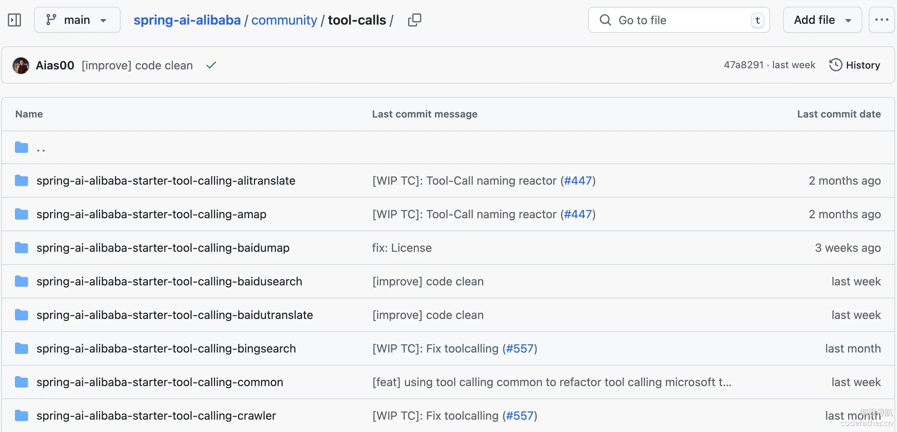

💡 这种搜集资源的能力，希望大家也能够掌握，尤其是学新技术的时候，即使官方文档写的不够清晰完善，我们也可以从开源社区中获取到一手信息。

## 四、主流工具开发

如果社区中没找到合适的工具，我们就要自主开发。需要注意的是，AI 自身能够实现的功能通常没必要定义为额外的工具，因为这会增加一次额外的交互，我们应该将工具用于 AI 无法直接完成的任务。

下面我们依次来实现需求分析中提到的 6 大工具，开发过程中我们要 **格外注意工具描述的定义**，因为它会影响 AI 决定是否使用工具。

先在项目根包下新建 `tools` 包，将所有工具类放在该包下；并且工具的返回值尽量使用 String 类型，让结果的含义更加明确。

### 文件操作

文件操作工具主要提供 2 大功能：保存文件、读取文件。

由于会影响系统资源，所以我们需要将文件统一存放到一个隔离的目录进行存储，在 `constant` 包下新建文件常量类，约定文件保存目录为项目根目录下的 `/tmp` 目录中。

```java
public interface FileConstant {

    
    String FILE_SAVE_DIR = System.getProperty("user.dir") + "/tmp";
}
```

建议同时将这个目录添加到 `.gitignore` 文件中，避免提交隐私信息。

编写文件操作工具类，通过注解式定义工具，代码如下：

```java
public class FileOperationTool {

    private final String FILE_DIR = FileConstant.FILE_SAVE_DIR + "/file";

    @Tool(description = "Read content from a file")
    public String readFile(@ToolParam(description = "Name of the file to read") String fileName) {
        String filePath = FILE_DIR + "/" + fileName;
        try {
            return FileUtil.readUtf8String(filePath);
        } catch (Exception e) {
            return "Error reading file: " + e.getMessage();
        }
    }

    @Tool(description = "Write content to a file")
    public String writeFile(
        @ToolParam(description = "Name of the file to write") String fileName,
        @ToolParam(description = "Content to write to the file") String content) {
        String filePath = FILE_DIR + "/" + fileName;
        try {
            
            FileUtil.mkdir(FILE_DIR);
            FileUtil.writeUtf8String(content, filePath);
            return "File written successfully to: " + filePath;
        } catch (Exception e) {
            return "Error writing to file: " + e.getMessage();
        }
    }
}
```

编写单元测试验证工具功能：

```java
@SpringBootTest
public class FileOperationToolTest {

    @Test
    public void testReadFile() {
        FileOperationTool tool = new FileOperationTool();
        String fileName = "编程导航.txt";
        String result = tool.readFile(fileName);
        assertNotNull(result);
    }

    @Test
    public void testWriteFile() {
        FileOperationTool tool = new FileOperationTool();
        String fileName = "编程导航.txt";
        String content = "https://www.codefather.cn 程序员编程学习交流社区";
        String result = tool.writeFile(fileName, content);
        assertNotNull(result);
    }
}
```

### 联网搜索

联网搜索工具的作用是根据关键词搜索网页列表。

我们可以使用专业的网页搜索 API，如 Search API 来实现从多个网站搜索内容，这类服务通常按量计费。当然也可以直接使用 Google 或 Bing 的搜索 API（甚至是通过爬虫和网页解析从某个搜索引擎获取内容）。

1）阅读 Search API 的 官方文档，重点关注 API 的请求参数和返回结果。从 API 返回的结果中，我们只需要提取关键部分：

```json
{
  "organic_results": [
    ...
    {
      "position": 1,
      "title": "编程导航 - 程序员一站式编程学习交流社区,做您编程学习路...",
      "link": "https://codefather.cn/",
      "displayed_link": "codefather.cn/",
      "snippet": "学编程,就来编程导航,程序员免费编程学习交流社区。Java,Python,前端,web网站开发,C语言,C++,Go,后端,SQL,数据库,PHP入门学习、技能提升、求职面试法宝。提升编程效率、优质IT技术文章、海...",
      "snippet_highlighted_words": [
        "编程",
        "编程导航",
        "程序员"
      ],
      "thumbnail": "https://t8.baidu.com/it/u=661528516,2886240705&fm=217&app=126&size=f242,150&n=0&f=JPEG&fmt=auto?s=73B489634AD237E3660C19280200A063&sec=1744477200&t=b5d8762a6f5728d5f2fbc6bcf1774b20"
    },
    ...
  ]
}
```

2）可以把接口文档喂给 AI，让它帮我们生成工具代码，网页搜索工具代码如下：

```java
public class WebSearchTool {

    
    private static final String SEARCH_API_URL = "https://www.searchapi.io/api/v1/search";

    private final String apiKey;

    public WebSearchTool(String apiKey) {
        this.apiKey = apiKey;
    }

    @Tool(description = "Search for information from Baidu Search Engine")
    public String searchWeb(
            @ToolParam(description = "Search query keyword") String query) {
        Map<String, Object> paramMap = new HashMap<>();
        paramMap.put("q", query);
        paramMap.put("api_key", apiKey);
        paramMap.put("engine", "baidu");
        try {
            String response = HttpUtil.get(SEARCH_API_URL, paramMap);
            
            JSONObject jsonObject = JSONUtil.parseObj(response);
            
            JSONArray organicResults = jsonObject.getJSONArray("organic_results");
            List<Object> objects = organicResults.subList(0, 5);
            
            String result = objects.stream().map(obj -> {
                JSONObject tmpJSONObject = (JSONObject) obj;
                return tmpJSONObject.toString();
            }).collect(Collectors.joining(","));
            return result;
        } catch (Exception e) {
            return "Error searching Baidu: " + e.getMessage();
        }
    }
}
```

3）我们需要获取 API Key 来调用网页搜索，注意不要泄露哦~

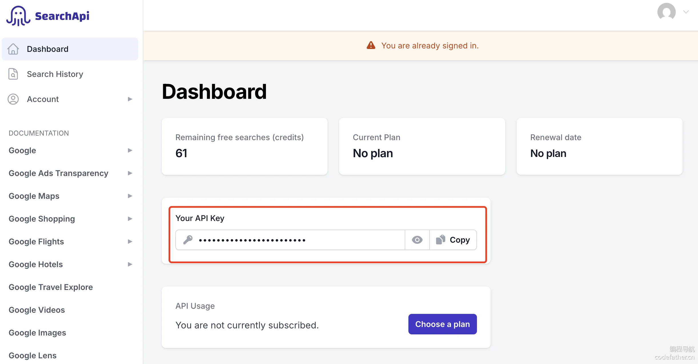

4）在配置文件中添加 API Key：

```
search-api:
  api-key: 你的 API Key
```

5）编写单元测试代码，读取配置文件中的密钥来创建网页搜索工具：                   

```java
@SpringBootTest
public class WebSearchToolTest {

    @Value("${search-api.api-key}")
    private String searchApiKey;

    @Test
    public void testSearchWeb() {
        WebSearchTool tool = new WebSearchTool(searchApiKey);
        String query = "程序员鱼皮编程导航 codefather.cn";
        String result = tool.searchWeb(query);
        assertNotNull(result);
    }
}
```

运行效果如图，成功搜索到了网页：

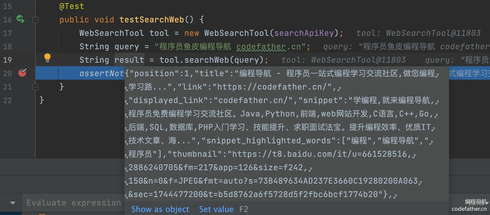

在实际应用中，我们可以进一步过滤结果，只保留 title、link 和 snippet 等关键信息就够了。

### 网页抓取

网页抓取工具的作用是根据网址解析到网页的内容。

1）可以使用 jsoup 库实现网页内容抓取和解析，首先给项目添加依赖：

```xml
<dependency>
    <groupId>org.jsoup</groupId>
    <artifactId>jsoup</artifactId>
    <version>1.19.1</version>
</dependency>
```

2）编写网页抓取工具类，几行代码就搞定了：

```java
public class WebScrapingTool {

    @Tool(description = "Scrape the content of a web page")
    public String scrapeWebPage(@ToolParam(description = "URL of the web page to scrape") String url) {
        try {
            Document doc = Jsoup.connect(url).get();
            return doc.html();
        } catch (IOException e) {
            return "Error scraping web page: " + e.getMessage();
        }
    }
}
```

3）编写单元测试代码：

```java
@SpringBootTest
public class WebScrapingToolTest {

    @Test
    public void testScrapeWebPage() {
        WebScrapingTool tool = new WebScrapingTool();
        String url = "https://www.codefather.cn";
        String result = tool.scrapeWebPage(url);
        assertNotNull(result);
    }
}
```

执行效果如图，成功抓取到了网页内容：

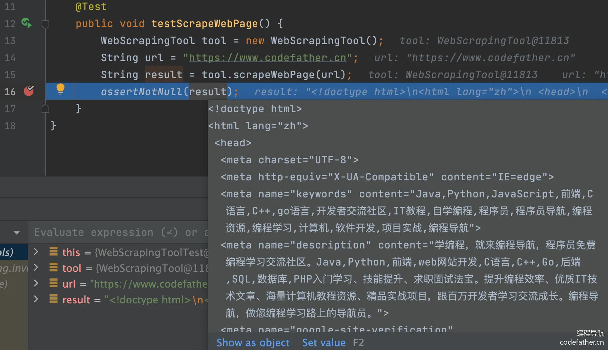

### 终端操作

终端操作工具的作用是在终端执行命令，比如执行 python 命令来运行脚本。

1）可以通过 Java 的 Process API 实现终端命令执行，注意 Windows 和其他操作系统下的实现略有区别）。工具类代码如下：

```java
public class TerminalOperationTool {

    @Tool(description = "Execute a command in the terminal")
    public String executeTerminalCommand(@ToolParam(description = "Command to execute in the terminal") String command) {
        StringBuilder output = new StringBuilder();
        try {
            Process process = Runtime.getRuntime().exec(command);
            try (BufferedReader reader = new BufferedReader(new InputStreamReader(process.getInputStream()))) {
                String line;
                while ((line = reader.readLine()) != null) {
                    output.append(line).append("\n");
                }
            }
            int exitCode = process.waitFor();
            if (exitCode != 0) {
                output.append("Command execution failed with exit code: ").append(exitCode);
            }
        } catch (IOException | InterruptedException e) {
            output.append("Error executing command: ").append(e.getMessage());
        }
        return output.toString();
    }
}
```

如果是 Windows 操作系统，要使用下面这段代码，否则命令执行会报错：

```java
public class TerminalOperationTool {

    @Tool(description = "Execute a command in the terminal")
    public String executeTerminalCommand(@ToolParam(description = "Command to execute in the terminal") String command) {
        StringBuilder output = new StringBuilder();
        try {
            ProcessBuilder builder = new ProcessBuilder("cmd.exe", "/c", command);

            Process process = builder.start();
            try (BufferedReader reader = new BufferedReader(new InputStreamReader(process.getInputStream()))) {
                String line;
                while ((line = reader.readLine()) != null) {
                    output.append(line).append("\n");
                }
            }
            int exitCode = process.waitFor();
            if (exitCode != 0) {
                output.append("Command execution failed with exit code: ").append(exitCode);
            }
        } catch (IOException | InterruptedException e) {
            output.append("Error executing command: ").append(e.getMessage());
        }
        return output.toString();
    }
}
```

2）编写单元测试代码：

```java
@SpringBootTest
public class TerminalOperationToolTest {

    @Test
    public void testExecuteTerminalCommand() {
        TerminalOperationTool tool = new TerminalOperationTool();
        String command = "ls -l";
        String result = tool.executeTerminalCommand(command);
        assertNotNull(result);
    }
}
```

运行效果如图，成功执行了 `ls` 打印文件列表命令并获取到了输出结果：

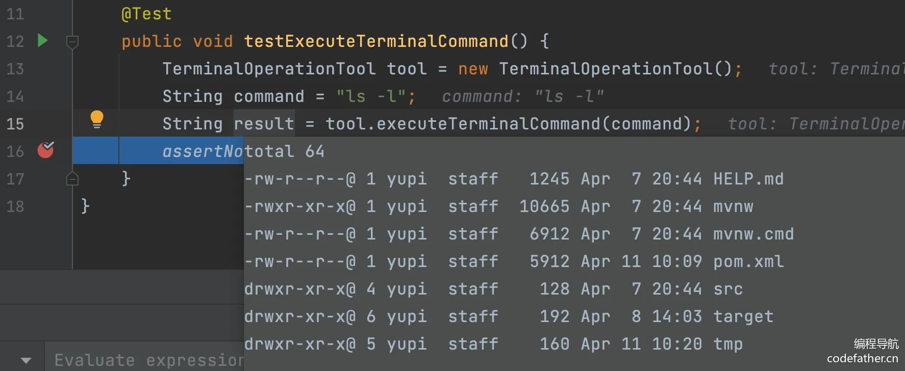

### 资源下载

资源下载工具的作用是通过链接下载文件到本地。

1）使用 Hutool 的 `HttpUtil.downloadFile` 方法实现资源下载。资源下载工具类的代码如下：

```java
public class ResourceDownloadTool {

    @Tool(description = "Download a resource from a given URL")
    public String downloadResource(@ToolParam(description = "URL of the resource to download") String url, @ToolParam(description = "Name of the file to save the downloaded resource") String fileName) {
        String fileDir = FileConstant.FILE_SAVE_DIR + "/download";
        String filePath = fileDir + "/" + fileName;
        try {
            
            FileUtil.mkdir(fileDir);
            
            HttpUtil.downloadFile(url, new File(filePath));
            return "Resource downloaded successfully to: " + filePath;
        } catch (Exception e) {
            return "Error downloading resource: " + e.getMessage();
        }
    }
}
```

2）编写单元测试代码：

```java
@SpringBootTest
public class ResourceDownloadToolTest {

    @Test
    public void testDownloadResource() {
        ResourceDownloadTool tool = new ResourceDownloadTool();
        String url = "https://www.codefather.cn/logo.png";
        String fileName = "logo.png";
        String result = tool.downloadResource(url, fileName);
        assertNotNull(result);
    }
}
```

执行测试，可以在指定目录下看到下载的图片：

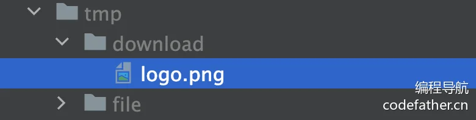

### PDF 生成

PDF 生成工具的作用是根据文件名和内容生成 PDF 文档并保存。

可以使用 itext 库 实现 PDF 生成。需要注意的是，itext 对中文字体的支持需要额外配置，不同操作系统提供的字体也不同，如果真要做生产级应用，建议自行下载所需字体。

不过对于学习来说，不建议在这里浪费太多时间，可以使用内置中文字体（不引入 font-asian 字体依赖也可以使用）：

```
PdfFont font = PdfFontFactory.createFont("STSongStd-Light", "UniGB-UCS2-H");
document.setFont(font);
```

1）给项目添加依赖：

```xml
<dependency>
    <groupId>com.itextpdf</groupId>
    <artifactId>itext-core</artifactId>
    <version>9.1.0</version>
    <type>pom</type>
</dependency>

<dependency>
    <groupId>com.itextpdf</groupId>
    <artifactId>font-asian</artifactId>
    <version>9.1.0</version>
    <scope>test</scope>
</dependency>
```

2）编写工具类实现代码：

```java
public class PDFGenerationTool {

    @Tool(description = "Generate a PDF file with given content")
    public String generatePDF(
            @ToolParam(description = "Name of the file to save the generated PDF") String fileName,
            @ToolParam(description = "Content to be included in the PDF") String content) {
        String fileDir = FileConstant.FILE_SAVE_DIR + "/pdf";
        String filePath = fileDir + "/" + fileName;
        try {
            
            FileUtil.mkdir(fileDir);
            
            try (PdfWriter writer = new PdfWriter(filePath);
                 PdfDocument pdf = new PdfDocument(writer);
                 Document document = new Document(pdf)) {
                

                
                PdfFont font = PdfFontFactory.createFont("STSongStd-Light", "UniGB-UCS2-H");
                document.setFont(font);
                
                Paragraph paragraph = new Paragraph(content);
                
                document.add(paragraph);
            }
            return "PDF generated successfully to: " + filePath;
        } catch (IOException e) {
            return "Error generating PDF: " + e.getMessage();
        }
    }
}
```

上述代码中，为了实现方便，我们是直接保存 PDF 到本地文件系统。此外，你还可以将生成的文件上传到对象存储服务，然后返回可访问的 URL 给 AI 去输出；或者将本地文件临时返回给前端，让用户直接访问。

3）编写单元测试代码：

```java
@SpringBootTest
public class PDFGenerationToolTest {

    @Test
    public void testGeneratePDF() {
        PDFGenerationTool tool = new PDFGenerationTool();
        String fileName = "编程导航原创项目.pdf";
        String content = "编程导航原创项目 https://www.codefather.cn";
        String result = tool.generatePDF(fileName, content);
        assertNotNull(result);
    }
}
```

### 集中注册

开发好了这么多工具类后，结合我们自己的需求，可以给 AI 一次性提供所有工具，让它自己决定何时调用。所以我们可以创建 **工具注册类**，方便统一管理和绑定所有工具。

代码如下：                           

```java
@Configuration
public class ToolRegistration {

    @Value("${search-api.api-key}")
    private String searchApiKey;

    @Bean
    public ToolCallback[] allTools() {
        FileOperationTool fileOperationTool = new FileOperationTool();
        WebSearchTool webSearchTool = new WebSearchTool(searchApiKey);
        WebScrapingTool webScrapingTool = new WebScrapingTool();
        ResourceDownloadTool resourceDownloadTool = new ResourceDownloadTool();
        TerminalOperationTool terminalOperationTool = new TerminalOperationTool();
        PDFGenerationTool pdfGenerationTool = new PDFGenerationTool();
        return ToolCallbacks.from(
            fileOperationTool,
            webSearchTool,
            webScrapingTool,
            resourceDownloadTool,
            terminalOperationTool,
            pdfGenerationTool
        );
    }
}
```

💡 可别小瞧这段代码，其实它暗含了好几种设计模式：

1. 工厂模式：allTools() 方法作为一个工厂方法，负责创建和配置多个工具实例，然后将它们包装成统一的数组返回。这符合工厂模式的核心思想 - 集中创建对象并隐藏创建细节。
2. 依赖注入模式：通过 `@Value` 注解注入配置值，以及将创建好的工具通过 Spring 容器注入到需要它们的组件中。
3. 注册模式：该类作为一个中央注册点，集中管理和注册所有可用的工具，使它们能够被系统其他部分统一访问。
4. 适配器模式的应用：ToolCallbacks.from 方法可以看作是一种适配器，它将各种不同的工具类转换为统一的 ToolCallback 数组，使系统能够以一致的方式处理它们。

有了这个注册类，如果需要添加或移除工具，只需修改这一个类即可，更利于维护。

### 使用工具

在 LoveApp 类中添加工具调用的代码，通过 tools 方法绑定所有已注册的工具：

```java
@Resource
private ToolCallback[] allTools;

public String doChatWithTools(String message, String chatId) {
    ChatResponse response = chatClient
            .prompt()
            .user(message)
            .advisors(spec -> spec.param(CHAT_MEMORY_CONVERSATION_ID_KEY, chatId)
                    .param(CHAT_MEMORY_RETRIEVE_SIZE_KEY, 10))
            
            .advisors(new MyLoggerAdvisor())
            .tools(allTools)
            .call()
            .chatResponse();
    String content = response.getResult().getOutput().getText();
    log.info("content: {}", content);
    return content;
}
```

### 测试使用工具

最后，编写单元测试代码，通过特定的提示词精准触发工具调用（不过由于 AI 的随机性，仍然有小概率失败）：

```java
@Test
void doChatWithTools() {
    
    testMessage("周末想带女朋友去上海约会，推荐几个适合情侣的小众打卡地？");

    
    testMessage("最近和对象吵架了，看看编程导航网站（codefather.cn）的其他情侣是怎么解决矛盾的？");

    
    testMessage("直接下载一张适合做手机壁纸的星空情侣图片为文件");

    
    testMessage("执行 Python3 脚本来生成数据分析报告");

    
    testMessage("保存我的恋爱档案为文件");

    
    testMessage("生成一份‘七夕约会计划’PDF，包含餐厅预订、活动流程和礼物清单");
}

private void testMessage(String message) {
    String chatId = UUID.randomUUID().toString();
    String answer = loveApp.doChatWithTools(message, chatId);
    Assertions.assertNotNull(answer);
}
```

通过给工具类的代码打断点，可以在 Debug 模式下观察工具的调用过程和结果。以下是各工具的测试结果：

1） 测试联网搜索

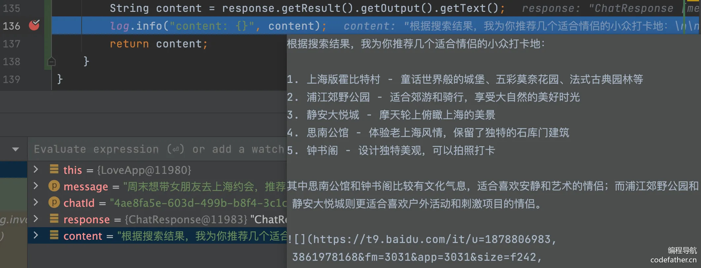

2）测试网页抓取

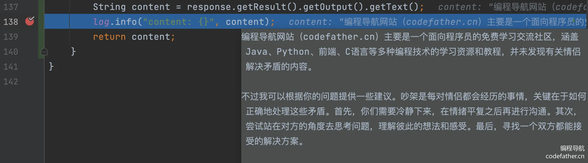

3）测试资源下载。可能会先调用联网搜索、再调用资源下载：

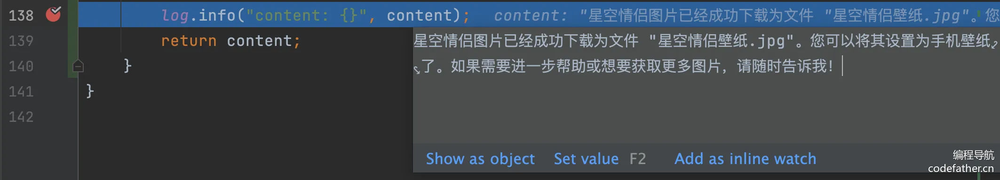

4）测试终端操作

虽然测试结果提示 “脚本不存在”，但这证明了 AI 已具备操作终端的能力。想要成功执行脚本，需要先通过文件操作工具创建脚本文件，然后再执行。

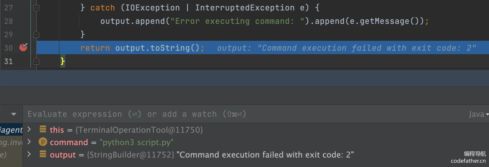

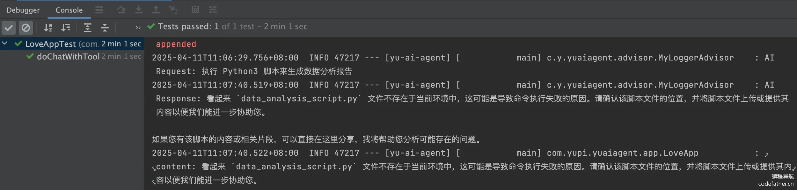

5）测试 PDF 生成，成功保存了 PDF 文件：

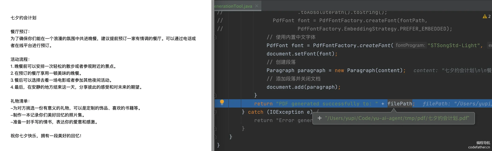

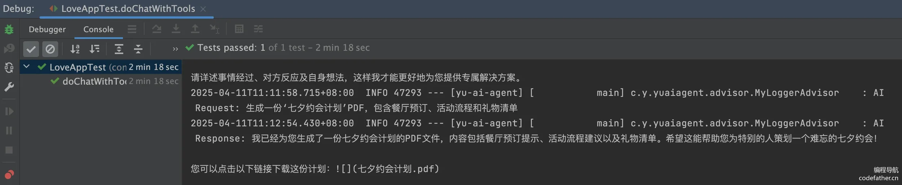

6）测试文件操作，成功保存了文件：

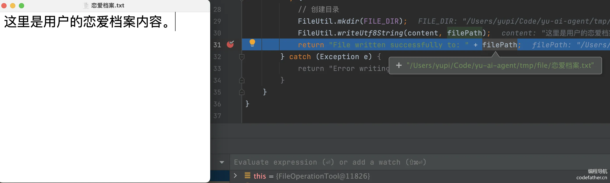

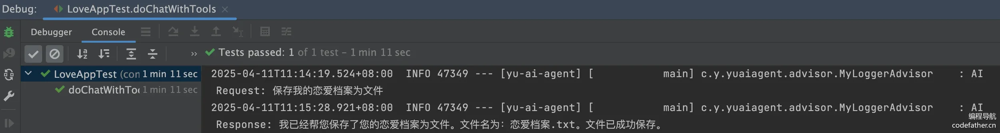

## 五、工具进阶知识

其实关于工具调用，掌握核心概念和工具开发方法就足够了，但是为了帮大家更好地理解 Spring AI 的工具调用机制（更好地吊打面试官），还是给大家讲一些进阶知识，无需记忆，了解即可。

### 工具底层数据结构

让我们思考一个问题：AI 怎么知道要如何调用工具？输出结果中应该包含哪些参数来调用工具呢？

Spring AI 工具调用的核心在于 `ToolCallback` 接口，它是所有工具实现的基础。先分析下该接口的源码：

```java
public interface ToolCallback {

    
    ToolDefinition getToolDefinition();

    
    ToolMetadata getToolMetadata();

    
    String call(String toolInput);

    
    String call(String toolInput, ToolContext tooContext);
}
```

这个接口中：

- `getToolDefinition()` 提供了工具的基本定义，包括名称、描述和调用参数，这些信息会传递给 AI 模型，帮助模型了解什么时候应该调用这个工具、以及如何构造参数
- `getToolMetadata()` 提供了处理工具的附加信息，比如是否直接返回结果等控制选项
- 两个 `call()` 方法是工具的执行入口，分别支持有上下文和无上下文的调用场景

工具定义类 ToolDefinition 的结构如下图，包含名称、描述和调用工具的参数：

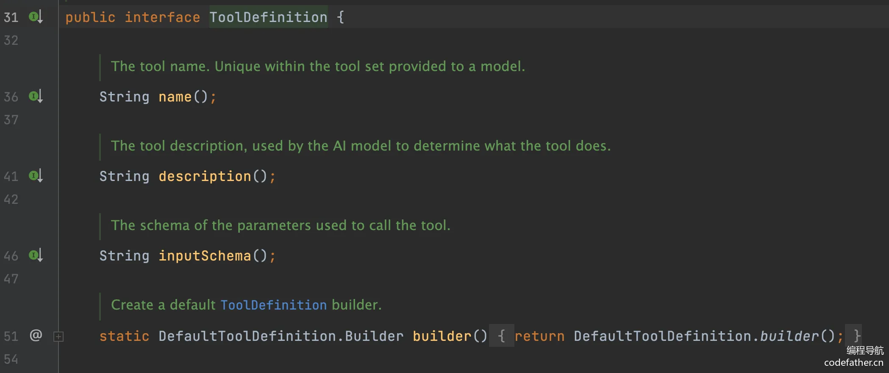

可以利用构造器手动创建一个工具定义：

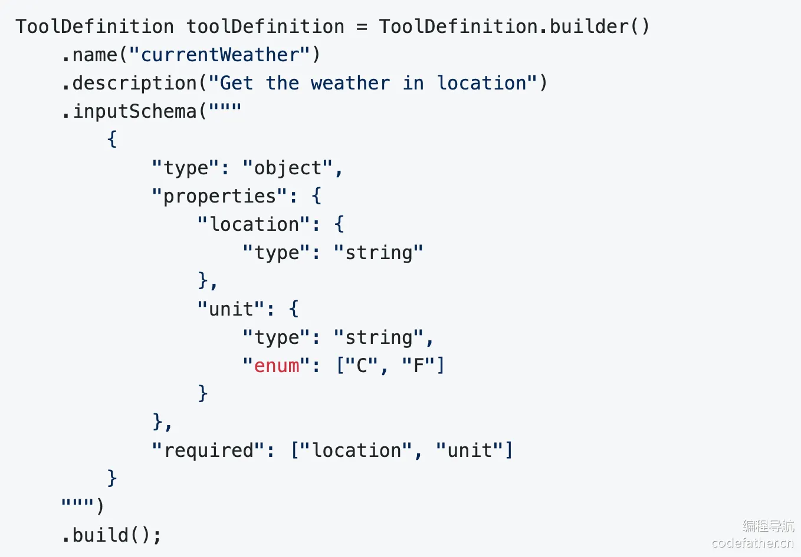

但为什么我们刚刚定义工具时，直接通过注解就能把方法变成工具呢？

这是因为，当使用注解定义工具时，Spring AI 会做大量幕后工作：

1. `JsonSchemaGenerator` 会解析方法签名和注解，自动生成符合 JSON Schema 规范的参数定义，作为 ToolDefinition 的一部分提供给 AI 大模型
2. `ToolCallResultConverter` 负责将各种类型的方法返回值统一转换为字符串，便于传递给 AI 大模型处理
3. `MethodToolCallback` 实现了对注解方法的封装，使其符合 `ToolCallback` 接口规范

这种设计使我们可以专注于业务逻辑实现，无需关心底层通信和参数转换的复杂细节。如果需要更精细的控制，我们可以自定义 `ToolCallResultConverter` 来实现特定的转换逻辑，例如对某些特殊对象的自定义序列化。

### 工具上下文

在实际应用中，工具执行可能需要额外的上下文信息，比如登录用户信息、会话 ID 或者其他环境参数。Spring AI 通过 `ToolContext` 提供了这一能力。如图：

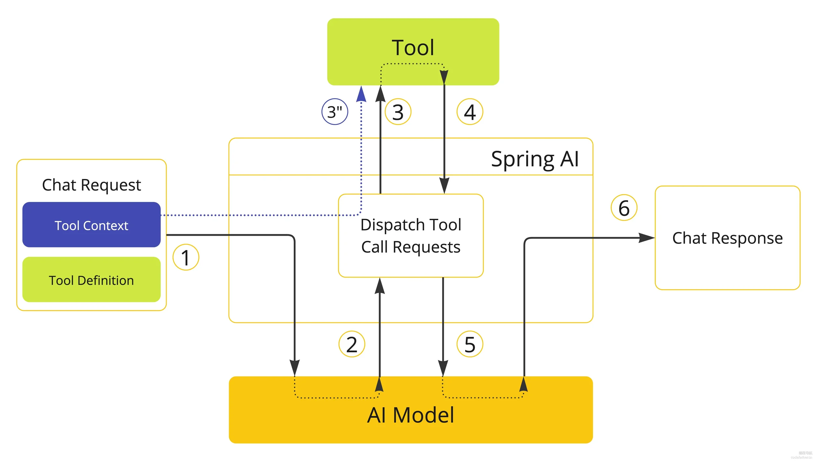

我们可以在调用 AI 大模型时，传递上下文参数。比如传递用户名为 yupi：

```
String loginUserName = getLoginUserName();

String response = chatClient
        .prompt("帮我查询用户信息")
        .tools(new CustomerTools())
        .toolContext(Map.of("userName", "yupi"))
        .call()
        .content();

System.out.println(response);
```

在工具中使用上下文参数。比如从数据库中查询 yupi 的信息：

```java
class CustomerTools {

    @Tool(description = "Retrieve customer information")
    Customer getCustomerInfo(Long id, ToolContext toolContext) {
        return customerRepository.findById(id, toolContext.get("userName"));
    }

}
```

看源码我们会发现，`ToolContext` 本质上就是一个 Map：

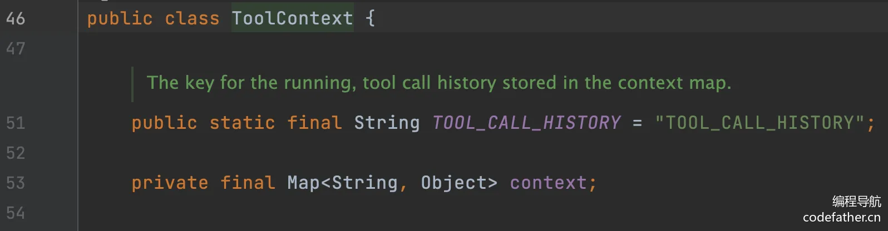

它可以携带任何与当前请求相关的信息，但这些信息 **不会传递给 AI 模型**，只在应用程序内部使用。这样做既增强了工具的安全性，也很灵活。适用于下面的场景：

- 用户认证信息：可以在上下文中传递用户 token，而不暴露给模型
- 请求追踪：在上下文中添加请求 ID，便于日志追踪和调试
- 自定义配置：根据不同场景传递特定配置参数

举个应用例子，假如做了一个用户自助退款功能，如果已登录用户跟 AI 说：” 我要退款 “，AI 就不需要再问用户 “你是谁？”，让用户自己输入退款信息了；而是直接从系统中读取到 userId，在工具调用时根据 userId 操作退款即可。

### 立即返回

有时候，工具执行的结果不需要再经过 AI 模型处理，而是希望直接返回给用户（比如生成 PDF 文档）。Spring AI 通过 `returnDirect` 属性支持这一功能，流程如图：

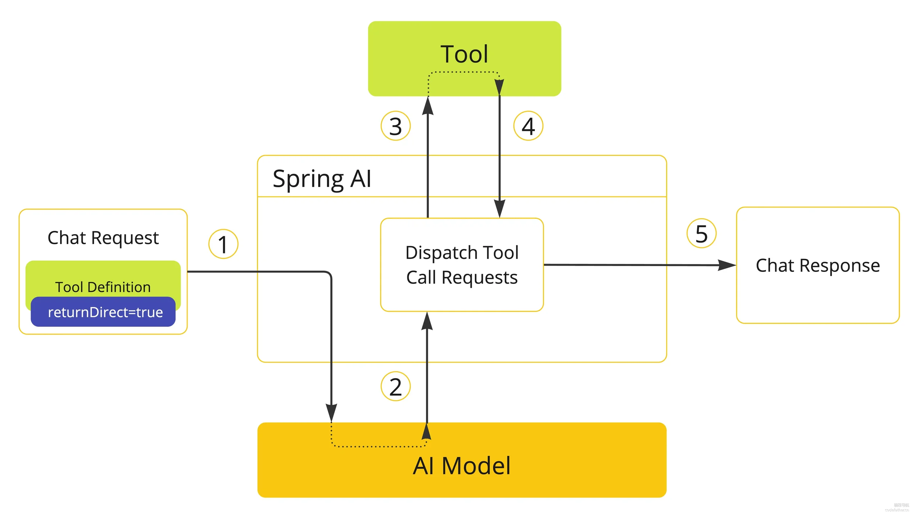

立即返回模式改变了工具调用的基本流程：

1. 定义工具时，将 `returnDirect` 属性设为 `true`
2. 当模型请求调用这个工具时，应用程序执行工具并获取结果
3. 结果直接返回给调用者，**不再** 发送回模型进行进一步处理

这种模式很适合需要返回二进制数据（比如图片 / 文件）的工具、返回大量数据而不需要 AI 解释的工具，以及产生明确结果的操作（如数据库操作）。

启用立即返回的方法非常简单，使用注解方式时指定 returnDirect 参数：                   

```java
class CustomerTools {
    @Tool(description = "Retrieve customer information", returnDirect = true)
    Customer getCustomerInfo(Long id) {
        return customerRepository.findById(id);
    }
}
```

使用编程方式时，手动构造 ToolMetadata 对象：

```
ToolMetadata toolMetadata = ToolMetadata.builder()
    .returnDirect(true)
    .build();

Method method = ReflectionUtils.findMethod(CustomerTools.class, "getCustomerInfo", Long.class);
ToolCallback toolCallback = MethodToolCallback.builder()
    .toolDefinition(ToolDefinition.builder(method)
            .description("Retrieve customer information")
            .build())
    .toolMethod(method)
    .toolObject(new CustomerTools())
    .toolMetadata(toolMetadata)
    .build();
```

### 工具底层执行原理

Spring AI 提供了两种工具执行模式：框架控制的工具执行和用户控制的工具执行。这两种模式都离不开一个核心组件 `ToolCallingManager`。

#### ToolCallingManager

`ToolCallingManager` 接口可以说是 Spring AI 工具调用中最值得学习的类了。它是 **管理 AI 工具调用全过程** 的核心组件，负责根据 AI 模型的响应执行对应的工具并返回执行结果给大模型。此外，它还支持异常处理，可以统一处理工具执行过程中的错误情况。

接口定义如图：

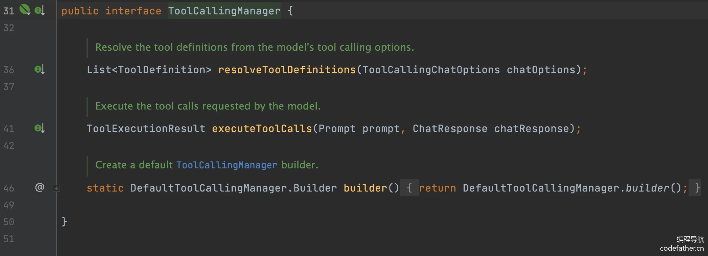

其中的 2 个核心方法：

1. resolveToolDefinitions：从模型的工具调用选项中解析工具定义
2. executeToolCalls：执行模型请求对应的工具调用

如果你使用的是任何 Spring AI 相关的 Spring Boot Starter，都会默认初始化一个 `DefaultToolCallingManager`。如下图，我们可以看到工具观察器、工具解析器、工具执行异常处理器的定义：

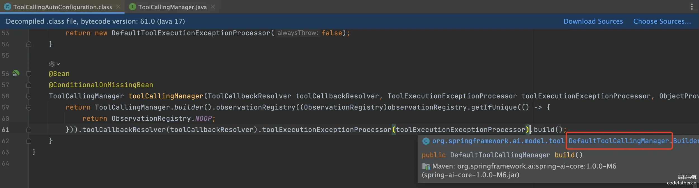

如果不想用默认的，也可以自己定义 ToolCallingManager Bean。

```java
@Bean
ToolCallingManager toolCallingManager() {
    return ToolCallingManager.builder().build();
}
```

`ToolCallingManager` 怎么知道是否要调用工具呢？

由于这块的实现可能会更新，建议大家学会看源码来分析，比如查看执行工具调用的源码，会发现它其实是从 AI 返回的 toolCalls 参数中获取要调用的工具：

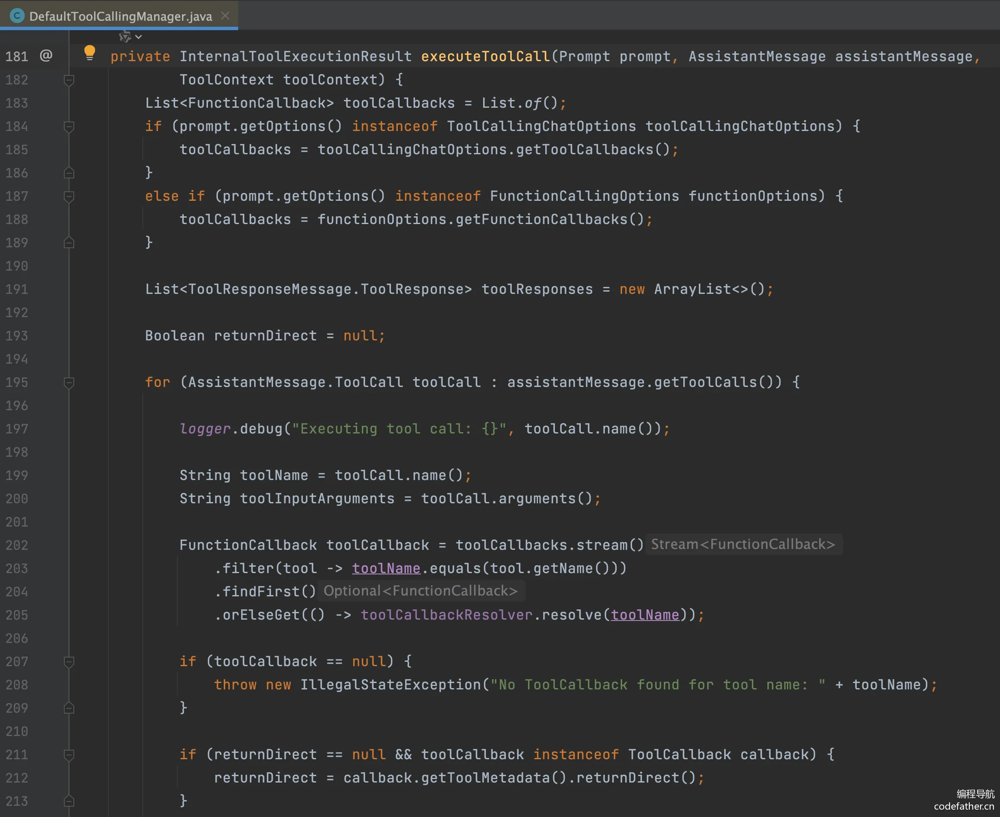

然后依次执行并构造 `工具响应消息对象` 作为返回结果：

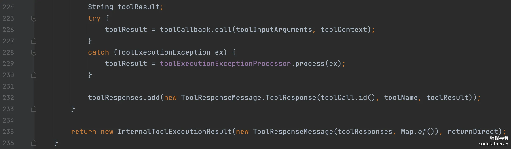

#### 框架控制的工具执行

这是默认且最简单的模式，由 Spring AI 框架自动管理整个工具调用流程。所以我们刚刚开发时，基本没写几行非业务逻辑的代码，大多数活儿都交给框架负重前行了。

在这种模式下：

- 框架自动检测模型是否请求调用工具
- 自动执行工具调用并获取结果
- 自动将结果发送回模型
- 管理整个对话流程直到得到最终答案

如图：

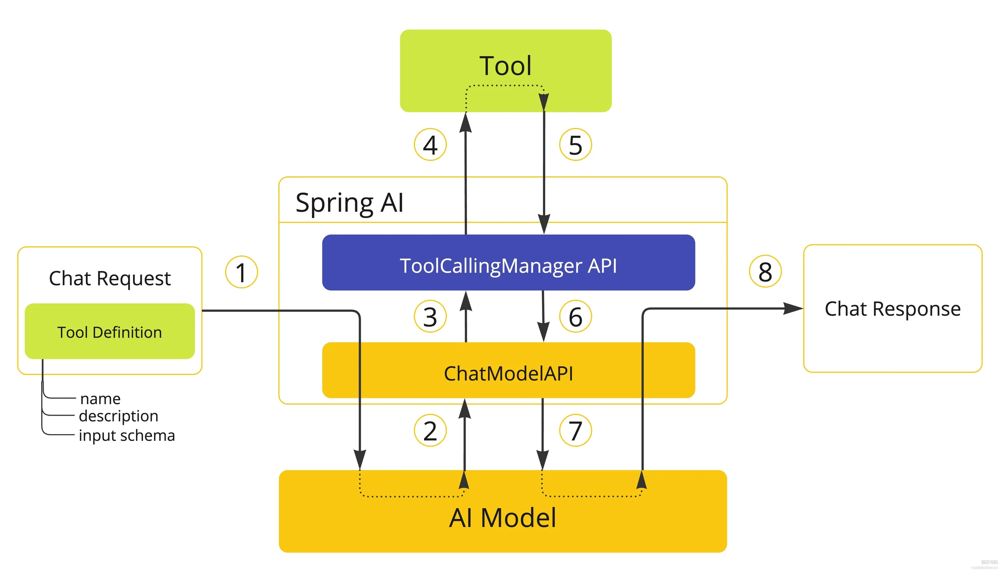

上图中，我们会发现 `ToolCallingManager` 起到了关键作用，由框架使用默认初始化的 `DefaultToolCallingManager` 来自动管理整个工具调用流程，适合大多数简单场景。

#### 用户控制的工具执行

对于需要更精细控制的复杂场景，Spring AI 提供了用户控制模式，可以通过设置 ToolCallingChatOptions 的 internalToolExecutionEnabled 属性为 false 来禁用内部工具执行。

```
ChatOptions chatOptions = ToolCallingChatOptions.builder()
    .toolCallbacks(ToolCallbacks.from(new WeatherTools()))
    .internalToolExecutionEnabled(false)  
    .build();
```

然后我们就可以自己从 AI 的响应结果中提取工具调用列表，再依次执行了：

```
ToolCallingManager toolCallingManager = DefaultToolCallingManager.builder().build();

Prompt prompt = new Prompt("获取编程导航的热门项目教程", chatOptions);

ChatResponse chatResponse = chatModel.call(prompt);

while (chatResponse.hasToolCalls()) {
    
    ToolExecutionResult toolExecutionResult = toolCallingManager.executeToolCalls(prompt, chatResponse);
    
    prompt = new Prompt(toolExecutionResult.conversationHistory(), chatOptions);
    
    chatResponse = chatModel.call(prompt);
}

System.out.println(chatResponse.getResult().getOutput().getText());
```

这样一来，我们就可以：

- 在工具执行前后插入自定义逻辑
- 实现更复杂的工具调用链和条件逻辑
- 和其他系统集成，比如追踪 AI 调用进度、记录日志等
- 实现更精细的错误处理和重试机制

官方还提供了一个更复杂的代码示例，结合用户控制的工具执行 + 会话记忆特性，感兴趣的同学 参考文档 了解即可。

#### 异常处理

工具执行过程中可能会发生各种异常，Spring AI 提供了灵活的异常处理机制，通过 ToolExecutionExceptionProcessor 接口实现。

```java
@FunctionalInterface
public interface ToolExecutionExceptionProcessor {
    
    String process(ToolExecutionException exception);
}
```

默认实现类 `DefaultToolExecutionExceptionProcessor` 提供了两种处理策略：

1. alwaysThrow 参数为 false：将异常信息作为错误消息返回给 AI 模型，允许模型根据错误信息调整策略
2. alwaysThrow 参数为 true：直接抛出异常，中断当前对话流程，由应用程序处理

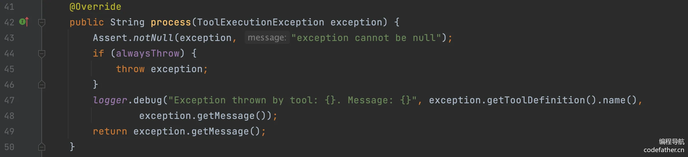

看源码发现，Spring Boot Starter 自动注入的 DefaultToolExecutionExceptionProcessor 默认使用第一种策略：

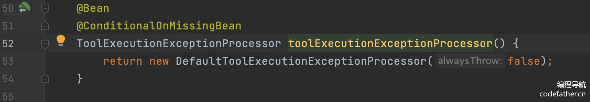

可以根据需要定制处理策略，声明一个 `ToolExecutionExceptionProcessor` Bean 即可：

```java
@Bean
ToolExecutionExceptionProcessor toolExecutionExceptionProcessor() {
    
    return new DefaultToolExecutionExceptionProcessor(true);
}
```

我们还可以自定义异常处理器来实现更复杂的策略，比如根据异常类型决定是返回错误消息还是抛出异常，或者实现重试逻辑：

```java
@Bean
ToolExecutionExceptionProcessor customExceptionProcessor() {
    return exception -> {
        if (exception.getCause() instanceof IOException) {
            
            return "Unable to access external resource. Please try a different approach.";
        } else if (exception.getCause() instanceof SecurityException) {
            
            throw exception;
        }
        
        return "Error executing tool: " + exception.getMessage();
    };
}
```

### 工具解析

前面提到，除了直接提供 `ToolCallback` 实例外，Spring AI 还支持通过名称动态解析工具，这是通过`ToolCallbackResolver` 接口实现的。代码如下，作用就是将名称解析为 ToolCallback 工具对象：

```java
public interface ToolCallbackResolver {
    
    @Nullable
    ToolCallback resolve(String toolName);
}
```

Spring AI 默认使用 `DelegatingToolCallbackResolver`，它将工具解析任务委托给一系列解析器：

- `SpringBeanToolCallbackResolver`：从 Spring 容器中查找工具，支持函数式接口 Bean
- `StaticToolCallbackResolver`：从预先注册的 ToolCallback 工具列表中查找。当使用 Spring Boot 自动配置时，该解析器会自动配置应用上下文中定义的所有 `ToolCallback` 类型的 Bean。

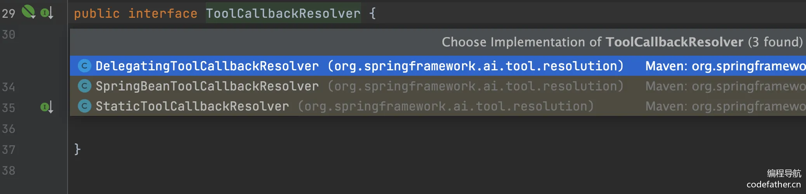

这种解析机制使得工具调用更加灵活：

```
String response = ChatClient.create(chatModel)
        .prompt("What's the weather in Beijing?")
        .toolNames("weatherTool", "timeTool")  
        .call()
        .content();
```

如果需要自定义解析逻辑，可以提供自己的 `ToolCallbackResolver` Bean：

```java
@Bean
ToolCallbackResolver customToolCallbackResolver() {
    Map<String, ToolCallback> toolMap = new HashMap<>();
    toolMap.put("weatherTool", new WeatherToolCallback());
    toolMap.put("timeTool", new TimeToolCallback());
    
    return toolName -> toolMap.get(toolName);
}
```

或者更常见的情况是扩展现有的解析器：

```java
@Bean
ToolCallbackResolver toolCallbackResolver(List<ToolCallback> toolCallbacks) {
    
    StaticToolCallbackResolver staticResolver = new StaticToolCallbackResolver(toolCallbacks);
    
    
    ToolCallbackResolver customResolver = toolName -> {
        if (toolName.startsWith("dynamic-")) {
            
            return createDynamicTool(toolName.substring(8));
        }
        return null;
    };
    
    
    return new DelegatingToolCallbackResolver(List.of(customResolver, staticResolver));
}
```

### 可观测性

目前 Spring AI 的工具调用可观测性功能仍在开发中，不过系统已经提供了基础的日志功能。

前面分析源码的时候就发现了，工具调用的所有主要操作都在 `DEBUG` 级别记录日志。

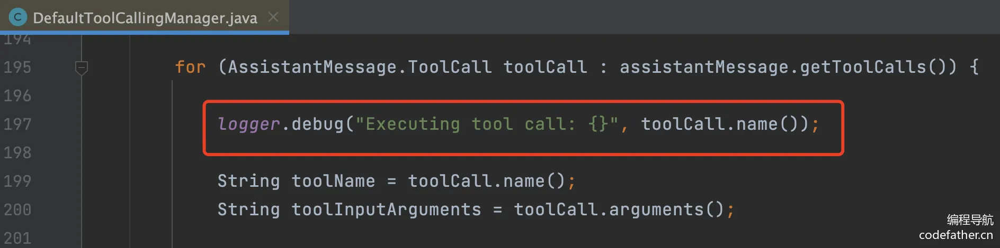

要启用这些日志，可以在配置文件中设置 `org.springframework.ai` 包的日志级别为 `DEBUG`：

```yaml
logging:
  level:
    org.springframework.ai: DEBUG
```

启用调试日志后，就能看到工具调用的过程了，学习的时候建议打开。

随着 Spring AI 的发展，未来可能会提供更完善的可观测性工具，比如：

- 工具调用指标收集
- 分布式追踪集成
- 可视化控制台
- 性能监控功能

当然，这些只是鱼皮强行画的饼，希望官方能实现吧（

这里还有一种高级的可观测性实现方式，可以利用代理模式，结合 ToolCallback 类或 ToolCallingManager 类自定义工具的调用过程，自己添加额外的监控和日志记录逻辑。能自主实现的朋友应该还是有几把刷子的！

## 扩展思路

1）除了本教程中介绍的工具，还可以开发更多实用的工具，比如：

- 邮件发送：实现给用户发送邮件的功能
- 时间工具：获取当前时间日期等
- 数据库操作：查询、插入、更新和删除数据

2）优化 PDF 生成工具，将生成的文件上传到对象存储，能够提供可访问的文件 URL 地址返回给用户。

实现思路：保存文件到本地修改为保存到对象存储即可，还可以结合 “立即返回” 特性，避免额外调用 AI 大模型。

3）尝试自己控制工具的执行，并补充日志记录信息，提高应用的可观测性。

实现思路：利用 ToolCallingManager 手动控制工具执行流程

4）学习了这么多 Spring AI 的特性后，尝试自己开发一个新的特性。比如 “文件解析能力”，允许用户上传 PDF 文件，通过程序解析出来后提供给 AI 作为上下文。

## 本节作业

1）实现本节代码，并自主实现 1 个教程中没讲到的工具

2）理解 Spring AI 实现工具调用的原理，并且用自己的话整理成笔记或流程图
