+++
title = "Linux下的软件管理"
date = 2025-08-01T23:29:19+08:00
weight = 10
tags = ["Linux", "运维", "软件管理"]
summary = "Linux 下软件的运行与编译、软件包与包管理器（rpm/yum、dpkg/apt）以及源码编译安装的完整笔记。"
+++

## 一.Linux下软件的运行和编译

### 1.内容的概述

在刚开始接触Linux时,我们就已经了解Linux有一个很大的优势，那就是它的内核是开源的。这里的源，主要指的就是源代码。那么这个源代码我们是怎么使用的呢？这需要有一定开发经验人才可以掌握。那么对于普通用户我们就不能使用Linux操作系统了嘛？这肯定是不可能的，为解决这一问题，诸君可以阅读一下这篇文章

开源软件最初只提供了.tar.gz的打包的源码文件，用户必须自已编译每个想在GNU/Linux上运行的软件源码。Linux的大多数软件都是使用C语言编写的(当然还有其它语言)，我们怎么把一个C语言的源码文件，进行编译呢？这里举一个C语言程序的执行过程。

我们创建一个hello.c文件，里面的内容就是简单的输出hello world，最后的效果就是在终端输出hello world


对于这样的源代码，我们要怎么才能使用呢？我们知道，每个源码都需要编译之后才可以执行。对于C语言源码的编译，我们使用gcc命令(需要进行下载)。

```bash
gcc hello.c -o hello
```

执行完后，我们的源码就被编译成了可执行文件hello

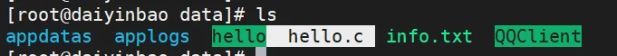

运行之，我们发现hello world 被打印在了终端。意味着这个源码被我们使用


但我们知道，一个程序是又大量的源代码文件组成的，我们在使用时不可能一个一个的编译的。而且在编译的过程中还有许多的依赖关系，那么就更加复杂了。那我们应该怎么办呢？

用户急需系统能提供一种更加便利的方法来管理这些软件，当Debian诞生时，这样一个管理工具dpkg也就应运而生，可用来管理deb后缀的"包"文件。从而著名的"package"概念第一次出现在Linux系统中，稍后Red Hat才开发自己的rpm包管理系统

## 二.Linux下的软件包

### 1. 软件包

#### 1.1 软件包的格式

前置配置：需要先将光盘进行自动挂载，在光盘上有大量软件包

```bash
rpm -q autofs || yum -y install autofs #下载光盘自动挂载
systemctl enable --now autofs #启动
```

下载好后，在我们的/目录下会出现一个misc目录

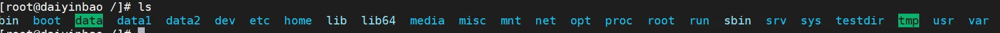

这个目录里面是空的，但仍可以进入cd目录下，该目录下有存放有rpm包的文件夹

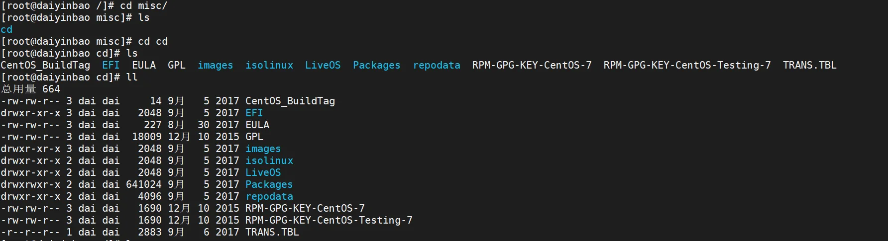

在Package目录下有大量的软件包，这就是我们下载软件的地方...

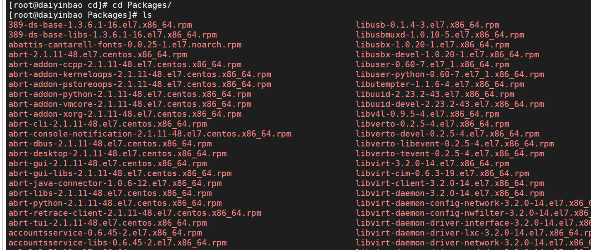

在centos下，这些以rpm结尾的文件就是软件包

软件包的命名方式：name-VERSION-release.arch.rpm

#### 1.2 软件包的文件

软件包中存在有大量的文件，包括了二进制文件、库文件、配置文件、帮助文件...

那么，当我下载一个软件时，怎么查看软件包中存在有那些文件呢？这里我们要使用到一个叫cpio的工具，用于具查看包文件列表，使用方法如下

```bash
yum install -y rpm-build #第一步，下载该工具
rpm2cpio package.rpm | cpio -itv  #使用该命令查看
```

例如:我们要查看libusal-1.1.11-23.el7.x86\_64.rpm软件包的文件

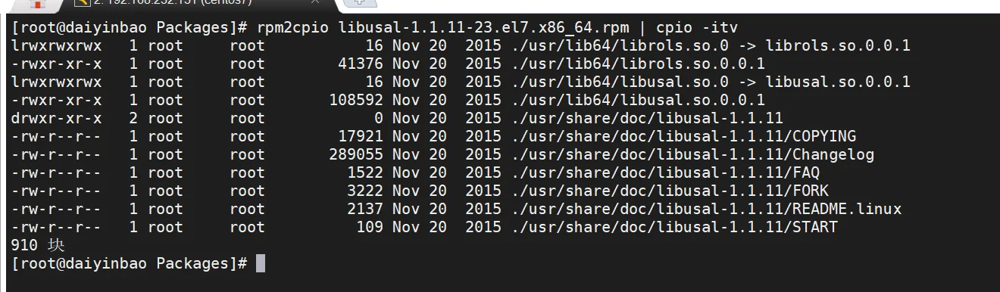

#### 1.3 软件包的管理

将编译好的应用程序的各组成文件打包一个或几个程序包文件，利用包管理器可以方便快捷地实现程序包的安装、卸载、查询、升级和校验等管理操作。
         软件包的管理

redhat：rpm文件, rpm 包管理器 ——centos

debian：deb文件, dpkg 包管理器 ——Ubuntu

软件包之间可能存在依赖关系，甚至循环依赖，即：A包依赖B包，B包依赖C包，C包依赖A包安装软件包时，会因为缺少依赖的包，而导致安装包失败

### 2. rpm 包管理器

CentOS系统上使用rpm管理程序包

常用功能:安装、卸载、升级、查询、校验、数据库维护

#### 2.1 rpm安装功能

```bash
rpm -ivh PACKAGE_FILE #PACKAGE_FILE指的是软件包名称
```

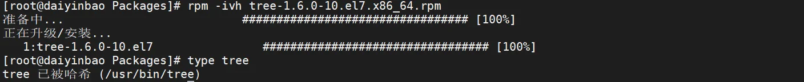

我们在执行 rpm -ivh tree-1.6.0-10.el7.x86\_64.rpm命令之后，可以使用tree命令了，以为着安装完成。但我们知道，软件包大多数存在依赖关系，rpm并未解决软件包之间的依赖关系。我们下载httpd服务可以证实这一特性

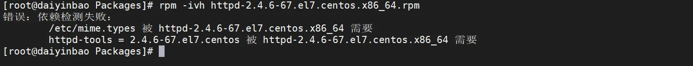

在图片中，我们可以看出，但所依赖的包未被下载时，安装该软件包不能成功。那么我们怎么看一个软件包与其他包的依赖关系呢？

```bash
rpm -qpR 包名.rpm  # 检查依赖
```

如果该命令输出的结果仅为 `rpmlib()` 或 `libc.so.6` 等基础库，则说明无额外依赖。例如tree

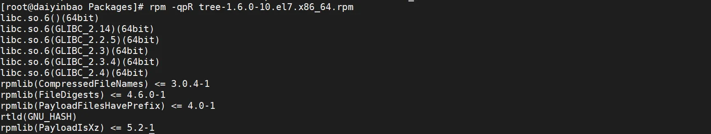

若存在其他的包，则说明需要其他依赖，例如httpd

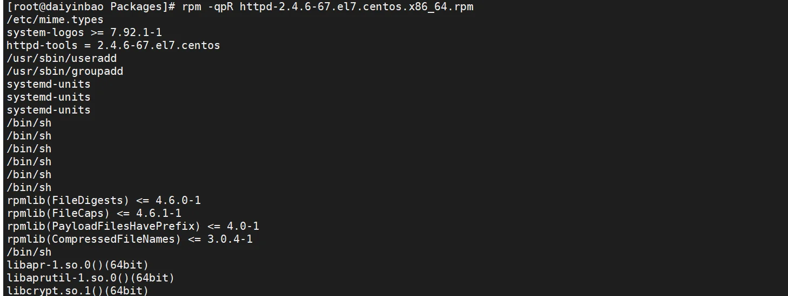

rpm的安装功能还有许多的选项，在命令后，完成特定的需求

```bash
--test: 测试安装，但不真正执行安装，即dry run模式
--nodeps：忽略依赖关系
--replacepkgs | replacefiles
--nosignature: 不检查来源合法性
```

#### 2.2 rpm查询功能

最基本的使用，查询该软件包是否安装（最常用）

```bash
rpm -q PackageName.rpm
```

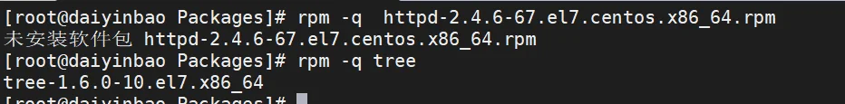

```bash
rpm -qa #列出系统中已安装的所有 RPM 包
```

我们怎么查询一个软件包安装之后产生了那些文件呢？使用rpm -ql组合

```bash
rpm -ql AppName #查询该程序产生的文件
```

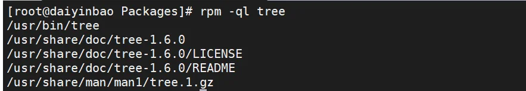

我们也可以通过rpm -qf 组合查询某个文件来自于那个包

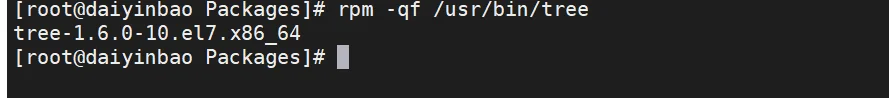

#### 2.3 rpm其他功能

**卸载功能**：

```bash
rpm -e AppName
```

当包卸载时，对应的配置文件不会删除， 以FILENAME.rpmsave形式保留

**校验功能**：

在安装包时，系统也会检查包的来源 是否是合法的检查包的完整性和签名

在检查包的来源和完整性前，必须导入所需要公钥

```bash
rpm --import /etc/pki/rpm-gpg/RPM-GPG-KEY-CentOS-7 #centos7引入公钥
rpm -K PackageName.rpm #进行校验
```

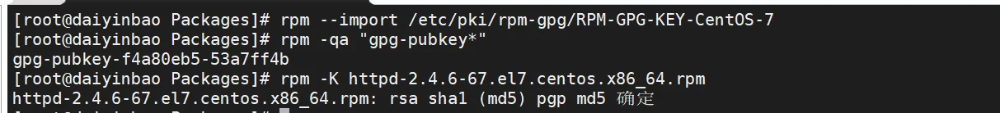

**说明**：

由上面的讲解，我们发现，rpm并没有解决包与包之间的依赖性问题，所以我们通常不使用rpm进行安装，而使用更强大的yum进行处理。通常使用rpm来进行软件包的一些查询功能。

解决依赖问题的工具

yum：rpm包管理器的前端工具
         dnf：Fedora 18+ rpm包管理器前端管理工具，CentOS 8 版代替 yum
         apt：deb包管理器前端工具

### 3.yum工具

#### 3.1 yum工作原理

yum工具可以解决下载安装包时的依赖性问题，可以在多个库之间定位软件包。

yum是基于C/S模式：

yum服务器端：存放rpm包和包相关的元数据等

yum客户端：访问yum服务器进行安装或查询

yum的实现过程：

先在yum服务器上创建仓库(yum repository) ，在仓库中事先存储了众多的rpm包，以及相关包的元数据（放置于特定目录repodata下），使用yum客户端下载包时，会自动下载repodata中的元数据，查询元数据是否存在相关的包及依赖关系，自动从仓库中找到相关包下载并安装。

#### 3.2 yum客户端的配置

yum客户端配置文件：

①/etc/yum.conf  —— 全局配置(为所有仓库提供公共配置)

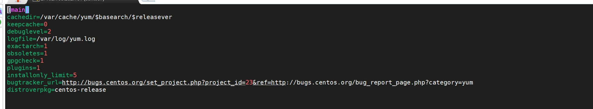

②/etc/yum.repos.d/\*repo —— 仓库配置(为每个仓库的提供配置文件)

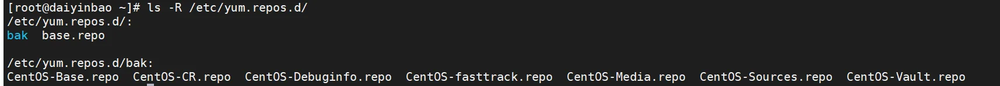

base.repo具体内容

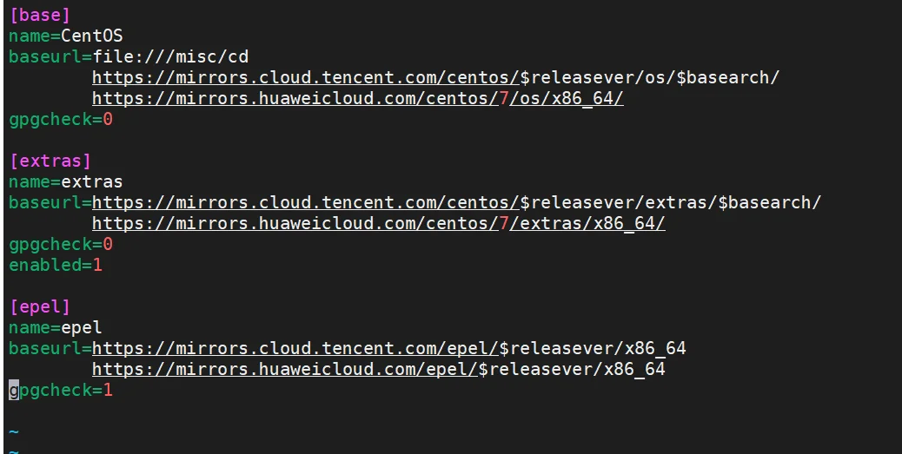

repo仓库配置含义:

```bash
[repositoryID]  #仓库id(唯一)
name=Some name for this repository #仓库名称
baseurl=url://path/to/repository/ #仓库路径
enabled={1|0} #是否启用该仓库
gpgcheck={1|0} #是否校验软件包的GPG签名
gpgkey=URL #若启用GPG校验，通过此URL提供公钥文件，用于验证签名
#说明：gpgkey这个url在下载epel-release可以在本地找到
#file:///etc/pki/rpm-gpg/RPM-GPG-KEY-EPEL-7
#也可联网
#https://mirrors.aliyun.com/epel/RPM-GPG-KEY-EPEL-7
enablegroups={1|0}
failovermethod={roundrobin|priority} #多URL时的访问策略
 roundrobin：意为随机挑选，默认值
 priority:按顺序访问
cost= 默认为1000 #仓库优先级权重
```

baseurl格式(重点)：

(1)协议：file://、http://、https://、ftp://

(2)相关变量:

```bash
yum的repo配置文件中可用的变量：
$releasever: 当前OS的发行版的主版本号，如：8，7，6
$arch: CPU架构，如：aarch64, i586, i686，x86_64等
$basearch：系统基础平台；i386, x86_64
$contentdir：表示目录，比如：centos-8，centos-7
$YUM0-$YUM9:自定义变量
```

(3) 示例：

```bash
http://server/centos/$releasever/$basearch/
http://server/centos/7/x86_64
```

(4)epel源

EPEL 是“扩展软件库”，不是系统自带的；

提供大量高质量的开源软件包，比如开发工具、网络服务、监控软件等；

不会与系统官方软件冲突，由社区严格测试和维护；

解决“官方源找不到软件”的问题，避免手动编译的麻烦

(5) 注意事项：

**yum仓库指向的路径一定必须是repodata目录所在目录**

**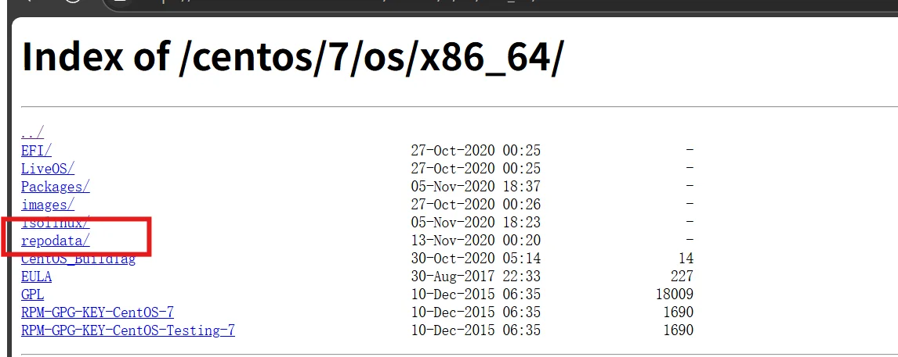**

CentOS 8 系统有两个yum 源：BaseOS和AppStream ，需要分别设置两个仓库.

#### 3.3 yum 命令

(1)显示仓库列表 —— yum repolist

```bash
yum repolist [all|enabled|disabled]
#都支持通配符
--disabled #不能使用的
--enabled  #可使用的
```

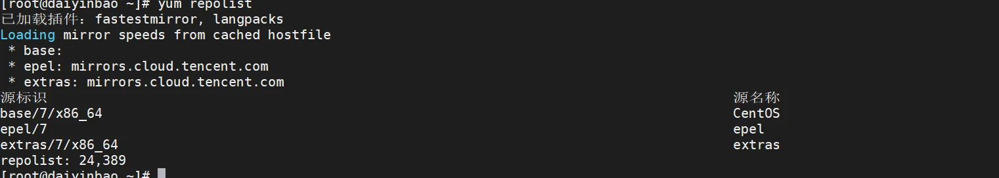

(2) 显示程序包

```bash
yum list PackageName #查看指定包 这里支持通配符
yum list all #查看所有包
yum list installed #查看已安装的包
yum list available #查看可安装的包
```

(3)安装程序包

```bash
yum install PackageName #安装包
yum install PackageName -y 默认允许安装包
--downloadonly #类似于下载安装包，但不安装
--downloaddir=<path>、--destdir=<path> #指定下载的目录,如果不存在自动创建
```

(4)卸载程序包

```bash
yum remove PackageName
erase PackageName
```

(5)升级和降级

```bash
yum upgrade PackageName #升级
yum update PackageName #降级
```

(6)查询

①查看程序包的信息

```bash
yum info PackageName
```

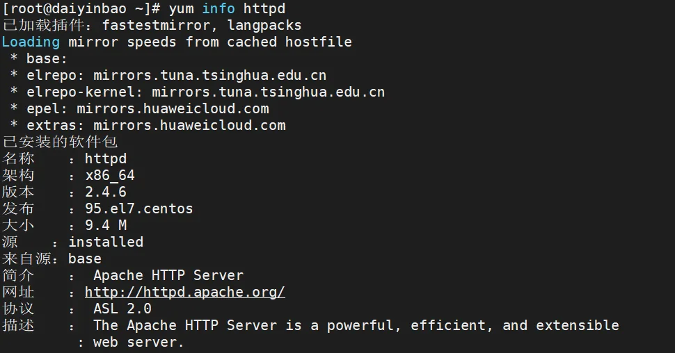

②查看指定的特性(可以是某文件)是由哪个程序包所提供

```bash
yum provides
```

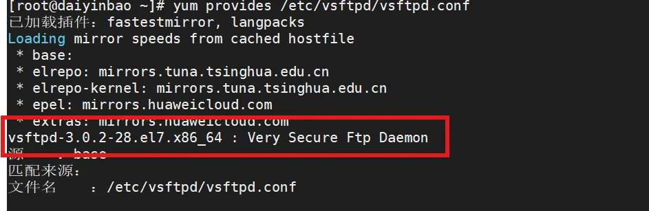

注意，需要写文件的全称

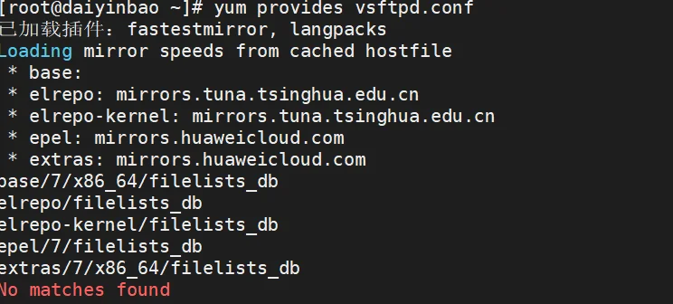

③查看未安装包的文件列表(存在rpm包时，可以使用rpm命令)

```bash
yum -y install yum-utils
repoquary -ql PackageName
```

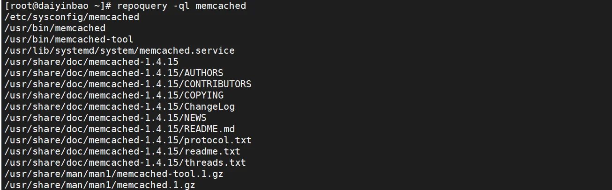

(7)仓库缓存

```bash
yum clean all #清除缓存
yum makeache #创建缓存
```

(8)yum的历史命令

```bash
yum history #centos7
dnf history #centos8
```

可以根据历史命令提供的编号还undo或者redo...历史命令

#### 3.4 实现私用 yum 仓库（重点）

在实际生产中，我们使用的一般都是局域网，为了提高在公司内部下载软件的效率，我们需要制作一个私有的仓库。

(1)我们使用光盘模拟yum仓库，将该仓库私有化。

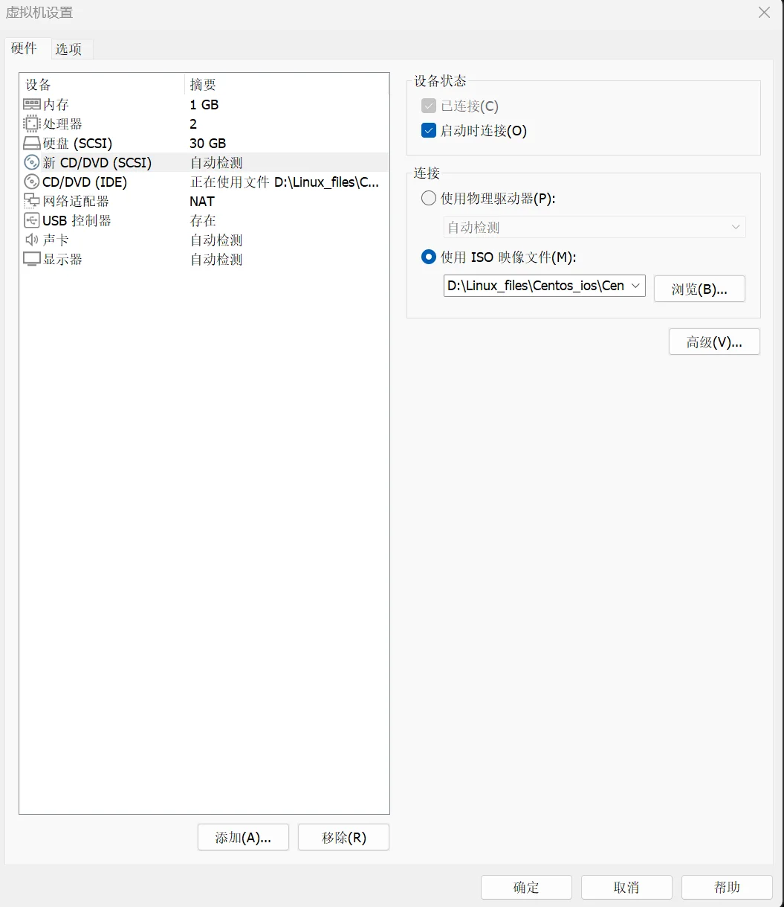

添加后，进行扫描，发现可正常使用

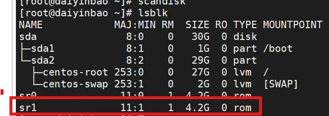

之后进行挂载，此时，我们的模拟仓库创建完成

```bash
mkdir /mnt_cd
mount /dev/sr1 /mnt_cd
```

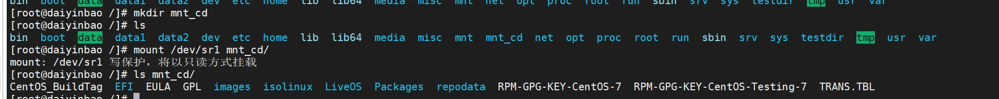

(2)下载httpd服务，使客户端可以访问到该服务器

```bash
yum install httpd -y
systemctl enable --now httpd
```

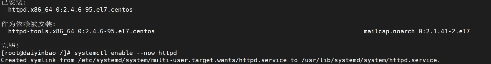

(3)启动后，我们已经可以在浏览器通过ip访问到服务器了


(4)我们将仓库内的内容发布到网站上，供别人访问

```bash
mkdir /var/www/html/centos/7/os
cp -a /mnt_cd/* /var/www/html/centos/7/os
```

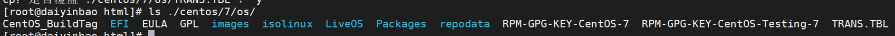

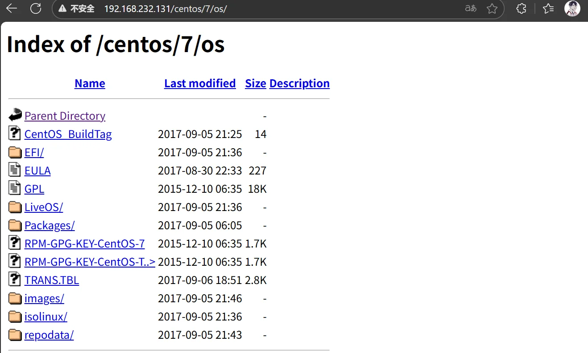

至此，我们yum的服务器端配置完成，在客户端完成配置即可

(5)下载aliyun的epel源，用于扩展

```bash
wget -O /etc/yum.repos.d/epel.repo \  https://mirrors.aliyun.com/repo/epel-7.repo
reposync -p /var/www/html --repoid=epel #从aliyun下载epel包
createrepo /var/www/html/epel/ #创建元数据
```

reposync命令讲解：

作用：**把远程 YUM仓库完整地“镜像”到本地目录**，形成可离线使用的软件源

```bash
-p /path	#下载根目录（会自动再建一层 repo-id 子目录）
--download-metadata	#连 repodata 一块拉，省得再 createrepo
```

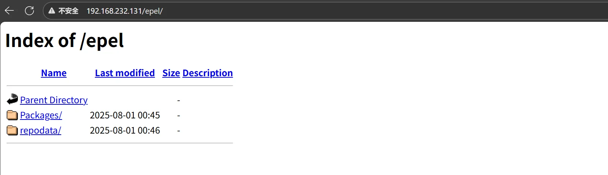

## 三.程序包编译

### 1.源码编译概述

#### 1.1 源码编译介绍

在这个开源盛行的环境下，虽然有很多源码都被打包成软件，供人使用。但并不是所有的源代码都打成包，如果想使用这样的软件，需要自己下载源码，进行编译安装。利用源码进行编译安装是比较繁琐的，我们需要使用相关的工具减少编译过程的复杂度。

#### 1.2 编译源码的工具

C、C++的源码编译：使用 make 项目管理

java的源码编译: 使用 maven

### 2.C语言源代码编译安装过程

#### 2.1 主要步骤

利用编译工具，通常只需要三个大的步骤

configure脚本 --> Makefile.in --> Makefile

> ①./configure  执行configure脚本，执行时会参考用户的指定以及Makefile.in文
>  件**生成Makefile。**通过选项传递参数，指定安装路径、启用特性。
>
> ②make 根据Makefile文件，会检测依赖的环境，进行构建应用程序
>
> ③make install 复制文件到相应路径

#### 2.2 编译安装准备

(1)准备软件相关的依赖包，一般直接下载

(2)准备开发工具，以下工具一般需要使用,需要在编译前下载使用

```
yum install  gcc make autoconf gcc-c++ glibc glibc-devel pcre pcre-devel openssl
openssl-devel systemd-devel zlib-devel  vim lrzsz tree tmux lsof tcpdump wget
net-tools iotop bc bzip2 zip unzip nfs-utils man-pages
```

(3)准备开发环境 ：开发库（glibc：标准库），头文件

#### 2.3 编译安装

(1)运行 configure 脚本，生成 Makefile 文件

这步的主要功能：可以指定安装位置和指定启用的特性

```bash
安装路径设定
--prefix=/PATH：指定默认安装位置,默认为/usr/local/
--sysconfdir=/PATH：配置文件安装位置
```

通常被编译操作依赖的程序包，需要安装此程序包的"开发"组件，其包名一般类似于namedevel-VERSION

(2)make 和make install

### 3.编译安装实战案例

#### 3.1 编译安装 cmatrix

(1)下载并解压缩包

```bash
cd /usr/local/src #一般存放源码的位置
wget https://github.com/abishekvashok/cmatrix/releases/download/v2.0/cmatrix-v2.0-Butterscotch.tar  #远程下载压缩包
tar xvf cmatrix-v2.0-Butterscotch.tar #解压
```


(2)进行编译安装

```bash
cd cmatrix
./configure --prefix=/apps/cmatrix #执行脚本命令
make && make install  #编译并安装
```

(3) 配置环境变量

```bash
echo 'PATH=/apps/cmatrix/bin:$PATH' > /etc/profile.d/cmatrix.sh
. /etc/profile.d/cmatrix.sh
```

(4)安装完成，运行

```bash
cmatrix -a -b -C yellow
```

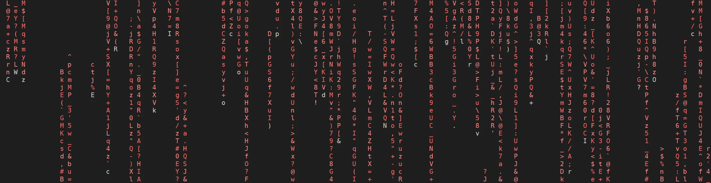

#### 3.2 编译安装 httpd 2.4

```bash
wget https://mirror.bit.edu.cn/apache//httpd/httpd2.4.46.tar.bz2
tar xvf httpd-2.4.46.tar.bz2 -C /usr/local/src
cd /usr/local/src/httpd-2.4.43/
./configure --prefix=/apps/httpd --sysconfdir=/etc/httpd --enable-ssl
make && make install
echo 'PATH=/apps/httpd/bin:$PATH' > /etc/profile.d/httpd.sh
. /etc/profile.d/httpd.sh
apachectl start
useradd -r -s /sbin/nologin -d /var/www -c Apache -u 48 apache
apachectl restart
```

## 四.Ubuntu下的软件安装

### 1. Ubuntu软件概述

Debian软件包通常为预编译的二进制格式的扩展名".deb"，类似rpm文件，因此安装快速，无

需编译软件。

包文件包括特定功能或软件所必需的文件、元数据和指令

dpkg：类似于rpm， dpkg是基于Debian的系统的包管理器。可以安装，删除和构建软件包，

但无法自动下载和安装软件包或其依赖项

apt：功能强大的软件管理工具，甚至可升级整个Ubuntu的系统，基于客户/服务器架构，类似

于yum

### 2. dpkg 包管理器

```bash
#安装包
dpkg -i package.deb
#删除包，不建议，不自动卸载依赖于它的包
dpkg -r package
#删除包（包括配置文件）
dpkg -P package
#列出当前已安装的包，类似rpm -qa
dpkg -l
#显示该包的简要说明
dpkg -l package
#列出该包的状态，包括详细信息，类似rpm –qi
dpkg -s package
#列出该包中所包含的文件，类似rpm –ql
dpkg -L package
#搜索包含pattern的包，类似rpm –qf
dpkg -S <pattern>
#配置包，-a 使用，配置所有没有配置的软件包
dpkg --configure package
#列出 deb 包的内容，类似rpm –qpl
dpkg -c package.deb
#解开 deb 包的内容
dpkg --unpack package.deb
#列出系统上安装的所有软件包
dpkg -l
#列出软件包安装的文件
dpkg -L bash
#查看/bin/bash来自于哪个软件包
dpkg -S /bin/bash
#安装本地的 .deb 文件
dpkg -i /mnt/cdrom/pool/main/z/zip/zip_3.0-11build1_amd64.deb
#卸载软件包
dpkg -r zip
```

一般建议不要使用dpkg卸载软件包。因为删除包时，其它依赖它的包不会卸载，并且可能无

法再正常运行

### 3. apt工具

```bash
#安装包：
apt install tree zip
#安装图形桌面
apt install ubuntu-desktop
#删除包：
apt remove tree zip
#说明：apt remove中添加--purge选项会删除包配置文件，谨慎使用
#更新包索引，相当于yum clean all;yum makecache
apt update
#升级包：要升级系统，请首先更新软件包索引，再升级
apt upgrade
#apt列出仓库软件包，等于yum list
apt list
#搜索安装包
apt search nginx
#查看某个安装包的详细信息
apt show apache2
#在线安装软件包
apt install apache2
#卸载单个软件包但是保留配置⽂件
apt remove apache2
#删除安装包并解决依赖关系
apt autoremove apache2
#更新本地软件包列表索引，修改了apt仓库后必须执⾏
apt update
#卸载单个软件包删除配置⽂件
apt purge apache2
#升级所有已安装且可升级到新版本的软件包
apt upgrade
#升级整个系统，必要时可以移除旧软件包。
apt full-upgrade
#编辑source源⽂件
apt edit-sources
#查看仓库中软件包有哪些版本可以安装
apt-cache madison nginx
#安装软件包的时候指定安装具体的版本
apt install nginx=1.14.0-0ubuntu1.6
#查看文件来自于哪个包,类似redhat中的yum provides <filename>
apt-file search 'string'  #默认是包含此字符串的文件
apt-file search -x  '正则表达式'
apt-file search -F /path/file
```
