+++
title = "实现spring机制——mini-spring"
date = 2025-03-15T20:04:22+08:00
weight = 20
tags = ["Java", "Spring", "源码", "后端"]
summary = "手写一个 mini-spring：实现 BeanDefinition 容器、singleton 管理、依赖注入、BeanPostProcessor 后置处理器机制与简单 AOP。"
+++

## 一.前言

spring是Java中庞大的框架，但我们大多数人在使用的时候都是基于API层的调用，很少从底层理解这个框架。这篇文章主要会实现spring中的BeanDefinition容器和singleton容器的管理，依赖注入，后置处理器BeanPostPeocessor的机制和简单的AOP实现。配置方式主要是基于注解的配置，这篇文章学完后，会对spring有更深的理解

前置知识：反射和注解，集合，spring框架的基本使用，动态代理

## 二.项目的搭建

该项目使用maven完成。不在导入spring所需要的依赖，导入基本的依赖，完成spring框架的实现。

需要的依赖:

```xml
    <dependencies>
        <!--测试工具-->
        <dependency>
            <groupId>junit</groupId>
            <artifactId>junit</artifactId>
            <version>4.13.1</version>
            <scope>test</scope>
        </dependency>
        <!--工具类-->
        <dependency>
            <groupId>commons-lang</groupId>
            <artifactId>commons-lang</artifactId>
            <version>2.6</version>
        </dependency>
    </dependencies>
```

项目的包结构

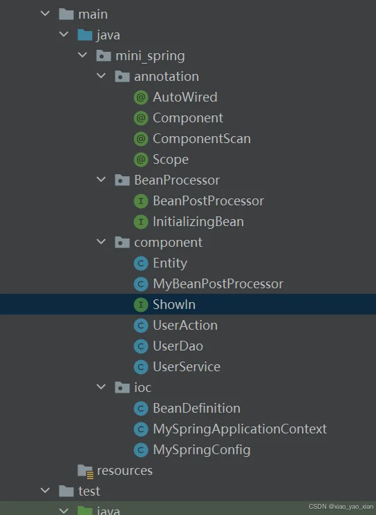

## 三.项目的实现

### 1.创建entity

创建实例类来注入到后续的spring容器中，先创建，暂时还没有业务。

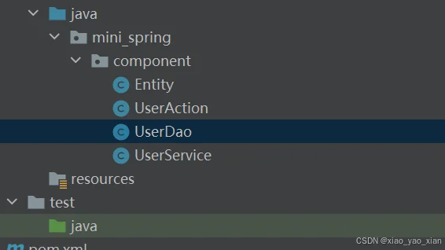

### 2.创建自己的spring容器

任务：创建自己的spring，实现扫描包，得到bean的class对象

#### 2.1 容器的配置信息

思路:采用注解+config类的方式**模拟bean.xml**文件，在注解中标明扫描的包

**编写注解 ComponentScan——标明扫描包**

```java
package mini_spring.annotation;
import java.lang.annotation.ElementType;
import java.lang.annotation.Retention;
import java.lang.annotation.RetentionPolicy;
import java.lang.annotation.Target;
//标明注解的作用范围
@Target(value = ElementType.TYPE)
//标明注解的生命周期
@Retention(value = RetentionPolicy.RUNTIME)
public @interface ComponentScan {
    String value() default "";//扫描的包
}
```

**完成MySpringConfig类，用ComponentScan修饰，指定容器的配置信息**

```java
package mini_spring.ioc;

import mini_spring.annotation.ComponentScan;
//指明扫描的包
@ComponentScan(value = "mini_spring.component")
public class MySpringConfig {
}
```

#### 2.2 创建容器类

类似于spring框架中的ioc容器

```java
package mini_spring.ioc;
public class MySpringApplicationContext {
    //通过MySpringConfig得到配置信息
    private Class configClass;

    public MySpringApplicationContext(Class configClass) {
        this.configClass = configClass;
    }
}
```

#### 2.3 得到扫描包文件

MySpringConfig有注解ComponentScan修饰，可以从中得到包名，在容器的构造器中实现。

```java
        //得到注解ComponentScan
        ComponentScan componentScan =
            (ComponentScan) this.configClass.getAnnotation(ComponentScan.class);
        String packagePath = componentScan.value();//得到了扫描的包名
        System.out.println("packagePath = " + packagePath);
        //得到类加载器，用于扫描文件
        ClassLoader classLoader = MySpringApplicationContext.class.getClassLoader();
        //在得到包的资源路径的形式是mini_spring/component，所以需要替换
        packagePath=packagePath.replace(".","/");
        //得到资源路径
        URL resource = classLoader.getResource(packagePath);
        System.out.println("resource = " + resource);
        //得到包的文件
        File packageFile = new File(resource.getFile());
```

在测试类中运行 ，的确得到了包文件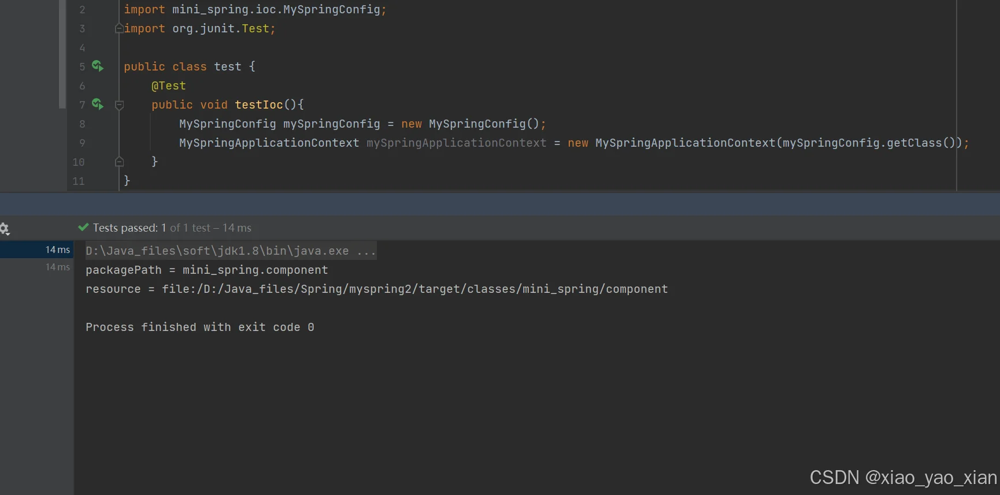

#### 2.4 得到类路径

得到需要扫描的包中的类路径

```java
//开始扫描包
if(packageFile.isDirectory()){
    File[] files = packageFile.listFiles();
    for (File file  : files) {
        System.out.println("====================================");
        //需要得到类路径，用于反射创建实例对象
        String absolutePath = file.getAbsolutePath();
        System.out.println("absolutePath = " +absolutePath);
        if(absolutePath.endsWith(".class")){//如果是类文件
            //反射所需要得到的类路径是mini_spring.component.UserService,
            //所以需要处理absolutePath
            String className =
            absolutePath.substring(absolutePath.lastIndexOf("\\") + 1,
            absolutePath.indexOf(".class"));
            System.out.println("className = "+className);
            String classFullPath = packagePath.replace("/",".") +"."  +className;
            System.out.println("classFullPath = " +classFullPath);
```

运行结果，得到了类的路径，这样我们可以通过反射创建对象了

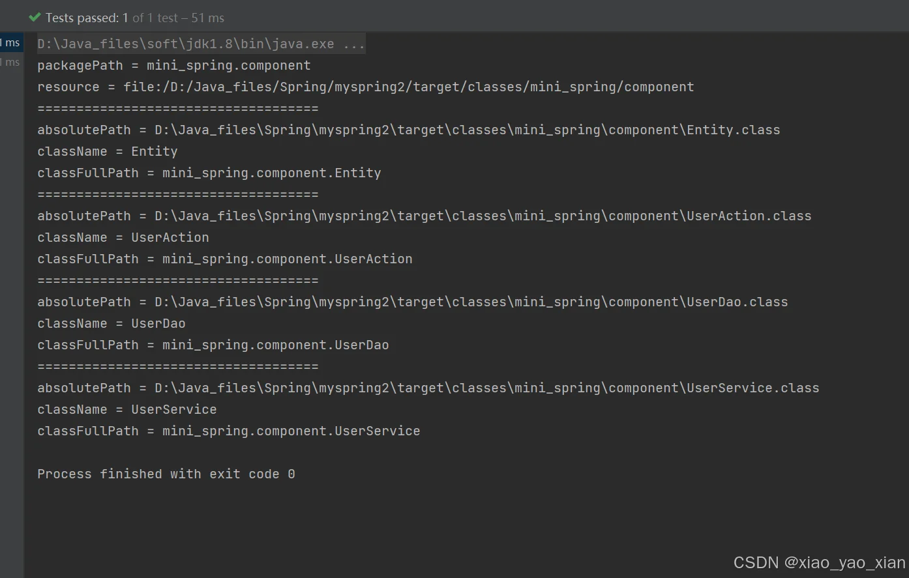

#### 2.5 创建component注解

说明：这里只以component注解为例，可以自行添加其他注解

该注解可以添加到类上，经过扫描注入到ioc容器中

```java
package mini_spring.annotation;
import java.lang.annotation.ElementType;
import java.lang.annotation.Retention;
import java.lang.annotation.RetentionPolicy;
import java.lang.annotation.Target;
@Target(value = ElementType.TYPE)
@Retention(value = RetentionPolicy.RUNTIME)
public @interface Component {
    String value() default "";
}
```

创建完注解后，引入之前创建的entity类，使其可以被扫描，下面只是其中一个，注意在Entity类上不标明，用于区分。

```java
package mini_spring.component;

import mini_spring.annotation.Component;
@Component
public class UserAction {
}
```

#### 2.6 识别bean

将有注解Component 的类识别出来。

```java
try {
    Class<?> clazz = classLoader.loadClass(classFullPath);
    //根据有无注解，判断是否为bean，在根据后续的业务注入
    if(clazz.isAnnotationPresent(Component.class)){
        System.out.println(className + " 是一个bean");
    }else {
        System.out.println( className+ " 不是一个bean");
    }
} catch (ClassNotFoundException e) {
        e.printStackTrace();
}
```

运行检验，得出有component注解修饰的都已被识别为bean。

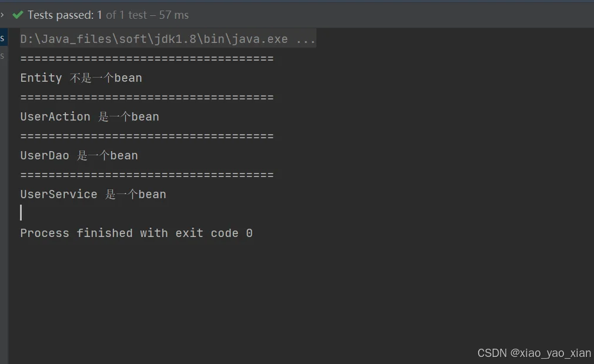

### 3.BeanDefinition容器的实现

我们首先要明白，BeanDefinition容器中储存的是需要注入ioc容器中的类信息，这里并没有创建实例，需要使用类信息利用反射创建对象。

我们使用一个类BeanDefinition，在声明需要注入类的信息，将BeanDefinition对象放入Map中，模拟BeanDefinition容器。

#### 3.1 创建BeanDefinition类

思考：这个类中需要有那些属性？

**类信息和作用域，在扫描时，将bean的信息封装到BeanDefinition的对象中**

```java
public class BeanDefinition {
    private Class clazz;//类信息
    private String scope;//作用域
}
```

篇幅有限，需要有getter和setter方法

#### 3.2 创建作用域注解

scope注解，用于标明类的作用域(单例or多例)，**value有prototype和singleton**两种

```java
@Target(value = ElementType.TYPE)
@Retention(value = RetentionPolicy.RUNTIME)
public @interface Scope {
    String value();
}
```

创建完注解后，在UserDao上标明注解使其为多例，单例不用标明，后面进行识别

```java
@Component
@Scope("prototype")
public class UserDao {

}
```

#### 3.3 创建BeanDefinition容器

**创建ConCurrentHashMap容器，放入beanDefinition的对象，String表示beanName**

这个属性是在MySpringApplicationContext中的

```java
private ConcurrentHashMap<String,BeanDefinition> beanDefinitionMap =
                                                    new ConcurrentHashMap<>();
```

#### 3.4 装载beanDefinitionMap

向beanDefinitionMap中注入对象

```java
if(clazz.isAnnotationPresent(Component.class)){
    System.out.println(className + " 是一个bean");
    Component component = clazz.getAnnotation(Component.class);
    String beanName = component.value();//得到beanName
    BeanDefinition beanDefinition = new BeanDefinition();
    if(clazz.isAnnotationPresent(Scope.class)){//如果有scope，则判断内容
        Scope scope = clazz.getAnnotation(Scope.class);
        String scopeVal = scope.value();
        //如果Component没有指明value，则使用类名首字母小写作为beanName
        if("".equals(beanName)){
            //调用库方法，实现首字母小写
            beanName= StringUtils.uncapitalize(className);
        }
        beanDefinition.setScope(scopeVal);//向beanDefinition加值
    }else {//如果没有scope默认为单例
        beanDefinition.setScope("singleton");
    }
    beanDefinition.setClazz(clazz);
    beanDefinitionMap.put(beanName,beanDefinition);
}else {
        System.out.println( className+ " 不是一个bean");
}
```

需要理解的是，一个beanDefinition对象对应一个entity，注入到beanDefinitionMap后，就是每个entity类的信息和作用域都被保存下来了

测试结果，可以发现beanDefinitionMap中已经保存了相应信息

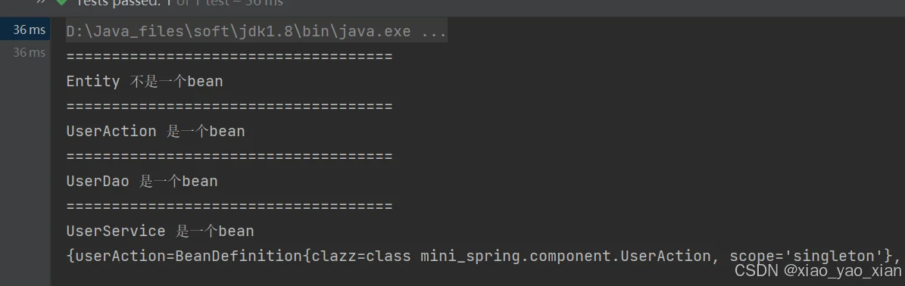

#### 3.5 整合

将扫描包，初始化beanDefinition的过程整合到一个方法中，在构造器中调用，方法中的代码就是上述代码复制粘贴。篇幅过长，不展示。

```java
public MySpringApplicationContext(Class configClass) {
        beanDefinitionsByScan(configClass);

    }
```

### 4.singleTon的初始化

#### 4.1 createBean()方法

根据beanDefinition中存放的类信息，创建对象，这里可以体现为什么需要无参构造器

```java
private Object createBean(BeanDefinition beanDefinition){
        //从beanDefinition中得到类信息
        Class clazz = beanDefinition.getClazz();
        try {
            //利用无参构造器创建对象
            Object instance = clazz.getDeclaredConstructor().newInstance();
            return instance;
        } catch (InstantiationException e) {
            e.printStackTrace();
        } catch (IllegalAccessException e) {
            e.printStackTrace();
        } catch (InvocationTargetException e) {
            e.printStackTrace();
        } catch (NoSuchMethodException e) {
            e.printStackTrace();
        }
        return null;
    }
```

#### 4.2 singleTon容器创建

singleTon容器储存的是单例对象，如果使用单例对象时，直接从该容器中获取。

```java
public ConcurrentHashMap<String,Object> singleTon = new ConcurrentHashMap<>();
```

单例对象都存放在该singleTon中

#### 4.3 初始化singleTon

我们需要在beanDefinitionMap容器创建完毕之后才可以得到所有类信息，之后才可以创建singleTon容器

```java
public MySpringApplicationContext(Class configClass) {
        beanDefinitionsByScan(configClass);
        Enumeration<String> keys = beanDefinitionMap.keys();
        //将beanDefinitionMap中的元素取出，用于创建对象
        while (keys.hasMoreElements()){
            //得到beanName
            String beanName = keys.nextElement();
            //根据beanName去除类信息
            BeanDefinition beanDefinition = beanDefinitionMap.get(beanName);
            //如果是单例，则放入singleTon中
            if("singleton".equalsIgnoreCase(beanDefinition.getScope())){
                //调用createBean方法创建对象
                Object bean = createBean(beanDefinition);
                singleTon.put(beanName,bean);
            }
        }
    }
```

初始化后，我们测试，运行结果，发现singleTon中已经装入实例对象了

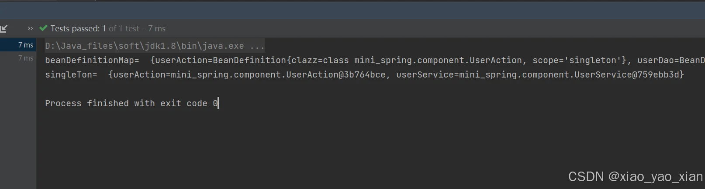

#### 4.4 getBean()方法

通过beanName从ioc容器中获取对象，如果是单例，则从singleTon容器中获取，如果不是单例则重新创建。

```java
 public Object getBean(String beanName){
        //判断是否有该bean
        if(beanDefinitionMap.containsKey(beanName)){
            BeanDefinition beanDefinition = beanDefinitionMap.get(beanName);
            //如果是单例
            if("singleton".equalsIgnoreCase(beanDefinition.getScope())){
                //从singleTon中获取
                return singleTon.get(beanName);
            }else {
                //如果不是单例，重新创建
                return createBean(beanDefinition);
            }
        }else {
            throw new NullPointerException("beanName is not found");
        }
    }
```

测试getBean方法

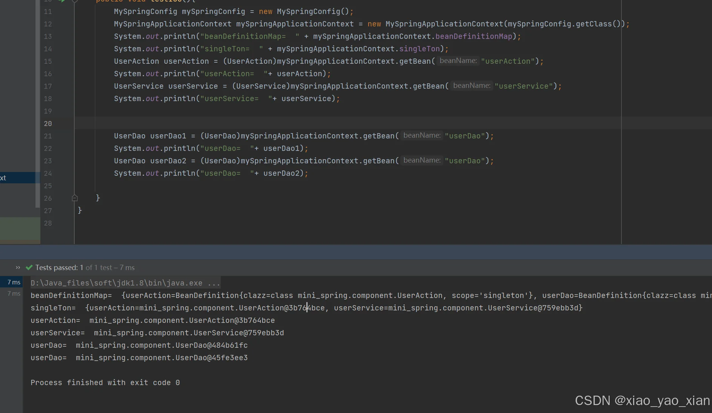

**可以发现有scope修饰的UseDao的实例，每次获取的对象都是不一样的，而单例对象UseAction和UserService获取的对象和singleTon中是一样的。**

### **5.实现依赖注入**

#### **5.1 AutoWired注解**

在spring中通常使用AutoWired注解来完成自动装配，会根据相应的规则实现。

创建AutoWired注解，需要作用在属性上 **ElementType.FIELD**

```java
//需要作用在属性上
@Target({ElementType.FIELD,ElementType.METHOD})
@Retention(value = RetentionPolicy.RUNTIME)
public @interface AutoWired {
}
```

#### 5.2 依赖注入设计

在UserAction类中添加属性为UserService，并创建相应的测试方法。

```java
@Component(value = "userAction")
public class UserAction {
    //添加注解
    @AutoWired
    private UserService userService;
    public void show1(){
        System.out.println("自动装配完成");
        userService.show();
    }

    public UserService getUserService() {
        return userService;
    }

    public void setUserService(UserService userService) {
        this.userService = userService;
    }
}

@Component(value = "userService")
public class UserService {
    public void show(){
        System.out.println("UserService的show()");
    }
}
```

#### 5.3 完成依赖注入

依赖注入是在创建实例之后扫描属性是否存在AutoWired注解，然后进行装配

**作者思考历程**

**第一阶段**:在创建好bean之后直接进行专配。代码如下：

```java
        try {
            //利用无参构造器创建对象
            Object instance = clazz.getDeclaredConstructor().newInstance();

            //在创建好对象后进行依赖注入
            //扫描该类的所有属性
            for (Field filed:clazz.getDeclaredFields()){
                //如果有AutoWired修饰
                if(filed.isAnnotationPresent(AutoWired.class)){
                    //通过属性名实现在ioc容器中查找bean进行装配
                    Object bean = getBean(filed.getName())
                    //是私有属性，需要破解
                    filed.setAccessible(true);
                    //进行装配，给该属性赋值
                    filed.set(instance,bean);
                }
          }
            return instance;
```

思考：有什么问题？

我们知道我们在在调用 Object bean = getBean(filed.getName())时，如果是单例的话是直接从singleTon中获取对象。这时，问题来了，**如果我们需要注入的bean还没有被创建到singleTon容器中怎么办呢**？果不其然，在调用测试方法时，直接报了空指针异常....

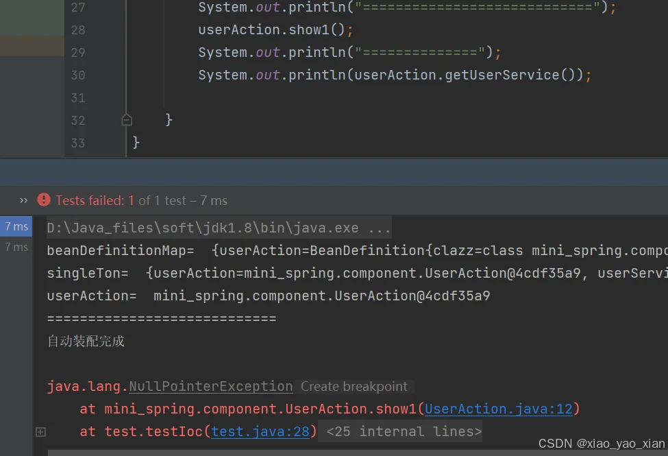

这里的原因就是UserService对象此时还没有被装到singleTon容器中，获得的就是null，继续改进

**第二阶段**：如果Object bean = getBean(filed.getName()) 得到的是null，我们直接设计先创建需要进行装配的对象UserService。代码如下

```java
        Class clazz = beanDefinition.getClazz();
        try {
            //利用无参构造器创建对象
            Object instance = clazz.getDeclaredConstructor().newInstance();

            //在创建好对象后进行依赖注入
            //扫描该类的所有属性
            for (Field filed:clazz.getDeclaredFields()){
                //如果有AutoWired修饰
                if(filed.isAnnotationPresent(AutoWired.class)){
                    //通过属性名实现在ioc容器中查找bean进行装配
                    Object bean = getBean(filed.getName());
                    //如果是null，说明还没有在singTon中，直接创建
                    if(bean==null){
                        bean=createBean(beanDefinitionMap.get(filed.getName()));
                    }
                    //是私有属性，需要破解
                    filed.setAccessible(true);
                    //进行装配，给该属性赋值
                    filed.set(instance,bean);
                }
          }
            return instance;
```

此时有什么问题？发现的确没有空指针报错了，也可以调用方法。但是我们知道，在自动装配的时候是从容器中扫描获取的，如果我们直接调用，**并没有将创建的bean放入到singleTon容器中**，这样我们获得的就**不是单例的对象**。我们测试查看发现的确不是同一个对象，这样设计也不符合spring容器。

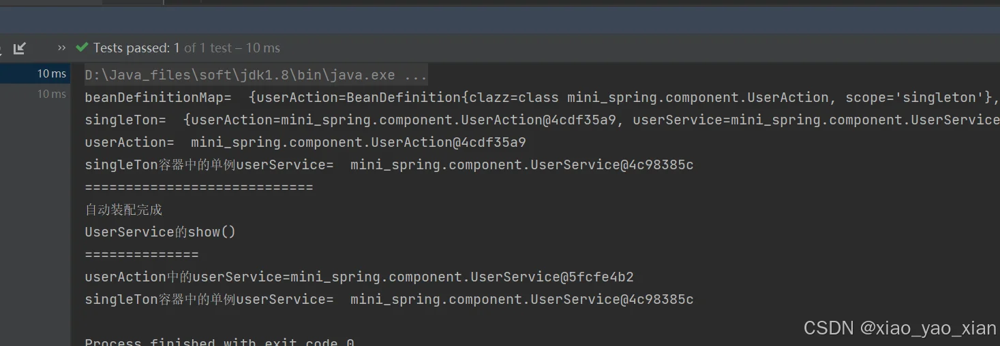

**第三阶段**：既然在创建过程中不能实现，我们在初始化singleTon容器后执行

```java
        //此时的singleTon容器已经初始化完毕了
        Enumeration<String> keys1 = singleTon.keys();
        //直接扫描该容器
        while (keys1.hasMoreElements()){
            String beanName = keys1.nextElement();
            Object instance = singleTon.get(beanName);
            Field[] declaredFields = instance.getClass().getDeclaredFields();
            //进行相同的业务
            for (Field field : declaredFields) {
                if(field.isAnnotationPresent(AutoWired.class)){
                    Object bean = getBean(field.getName());
                    field.setAccessible(true);
                    try {
                        field.set(instance,bean);
                    } catch (IllegalAccessException illegalAccessException) {
                        illegalAccessException.printStackTrace();
                    }
                }
            }
        }
```

**这样可以实现直接从singleTon容器中获取对象**，而且得到的还是同一个

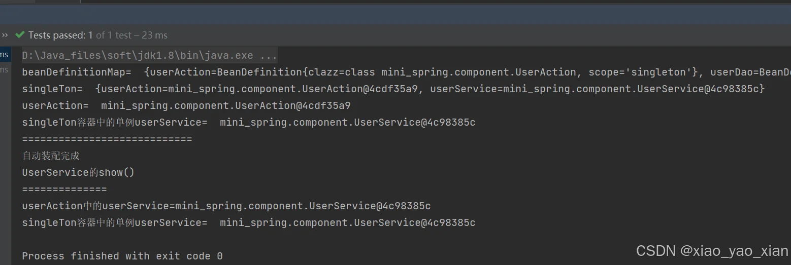

这里并不是采用原生的方式，因为缓存机制的实现太复杂。这个方法的话会造成遍历时间的浪费，我们可以简单理解。

产生这个现象的原因是：**我们是边创建bean边初始化singleTon容器的**，这样就是有顺序的影响，如果注入的bean不是单例的，我们就可以直接使用方案1，而方案3的话无论怎样都可以，只是会有时间的损耗。

原生的spring并不是采用作者的方案实现的，而是使用一种缓存机制实现的，这里不讲解。

### 6.后置处理器的实现

我们知道，后置处理器的方法是在初始化方法的前后执行的，我们就先完成初始化方法。

#### 6.1 初始化方法的设计

需要初始化的类都需要实现一个**接口InitializingBean**,接口中可以指定初始化方法

```java
public interface InitializingBean {
    void afterPropertiesSet() throws Exception;
}
```

需要初始化的类实现该接口即可

```java
@Component(value = "userService")
public class UserService implements InitializingBean {
    public void show(){
        System.out.println("UserService的show()");
    }

    @Override
    public void afterPropertiesSet() throws Exception {
        System.out.println("UserService初始化完成afterPropertiesSet()");
    }
}
```

实现该接口后需要在完成属性设置之后调用该初始化方法，所以就在依赖注入后调用

```java
            //判断该instance是否实现了接口
            if(instance instanceof InitializingBean){
                try {
                    //强转并调用初始化方法
                    ((InitializingBean) instance).afterPropertiesSet();
                } catch (Exception e) {
                    e.printStackTrace();
                }
            }
```

测试方法，发现已经完成初始化

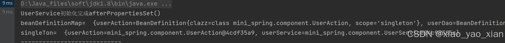

#### 6.2 后置处理器的设计

先创建BeanPostProcessor接口，实现该接口的类就是后置处理器，可以有多个后置处理器

```java
public interface BeanPostProcessor {
    default Object postProcessBeforeInitialization(Object bean, String beanName) {
        return bean;
    }
    default Object postProcessAfterInitialization(Object bean, String beanName) {
        return bean;
    }
}
```

实现类 该类需要被注入到容器所以需要添加注解

```java
@Component
public class MyBeanPostProcessor implements BeanPostProcessor {
    @Override
    public Object postProcessBeforeInitialization(Object bean, String beanName) {
        System.out.println("postProcessBeforeInitialization()被调用..");
        return bean;
    }

    @Override
    public Object postProcessAfterInitialization(Object bean, String beanName) {
        System.out.println("postProcessAfterInitialization被调用...");
        return bean;
    }
}
```

#### 6.3 后置处理器的实现

为了方便处理所有的后置处理器，我们根据是否实现BeanPostProcessor 接口将后置处理器放入到集合中，类似于一个容器

```java
private List<BeanPostProcessor> beanPostProcessorList=new ArrayList<>();
```

我们在**将bean注入ioc容器时判断，将后置处理器装入到集合中**

```java
//判断clazz是否为BeanPostProcessor的实现类
if(BeanPostProcessor.class.isAssignableFrom(clazz)){
    try {
        //如果是，将BeanPostProcessor的实例beanPostProcessorList    中，统一调用
        BeanPostProcessor beanPostProcessor = (BeanPostProcessor) clazz.newInstance();
        beanPostProcessorList.add(beanPostProcessor);
    }catch (InstantiationException e) {
        e.printStackTrace();
    } catch (IllegalAccessException e) {
        e.printStackTrace();
    }
}
```

注入到容器之后，我们在初始化方法前后执行后置处理器中的方法

```java
             //进行前置处理，从容器中取出对象
            for (BeanPostProcessor beanPostProcessor : beanPostProcessorList) {
                Object obj;
                obj=beanPostProcessor.postProcessBeforeInitialization(instance,beanName);
                if(obj!=null){
                    instance=obj;
                }

            }
            //判断该instance是否实现了接口
            if(instance instanceof InitializingBean){
                try {
                    //强转并调用初始化方法
                    ((InitializingBean) instance).afterPropertiesSet();
                } catch (Exception e) {
                    e.printStackTrace();
                }
            }
            //进行后置处理，从容器中取出对象
            for (BeanPostProcessor beanPostProcessor : beanPostProcessorList) {
                Object obj;
                obj=beanPostProcessor.postProcessAfterInitialization(instance,beanName);
                if(obj!=null){
                    instance=obj;
                }
            }
```

完成后，发现的确完成后置处理器的功能

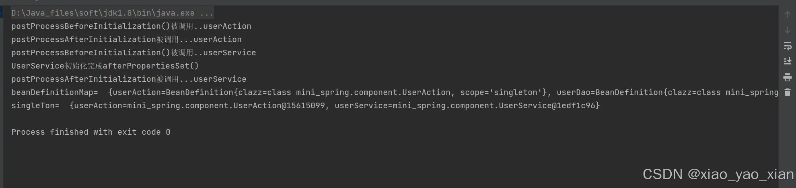

### 7.AOP的简单实现

#### 7.1 AOP机制的设计

在AOP编程中，我们调用方法，实际调用的是动态代理对象的方法。我们是在什么时候将对象转成动态代理的呢？这就与我们的后置处理器相关，我们在后置处理中，如果判断出需要使用AOP机制，我们就会引入动态代理对象。

动态代理所需要的接口和类

```java
public interface ShowIn {
    void show();
}

import mini_spring.BeanProcessor.InitializingBean;
import mini_spring.annotation.Component;

@Component(value = "userService")

public class UserService implements InitializingBean ,ShowIn{
    @Override
    public void show(){
        System.out.println("UserService的show()");
    }

    @Override
    public void afterPropertiesSet() throws Exception {
        System.out.println("UserService初始化完成afterPropertiesSet()");
    }
}
```

#### 7.2 AOP的实现

这里只进行简单的实现，属于硬编码模式，因为对切面类，切面方法的判断只是对反射的应用，与AOP机制没有太大的关系

在后置处理器中实现代理对象的转化

```java
public Object postProcessAfterInitialization(Object bean, String beanName) {
        System.out.println("postProcessAfterInitialization被调用..."+ beanName);
        //这里是硬编码
        //如果这个类是需要使用切面编程的类，可以通过反射识别出来，这里简化，指定为userService
        if ("userService".equals(beanName)) {
            //创建代理对象
            Object proxyInstance = Proxy.newProxyInstance(bean.getClass().getClassLoader(),
                    bean.getClass().getInterfaces(), new InvocationHandler() {
                        @Override
                        public Object invoke(Object proxy, Method method, Object[] args)
                                throws Throwable {
                            System.out.println("method=" + method.getName());
                            Object result = null;
                            //假如我们进行前置通知+返回通知 处理的方法是show
                            //后面可以通过注解来做的更加灵活
                            if ("show".equals(method.getName())) {
                                System.out.println("前置通知");
                                result = method.invoke(bean, args);//执行目标方法
                                System.out.println("返回通知");
                                //进行返回通知的处理

                            } else {
                                //如果不是需要切入的方法，就直接执行，不用采用代理对象执行
                                result = method.invoke(bean, args);//执行目标方法
                            }
                            return result;
                        }
                    });
            //如果bean是需要返回代理对象的, 这里就直接return proxyInstance
            return proxyInstance;
        }
        return bean;
    }
```

在容器创建时体现

```java
  //进行前置处理，从容器中取出对象
            for (BeanPostProcessor beanPostProcessor : beanPostProcessorList) {
                Object obj;
                obj=beanPostProcessor.postProcessBeforeInitialization(instance,beanName);
                if(obj!=null){
                    instance=obj;
                }
                singleTon.put(beanName,instance);

            }
            //判断该instance是否实现了接口
            if(instance instanceof InitializingBean){
                try {
                    //强转并调用初始化方法
                    ((InitializingBean) instance).afterPropertiesSet();
                } catch (Exception e) {
                    e.printStackTrace();
                }
            }
            //进行后置处理，从容器中取出对象
            for (BeanPostProcessor beanPostProcessor : beanPostProcessorList) {
                Object obj;
                obj=beanPostProcessor.postProcessAfterInitialization(instance,beanName);
                if(obj!=null){
                    instance=obj;
                }
                singleTon.put(beanName,instance);
            }
```

运行测试，发现已经变为代理对象，并且是代理对象执行的方法

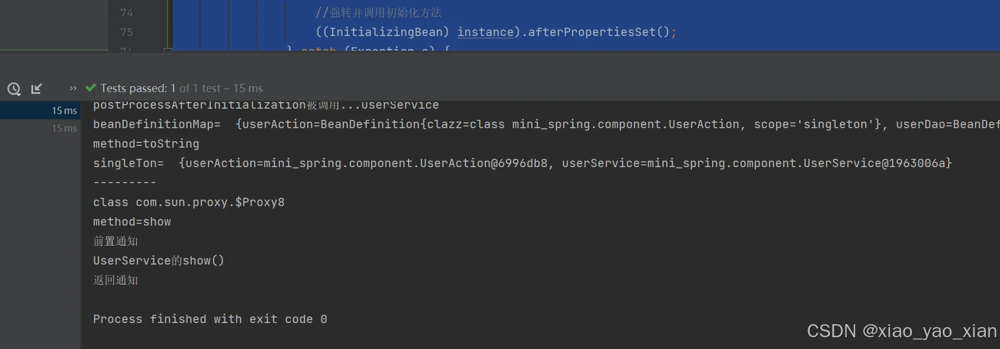

## 四.项目的总结

该项目简单的实现了AOP的机制，与原生的spring仍有很大的区别，但对我们简单了解spring执行流程有很大的帮助

在实现AOP机制我们采用了一些硬编码的形式，这里可以自行进行完善

希望这篇文章对大家有所帮助
