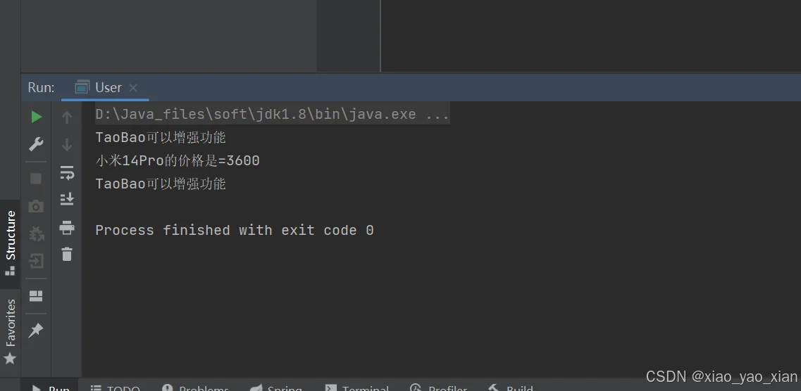
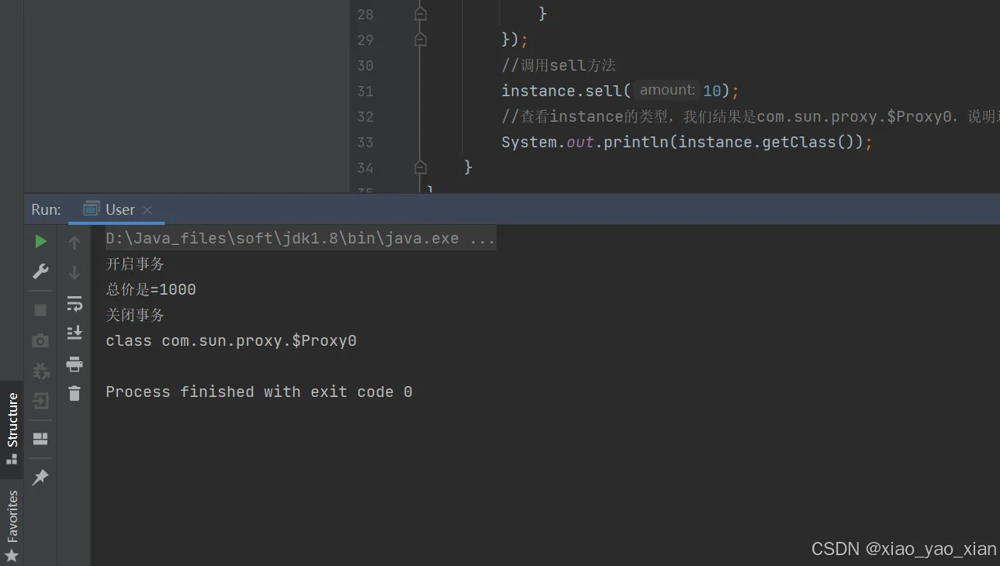
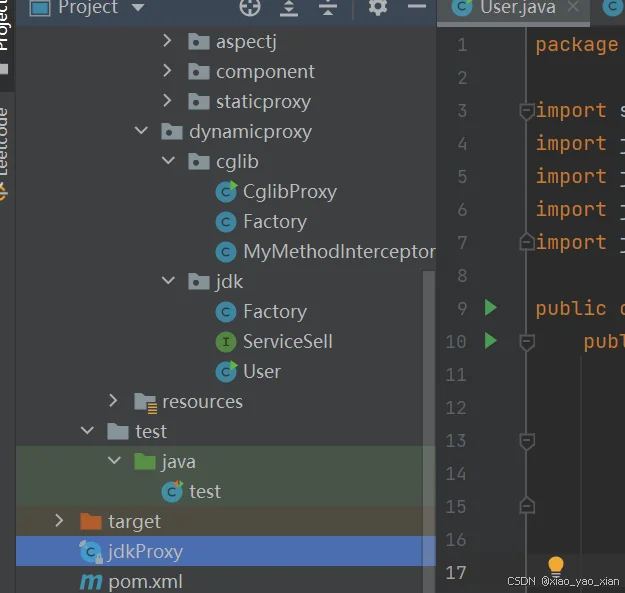
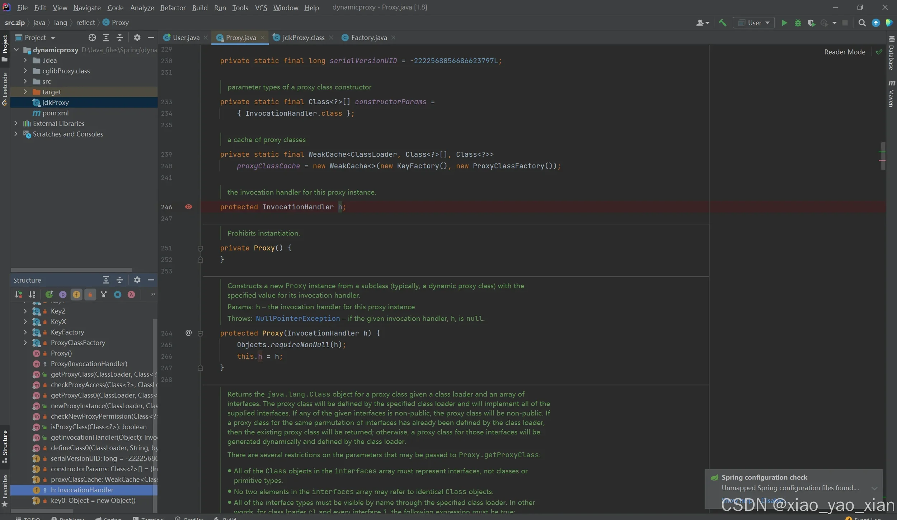
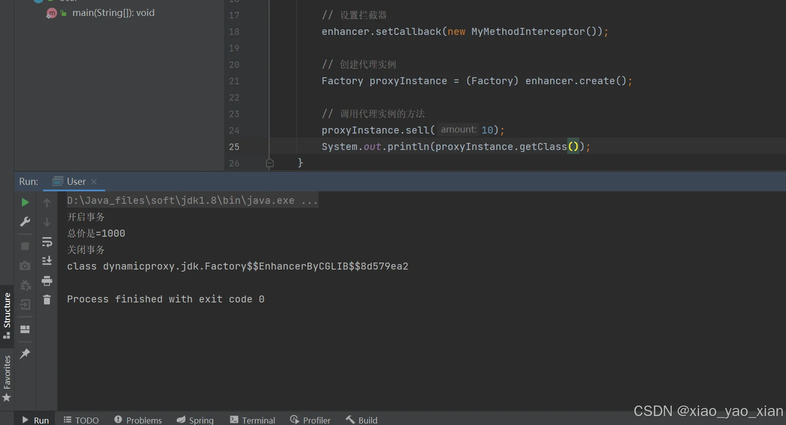
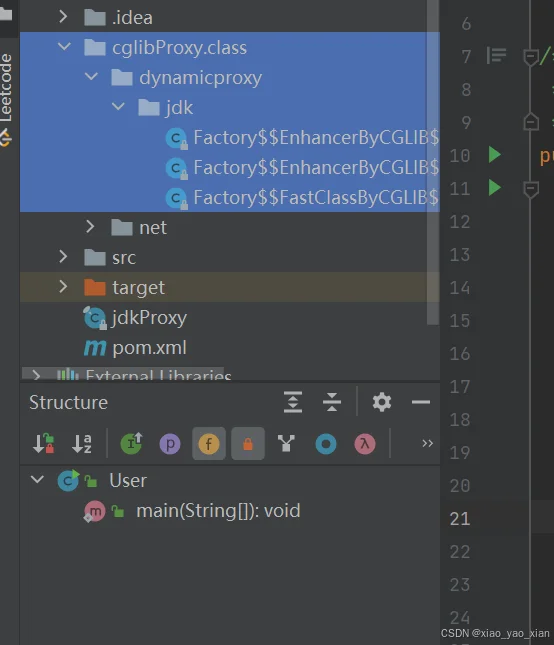
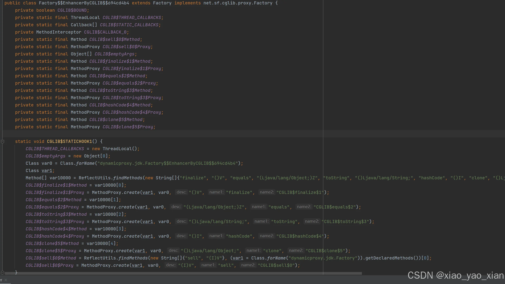

+++
title = "深入理解动态代理"
date = 2025-12-17T10:00:00+08:00
weight = 10
tags = ["Java", "后端", "Spring", "底层"]
summary = "从静态代理讲起，深入理解 JDK 动态代理与 CGLIB 动态代理的设计思想与底层实现。"
+++

## 一.前言

这篇文章主要会讲解动态代理的设计思想。当我们在学习spring框架中的切面编程(AOP)时，会使用到动态代理机制。对于AOP中的动态代理有不能理解流程的，可以通过这篇文章进行学习。该篇**没有大量的源码学习**，初识动态代理的朋友也可以理解，主要是**理解动态代理的设计思想**。学完后，不管是jdk动态代理还是cglb动态代理，都会有一个新的认识。

提醒：学习前需要有**反射、动态绑定机制和内部类**的基础。

在电脑阅读效果最佳！

## 二.静态代理

### 1.静态代理

在学习动态代理之前，我们有必要了解一下静态代理模式，动态代理的设计思想与静态代理相关，都是通过设计**代理类**增强**目标类**的功能。

怎样理解代理类和目标类？通过一个具体的例子来讲解

### 2.引入静态代理

在日常生活中，我们购买东西一般有三个对象。一个是购物者，一个是商家，一个是厂家。我们买东西一般是从商家买，而不是直接从厂家购买。因为我们从商家买东西更加方便，厂家把东西批发给商家也更加合理。购买者更加方便，商家可以盈利，厂家可以提高生产，这可以提高消费质量。

在购买商品的实例中，我们可以将**厂家表示为目标类**(商品的目标来源)，**商家就是代理类(服务于目标类)**，可以增强目标类的功能。在这中间就有一个静态代理模式的思想。**厂家和商家都有相同的业务**，就是卖东西，都需要有相应的规范。在Java中，我们可以用**接口**来规范出售商品的行为。下面通过Java代码来模拟购买商品的过程，来体现静态代理。

### 3.静态代理模式

为了方便，我们就以购买手机为实例进行讲解。其中的商家我们表示为淘宝(TaoBao类)，厂家就用小米（XiaoMi类）表示。

上面提到，我们可以使用接口来规范卖商品行为，我们**定义SellPhone接口**

```java
/**
 * 有出售需求的对象需要实现该接口
 */
public interface SellPhone{
    /**
     * 该方法表示卖商品
     * @param price 模拟购买的价格
     */
    void sell(int price);
}
```

实现该接口可以模拟出售商品的行为，接下来我们实现目标类(XiaoMi类)

```java
/**
 * 这个类表示目标类——厂家
 */
public class XiaoMi implements SellService{
    /**
     * 出售小米手机
     * @param price 模拟购买的数量
     */
    @Override
    public void sell(int price ) {
        System.out.println("小米14Pro的价格是=" + price);
    }
}
```

目标类一般是直接是供代理类使用的，比如实际生活中，厂家一般是把货卖给商家，而不是直接把货买个个体，厂家和商家直接进行对接，这样可以说明**代理类中需要有目标类的对象，以便于对接功能**，接下来我们实现代理类(TaoBao类)

```java
/**
 * 代理类，可以增强目标类的功能——商家
 */
public class TaoBao implements SellService{
    
    //代理类直接和目标类对接
    private XiaoMi xiaoMiFactory=new XiaoMi();

    /**
     * 代理类的方法，可以增强功能
     * @param price 模拟购买的价格
     */
    @Override
    public void sell(int price) {
        System.out.println("TaoBao可以增强功能");
        xiaoMiFactory.sell(price);
        System.out.println("TaoBao可以增强功能");

    }

}
```

实现类代理类后，我们用户购买商品，一般是直接和代理类对接，我们模拟购买商品

```java
/**
 * 模拟购买行为
 */
public class User {
    public static void main(String[] args) {
        //用户一般和代理类对接
        TaoBao taoBao = new TaoBao();
        //购买行为
        taoBao.sell(3600);
    }
}
```

在这里调用sell()方法，就已经是**被代理对象增强后的方法**，这就是基本的静态代理模式



### 4.静态代理模式总结

使用这种代理模式，**可以实现功能的解耦**，比如说目标类(厂家)只需要实现出售的行为，但功能就单一，不能满足用户的需求。代理类的出现，可以增强功能，上面的例子只是一个模拟，代理类的增强功能远不止于此，实际可以进行权限的设置或者日志管理等功能。该例子只是便于让我们理解其中的思想。

思考静态代理有什么缺陷呢？虽然我们可以调用代理类，使用增强后的功能，**但满足的需求过于单一**，比如我们这个TaoBao这个代理类在上述的例子中只能实现卖手机的功能，如果需要增加其他的功能，我们就需要**对代理类进行修改**或者**创建更多的代理类满足不同的需求**。如果修改代理类，那么就会增加后续的维护成本。如果增加代理类的话，就会增加设计的成本。这些对我们的开发都有影响，**于是就有了动态代理的出现。**

## 三.JDK动态代理

### 1.JDK动态代理

相信在理解静态代理之后，我们可以明白，在代理模式中有两个重要的类，代理类和目标类。**代理类是服务于目标类的**，对其功能进行增强。

用户在购买手机的这个实例中，我们也是先了解了有这个品牌的手机，才会在不同的购买平台购买。所以在这个代理模式的**直接表现出来的就是这个目标类(XiaoMi类)和用户**，这是我们理解动态代理的关键。

动态代理最大的优点就是灵活性高，**动态代理在运行时动态生成代理对象，**可以根据不同的需求和运行时环境灵活地创建代理**，**在动态代理中，我们的**代理对象并没有直接的展现在用户面前，但是我们仍可以在调用方法时，获得增强的功能**。这是我们很难理解的，下面我们将详细展现jdk动态代理。

**在进入代码讲解之前，需要了解这个非常非常重要的底层逻辑！！！！！！！！！！！！**

\*\*动态代理模式就是在底层动态地创建了一个代理类，供用户使用，但用户不能直接看到。其余的实现机制可以通过静态代理来理解。\*\*下面的内容我们会将这个动态创建的代理类的结构通过代码展现出来，这个代理类是真实存在的。

### 2.JDK动态代理中使用的类和接口

(1)Proxy类——代理类

> **-这个类中有一个非常重要的方法\*\*\*\*newProxyInstance，可以用来创建代理对象**
>
> **public static** **Object newProxyInstance ( ClassLoader loader,**
>
> **Class<?>[] interfaces,**
>
> **InvocationHandler handler);**
>
> **-参数讲解**
>
> **loader：目标类的类加载器，通过目标对象的反射可获取**
>
> **interfaces：目标类实现的接口数组，通过目标对象的反射可获取**
>
> \*\*–\*\*这个接口相当于静态代理的SellPhone接口，可以规范行为
>
> **handler：调用处理器，也叫做方法拦截器，后续会重点讲解。**
>
> **–返回对象**
>
> **经过一系列的操作后，返回的对象就是我们看不见的代理对象，非常重要**

(2)InvocationHandler接口

> **-在该接口中有一个非常重要的方法invoke，该方法主要用于完成功能的增强**
>
> **public Object invoke(Object proxy, Method method, Object[] args);**
>
> **-参数讲解**
>
> **proxy:调用方法的代理对象(后续会进一步讲解)**
>
> **method：需要增强功能的方法**
>
> \*\*–\*\*类似于静态代理中厂家(XiaoMi类)的sell方法
>
> **args：method方法的参数**
>
> **–重要理解说明**
>
> **这个方法在静态代理中就相当于代理类(TaoBao类) 的sell方法，最终实现功能增强的地方**

(3)还有部分Java基础反射中用到类，这里不过多讲解

### 3.JDK动态代理的实现

设计：在讲解JDK动态代理的实现时，我们仍然使用出售商品的例子来展示。只不过，我们这里没有手动创建代理类了，这里只需要创建厂家类(Factory类)和用户类(User类)，还有规范行为的接口ServiceSell。

首先实现ServiceSell接口

```java
/**
 * 规范出售商品的行为
 */
public interface ServiceSell {
    /**
     * 
     * @param amount 出售商品数量
     */
    void sell(int amount);
}
```

实现完接口后，我们实现厂家类Factory，需要实现ServiceSell接口

```java
/**
 * 厂家类
 */
public class Factory implements ServiceSell{

    /**
     * 厂家出售方法
     * @param amount 出售商品数量
     */
    @Override
    public void sell(int amount) {
        System.out.println("总价是="+(amount*100));
    }
}
```

需要注意的是，我们的动态代理方法中没有手动创建的代理类，而是我们直接实现用户类，在用户类中调用方法**newProxyInstance**，动态创建代理类。创建用户类(User类)

```java
public class User {
public static void main(String[] args) throws Exception {
        #在User类中动态创建代理对象
        ServiceSell instance =
                (ServiceSell)Proxy.newProxyInstance(
                                Factory.class.getClassLoader(),
                                Factory.class.getInterfaces(), 
                                new InvocationHandler() {
            #InvocationHandler是一个接口，所以我们通过内部类的方式创建对象，进行传参
            #实现该接口的类必须要实现invoke方法，在这个方法里我们可以进行sell方法的增强     
            @Override
            public Object invoke(Object proxy, Method method, 
                                    Object[] args) throws Throwable {
                #实现功能的增强
                System.out.println("开启事务");
                #调用目标类(厂家)的方法
                method.invoke(new Factory(), args);
                System.out.println("关闭事务");
                return null;
            }
        });
        #调用sell方法
        instance.sell(10);
        #查看instance的类型，我们结果是com.sun.proxy.$Proxy0，
        #说明这个instance已经是一个代理类了
        System.out.println(instance.getClass());
    }
}
```

再次强调 **newProxyInstance**方法的传参**使用了内部类**，需要有所了解，当然也可以通过实现InvocationHandler接口的方式创建对象传入。

我们运行这个主方法观察结果…



从这个运行结果中我们可以看到，调用sell方法时，该功能是已经得到加强了的，说明我们的代理对象已经创建，并且实现了方法功能的加强，已经实现了静态代理中的效果。

**这里很难理解，为什么我们是将功能的加强写在InvocationHandler的内部类对象中的invoke方法中的，调用sell方法是怎么实现功能增强的呢，最终是怎么调用到invoke方法的呢？？？？**

接下来，我们通过对 **newProxyInstance()方法的返回结果**的源代码进行讲解

### 4.JDK动态代理的底层讲解

在弄清楚底层是怎么调用invoke方法之前，我们最想看清Proxy.newProxyInstance这个方法自动生成的代理对象究竟长什么模样，接下来我们引入一段代码，来弄清底层生成的源码。

我们在Proxy.newProxyInstance()前添加代码。

```java
public class User {
    public static void main(String[] args) throws Exception {

        #新增代码
        byte[] proxy1s = ProxyGenerator.generateProxyClass("jdkProxy", 
                                            Factory.class.getInterfaces());
        String filePath = System.getProperty("user.dir") + "/jdkProxy.class";
        try (FileOutputStream fos = new FileOutputStream(filePath)) {
            fos.write(proxy1s);
        }

        #在User类中动态创建代理对象
        ServiceSell instance =
                (ServiceSell)Proxy.newProxyInstance(
                                    Factory.class.getClassLoader(), 
                                    Factory.class.getInterfaces(), 
                                    new InvocationHandler() {
            #InvocationHandler是一个接口，所以我们通过内部类的方式创建对象，进行传参
            #实现该接口的类必须要实现invoke方法，在这个方法里我们可以进行sell方法的增强
            @Override
            public Object invoke(Object proxy, 
                                 Method method,
                                 Object[] args) throws Throwable {
                #实现功能的增强
                System.out.println("开启事务");
                method.invoke(new Factory(), args);
                System.out.println("关闭事务");
                return null;
            }
        });
        #调用sell方法
        instance.sell(10);
        #查看instance的类型，我们结果是com.sun.proxy.$Proxy0，说明这个instance已经是一个代理类了
        System.out.println(instance.getClass());
    }
}
```

> -1.这段代码的作用是利用Java的动态代理机制，**生成一个代理类的字节码，并将其保存为一个.class文件**
>
> byte[] proxy1s = ProxyGenerator.generateProxyClass(“jdkProxy”, Factory.class.getInterfaces());
>  String filePath = System.getProperty(“user.dir”) + “/jdkProxy.class”;
>  try (FileOutputStream fos = new FileOutputStream(filePath)) {
>  fos.write(proxy1s);
>  }
>
> -2.说明：这段代码的具体的逻辑可以不用过深理解，只需要理解他的业务，**理解成一种工具**，就是生成字节码文件，可以简单的**理解为Proxy.newProxyInstance()生成的代理类可以通过这段代码展示在用户面前**
>
> -3.大家在使用这段代码时，需要注意自己jdk的版本和兼容性问题

我们执行该程序，看到结果，我们发现我们指定的目录中出现了该字节码文件jdkProxy.class



打开该字节码文件，我们可以神奇的发现，**底层自动创建的代理类的真面目展现出来了**

```java
//
// Source code recreated from a .class file by IntelliJ IDEA
// (powered by FernFlower decompiler)
//

import dynamicproxy.jdk.ServiceSell;
import java.lang.reflect.InvocationHandler;
import java.lang.reflect.Method;
import java.lang.reflect.Proxy;
import java.lang.reflect.UndeclaredThrowableException;

public final class jdkProxy extends Proxy implements ServiceSell {
    private static Method m1;
    private static Method m2;
    private static Method m0;
    private static Method m3;

    public jdkProxy(InvocationHandler var1) throws  {
        super(var1);
    }

    public final boolean equals(Object var1) throws  {
        try {
            return (Boolean)super.h.invoke(this, m1, new Object[]{var1});
        } catch (RuntimeException | Error var3) {
            throw var3;
        } catch (Throwable var4) {
            throw new UndeclaredThrowableException(var4);
        }
    }

    public final String toString() throws  {
        try {
            return (String)super.h.invoke(this, m2, (Object[])null);
        } catch (RuntimeException | Error var2) {
            throw var2;
        } catch (Throwable var3) {
            throw new UndeclaredThrowableException(var3);
        }
    }

    public final int hashCode() throws  {
        try {
            return (Integer)super.h.invoke(this, m0, (Object[])null);
        } catch (RuntimeException | Error var2) {
            throw var2;
        } catch (Throwable var3) {
            throw new UndeclaredThrowableException(var3);
        }
    }

    public final void sell(int var1) throws  {
        try {
            super.h.invoke(this, m3, new Object[]{var1});
        } catch (RuntimeException | Error var3) {
            throw var3;
        } catch (Throwable var4) {
            throw new UndeclaredThrowableException(var4);
        }
    }

    static {
        try {
            m1 = Class.forName("java.lang.Object").getMethod("equals", Class.forName("java.lang.Object"));
            m2 = Class.forName("java.lang.Object").getMethod("toString");
            m0 = Class.forName("java.lang.Object").getMethod("hashCode");
            m3 = Class.forName("dynamicproxy.jdk.ServiceSell").getMethod("sell", Integer.TYPE);
        } catch (NoSuchMethodException var2) {
            throw new NoSuchMethodError(var2.getMessage());
        } catch (ClassNotFoundException var3) {
            throw new NoClassDefFoundError(var3.getMessage());
        }
    }
}
```

可以发现这个类的名字是我们自己取的文件名(可忽略)，简单做一个展示，主要分析其结构。

我们在采用静态代理模式的思想来剖析这个类，这个类可以理解为代理类(TaoBao类)。

> -类的定义
>
> public final class jdkProxy **extends Proxy** **implements ServiceSell**
>
> -extends Proxy：继承了代理类**Proxy**
>
> **-implements ServiceSell：实现了ServiceSell接口。**
>
> 重点理解：和我们静态代理的TaoBao类是不是一样呢？因为都要规范行为，都实现了相同的接口**ServiceSell**

可以看出，我们生成的这个代理类和静态代理中手动实现的代理类**都是和目标了实现了相同接口**，和我们代理模式的设计理念是一致的。

我们也可以解释为什么**Proxy.newProxyInstance()**在传参时，为什么需要传输目标类的接口，Class<?>[] interfaces，这样才可以在**自动生成这个类的时候实现该接口**。

> -静态代码块，我们这里省去异常处理的分析，主要分析try的内容
>
> static {
>  try {
>  m1 = Class.forName(“java.lang.Object”).getMethod(“equals”, Class.forName(“java.lang.Object”));
>  m2 = Class.forName(“java.lang.Object”).getMethod(“toString”);
>  m0 = Class.forName(“java.lang.Object”).getMethod(“hashCode”);
>  m3 = Class.forName(“dynamicproxy.jdk.ServiceSell”).getMethod(“sell”, Integer.TYPE);
>  }
>  }
>
> -理解：我们知道，静态代码块是在**类加载时就会执行**，分析其执行的业务。
>
> 从类的结构来看m0,m1,m2…都是Method的对象，表示一个方法
>
> 这个静态代码块就是获得类的基本方法和**根据接口实现的方法**
>
> 我们主要看m3
>
> m3 = Class.forName(“**dynamicproxy.jdk.ServiceSell**“).getMethod(“**sell**“, Integer.TYPE);根据这个接口我们得到了**ServiceSell**接口内的方法，也正是我们目标类的方法(需要增强的方法)，**因此我们可以理解m3就是目标类（Factory类）的sell**

通过这段静态代码块的分析，我们可以理解，在底层，我们是怎么得到目标类的sell方法的呢？ 原来就是通过反射获得了该方法。

接下来就是很重要的**代理类中的方法**了，观察这个类的结构，不难发现，**确实存在一个sell方法**。那是肯定的，因为我们在**调用instance.sell(10)时，**确实调用了sell()，我们在这里就可以理解**这个instance就是我们自动生成这个类的实例对象**

> **-sell()方法的讲解，我们仍然忽略异常处理**
>
> public final void sell(int var1) throws {
>  try {
>  **super.h.invoke(this, m3, new Object[]{var1});**
>  }
>  }
>
> -**super.h.invoke(this, m3, new Object[]{var1});**
>
> **这是代理类中sell()方法的业务逻辑**
>
> 逐字解析
>
> **super.h，**我们想这到底是什么对象执行后面的逻辑**？**
>
> 在类的定义中，我们知道这个代理类时**extends Proxy，**所以想要了解这个h是什么**，我们进入Proxy源码**



> 在Proxy源码中，我们的确找到了h这个对象
>
> **protected InvocationHandler h;**
>
> 我们发现，**它居然是实现InvocationHandler接口的对象，我们在前面调用Proxy.newProxyInstance()时不正是传入了这个参数嘛，就是那个内部类对象！！！**

**这下彻底理解了在代理类中sell方法执行super.h.invoke()时，原来就是调用了在传入参数的InvocationHandler内部类对象的invoke方法，在这里实现了功能的加强。**

> 继续解析 **super.h.invoke(this, m3, new Object[]{var1});**
>
> -当我们知道这个方法的源头之后，我们就可以理解参数了
>
> this：就是**当前的代理对象**，在实际例子中就是instance
>
> **m3：就是在静态代码块解析中的方法，就相当于sell()**
>
> Object[]{var1}：sell()方法的参数。
>
> 我们再来看参数**InvocationHandler内部类的方法**
>
> public Object invoke(Object proxy, Method method,
>  Object[] args) throws Throwable {
>  //实现功能的增强
>  System.out.println(“开启事务”);
>  //调用目标类(厂家)的方法
>  method.invoke(new Factory(), args);
>  System.out.println(“关闭事务”);
>  return null;
>  }
>
> 这样一对照，我们就清晰了功能增强的源头，以及怎么执行到该方法的

### 5.JDK动态代理的总结

经过上面的讲解，我们应该可以明白我们创建的代理对象instance在执行sell方法时，是怎么执行到invoke方法的，怎么实现的功能增强。

我们再次梳理一下执行逻辑

1.我们创建代理对象 Proxy.newProxyInstance(…)，**需要理解参数含义**

2.在底层生成我们的代理对象instance，对象中包含有sell()方法

3.调用sell()方法，instance.sell(…)

4.**在sell方法中调用InvocationHandler内部类对象的方法invoke**

5.在invoke()中调用目标类的sell()方法，实现功能的增强

JDK动态代理讲解完毕，希望大家在静态代理的基础上理解JDK动态代理，至于底层是怎么自动创建这个代理对象，这里不再讲解，**主要是理解JDK动态代理实现功能增强时的执行流程和代理模式的设计。**

**jdk动态代理可以没有目标类，但一定需要有接口，这个代理类实际是通过接口创建的.**

## 四.CGLB动态代理

### 1.引入CGLB动态代理

在我们学习完JDK动态代理之后，我们思考一个问题。除了通过实现接口可以调用相同的方法，还有那些途径可以实现呢？万一我们的**目标类没有实现接口**，我们还可以通过创建代理对象来其功能嘛？

答案是肯定的，我们还可以**通过继承的方式来重写父类的方法**来实现增强。不管该类有无实现接口，都可以采用继承的方式进行(**前提就是需要重写的方法不能使用final修饰**)。这就引入了我们的CGLB动态代理。

\*\*CGLIB通过继承目标类并重写其方法来实现代理。\*\*当代理类继承目标类后，就可以实现父类的方法，在该方法中可以实现功能的增强。

CGLB动态代理和JDK动态代理实现功能增强的流程是差不多的，都是**代理类增强方法，调用方法时，实际调用的就是代理类自动生成的相应方法**，这是代理模式设计的基本思想

在Java中使用CGLB动态代理时，需要引入CGLB库，读者自行下载。

```xml
<dependency>
    <groupId>cglib</groupId>
    <artifactId>cglib</artifactId>
    <version>2.2.2</version>
</dependency>
```

### 2.CGLB动态代理使用的类和接口

1.**Enhancer类**

> -1\*\*.**用于**创建代理对象的核心类\*\*，类似于JDK动态代理中的`Proxy`类
>
> -2.内部有三个重要方法
>
> (1)public void **setSuperclass**(Class superclass)
>
> **设置父类，也就是目标类**，传入目标类的类对象
>
> (2)public void **setCallback**(Callback callback)；
>
> **设置方法拦截器**，相当于JDK动态代理中的实现**InvocationHandler接口的内部类对象**
>
> (3)public Object **create**()；
>
> **创建代理对象，相当于Proxy.newProxyInstance(…)**

2.**MethodInterceptor**接口——方法拦截器

> -1.该接口的源码
>
> public interface MethodInterceptor **extends Callback** {
>  Object intercept(Object var1, Method var2, Object[] var3, MethodProxy var4) throws Throwable;
>  }
>
> -2.MethodInterceptor接口实现了Callback接口(**接口实现接口**)
>
> -3.重要方法Object **intercept**(Object var1, Method var2, Object[] var3, MethodProxy var4)；
>
> 该方法相当于**InvocationHandler接口中的invoke方法，实现方法增强**
>
> -4.该接口类似于JDK动态代理的**InvocationHandler接口**

### 3.CGLB动态代理的实现

我们任然使用工厂和用户的实例来模拟CGLB动态代理，需要注意的是，我们这里不在需要创建接口。我们在调用**setCallback**(Callback callback)方法时，不在使用内部类传参，而是通过一个实现接口的方法拦截器类传入参数(当然也可以使用内部类)。

创建Factory类

```java
/**
 * 这个类是目标类
 */
public class Factory {
    /**
     * 需要实现增强的方法
     * @param amount
     */
    public void sell(int amount){
        System.out.println("总价是="+(amount*100));
    }
}
```

创建方法拦截器类，相当于JDK动态代理中的**InvocationHandler接口的内部类对象**

```java
/**
 * 方法拦截器类
 */
public class MyMethodInterceptor implements MethodInterceptor {
    /**
     * 相当于jdk动态代理中的invoke方法
     * @param o
     * @param method
     * @param objects
     * @param methodProxy
     * @return
     * @throws Throwable
     */
    @Override
    public Object intercept(Object o, Method method, Object[] objects, 
                            MethodProxy methodProxy) throws Throwable {
        # 方法调用前的逻辑
        System.out.println("开启事务");
        # 调用目标方法
        Object result = methodProxy.invokeSuper(o, objects);
        # 方法调用后的逻辑
        System.out.println("关闭事务");

        return result;
    }
}
```

创建用户类，在用户类中使用CGLB动态代理自动生成代理对象

```java
/**
 * 用户类
 */
public class User {
    public static void main(String[] args) {
        Enhancer enhancer = new Enhancer();

        # 设置目标类
        enhancer.setSuperclass(Factory.class);

        # 设置拦截器
        enhancer.setCallback(new MyMethodInterceptor());

        # 创建代理实例
        Factory proxyInstance = (Factory) enhancer.create();

        # 调用代理实例的方法
        proxyInstance.sell(10);
    }
}
```

执行程序，观察结果



我们发现调用sell方法时，已经生成代理对象，并且对方法进行了增强。这里我们会和JDK动态代理有相同的疑惑，是怎么实现功能的增强的呢？

其实，在底层也是自动生成了一个代理对象，接下来，我们看看这个代理对象的真实面目。

### 4.CGLB动态代理的底层讲解

和JDK动态代理一致，我们需要引入一段代码(工具) ，将这个底层创建的类展示出来

```java
/**
 * 用户类
 */
public class User {
    public static void main(String[] args) {
        #新增代码
        System.setProperty(DebuggingClassWriter.DEBUG_LOCATION_PROPERTY, "./src");
        
        Enhancer enhancer = new Enhancer();
        # 设置目标类
        enhancer.setSuperclass(Factory.class);

        # 设置拦截器
        enhancer.setCallback(new MyMethodInterceptor());

        # 创建代理实例
        Factory proxyInstance = (Factory) enhancer.create();

        # 调用代理实例的方法
        proxyInstance.sell(10);
        System.out.println(proxyInstance.getClass());
    }
}
```

> System.setProperty(DebuggingClassWriter.DEBUG\_LOCATION\_PROPERTY, “./src”);
>
> -1.新增代码，需要讲解的内容和JDK中相似…主要当作是**工具**

执行完这段代码之后，我们目录下就会生成字节码文件夹



生成了三个字节码文件，我们只需要找到对应的类即可，可以发现这个底层生成的代理类非常的复杂，我们不以代码形式展现



我们理解这个类，提取出主要部分即可

> -1.首先看这个类的定义，发现它继承了**Factory类，可以重写方法，实现增强**
>
> public class FactoryEnhancerByCGLIB694cd4b4 **extends Factory** implements net.sf.cglib.proxy.Factory{}
>
> -2.看这个类中的属性**CGLIB$sell$0$Method** ，是通过反射从父类得到sell方法和参数
>
> **CGLIB$sell$0$Method** = ReflectUtils.findMethods(new String[]{“**sell**“, “(I)V”}, (**var1 = Class.forName(“dynamicproxy.jdk.Factory**“)).getDeclaredMethods())[0];
>
> -3.再看这个类中实现方法**增强的sell**
>
> public final void **sell(int var1)** {
>  MethodInterceptor var10000 = this.CGLIB$CALLBACK\_0;
>  if (var10000 == null) {#假如参数是空
>  CGLIB$BIND\_CALLBACKS(this);
>  var10000 = this.CGLIB$CALLBACK\_0;
>  }
>
> **if (var10000 != null) {//假如参数不为空–>主要业务 var10000.****intercept****(this, CGLIB$sell$0$Method, new Object[]{new Integer(var1)},CGLIB$sell$0$Proxy);**
>  } else {
>  **super.sell(var1);**
>  }
>  }
>
> 通过代理类中的sell方法，我们可以看到仍然是在最终调用了方法拦截器的**intercept()方法，实现功能增强**
>
> -4.说明，方法参数和JDK动态代理中相差不大，这里不在讲解

### 5.CGLB动态代理的总结

通过底层的讲解，我们发现和JDK动态代理的执行流程几乎是一模一样。**这两种动态代理都是代理模式设计思想的体现**。需要注意的是，通过继承的方式，我们**不能够用final修饰类**，用final修饰目标类之后，不能在继承，代理对象就不会成功生成。

## 五.总结

### 1.两种代理模式的比较

| **特性** | **JDK动态代理** | **CGLIB动态代理** |
| --- | --- | --- |
| **是否需要接口** | 必须实现接口 | 不需要接口 |
| **性能** | 稍逊于CGLIB | 更高 |
| **实现方式** | 基于反射 | 基于字节码操作 |
| **适用场景** | 目标类实现接口，轻量级代理需求 | 目标类无接口，高性能需求，增强类功能 |
| **限制** | 无特殊限制 | 不能代理`final`类或`final`方法 |
| **依赖** | 无额外依赖 | 需要CGLIB库 |

### 2.文章总结

作者自认为的亮点：

(1)这篇文章主要从静态代理模式的角度来深入理解动态代理，**发现三种代理都是体现代理设计模式思想。**

(2)通过购买商品的实例，将抽象的源码分析转变成了比较清晰的代码实现。

(3)**引入库方法将底层创建的代理类，以字节码的形式展现在用户面前，剖析代理类**。

第一次写文章，发现错误希望大家理解和指正！！

文章内容结束，读者在阅读过程中遇到的问题，可以私信作者。最后，如果文章对大家有帮助，希望大家可以帮忙宣传，感谢各位读者！！
