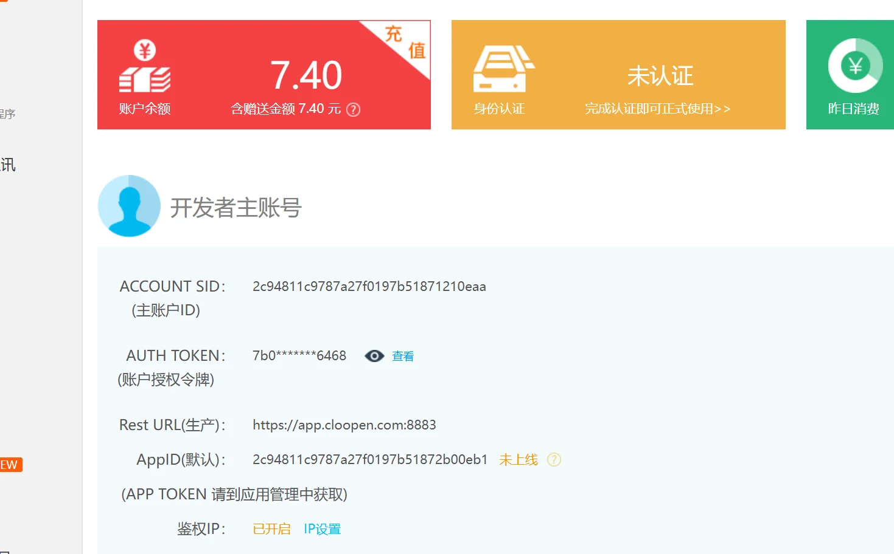
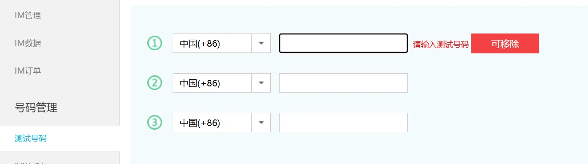
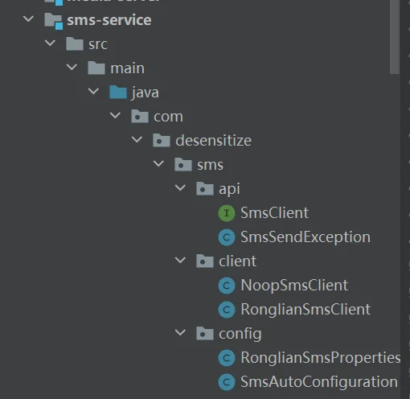

+++
title = "容联云——用于解决微服务中短信验证"
date = 2025-12-14T10:00:00+08:00
weight = 10
tags = ["Java", "后端", "微服务", "短信服务"]
summary = "在微服务中集成容联云短信服务，实现短信验证码的发送、缓存与频率限制。"
+++

## 一.容联云使用

这篇文章主要讲解项目中如何调用容联云服务器，是原生自己写的客户端，没有引入容联云依赖。说简单点：引入依赖调用api是对客户端的封装。这里使用原生的更可以了解底层实现机制，可以加入自己的想法。

优点：

✔ 架构干净

✔ 分层正确

✔ 符合企业中台设计

✔ 为多短信通道留好了扩展点

### 1.官网

官网：https:/\*\*/[www.yuntongxun.com](http://www.yuntongxun.com/)

注册登陆后，选择开发者账号，可以选择免费电话用于短信，而且不用进行审核，直接使用，对学习的开发者很友好。



这里可以选择测试号码：



这里需要注意的几个重要字段，这里不用在sms-service下配置，在需要使用sms-service的地方配置

```yaml
sms:
  ronglian:
    enabled: false
    account-sid: ""
    auth-token: ""
    app-id: ""
    login-template-id: "1" #开发者模式选择1，其余根据情况选择
```

### 2.创建Properties类

```java
import org.springframework.boot.context.properties.ConfigurationProperties;
/**
 * 容联云短信配置。
 */
@Data
@ConfigurationProperties(prefix = "sms.ronglian")
public class RonglianSmsProperties {
    /**
     * 是否启用容联云短信。
     */
    private boolean enabled = false;
    /**
     * API 访问域名。
     */
    private String host = "app.cloopen.com";
    /**
     * API 端口。
     */
    private String port = "8883";
    /**
    *配置容联云相关信息
    */
    private String accountSid;
    private String authToken;
    private String appId;
    private String loginTemplateId;
    private int loginExpireMinutes = 5;
    public boolean isConfigured() {
        return enabled
                && accountSid != null && authToken != null
                && appId != null && loginTemplateId != null;
    }
}
```

### 3.创建容联云api接口

```java
/**
 * 短信发送抽象。
 */
public interface SmsClient {
    /**
     * 发送登录验证码。
     */
    void sendLoginCode(String phone, String code);
    /**
     * 发送通用模板短信。
     */
    void sendTemplate(String phone, String templateId, String... params);
}
```

### 4.创建异常处理类

```java
/**
 * 发送短信失败异常。
 */
public class SmsSendException extends RuntimeException {
    public SmsSendException(String message) {
        super(message);
    }
    public SmsSendException(String message, Throwable cause) {
        super(message, cause);
    }
}
```

### 5.创建客户端RonglianSmsClient

```java
/**
 * 容联云短信客户端实现，负责如何调用第三方短信服务，不包含业务逻辑
 */
public class RonglianSmsClient implements SmsClient {
    #日志记录器
    private static final Logger log = LoggerFactory.getLogger(RonglianSmsClient.class);
    /**
     * 容联云要求的时间戳格式：yyyyMMddHHmmss
     * 用于生成 sig 签名和 Authorization 头
     */
    private static final DateTimeFormatter TS_FORMATTER = DateTimeFormatter.ofPattern("yyyyMMddHHmmss");

    #用于调用容联云短信 REST 接口,这里用于调用容联云的服务器
    private final RestTemplate restTemplate = new RestTemplate();
    #配置属性
    private final RonglianSmsProperties properties;
    /**
     * 构造方法（构造器注入）
     *
     * @param properties 容联云短信配置
     *
     * @throws IllegalArgumentException 当短信配置不完整时，阻止 Bean 初始化
     */
    public RonglianSmsClient(RonglianSmsProperties properties) {
        if (!properties.isConfigured()) {
            throw new IllegalArgumentException("sms.ronglian.* 未正确配置，无法启用容联云短信");
        }
        this.properties = properties;
    }
    /**
     * 发送登录验证码短信
     * 内部仍然走模板短信发送逻辑，
     * 只是对「登录验证码」这一业务场景的封装。
     * @param phone 接收短信的手机号
     * @param code  登录验证码
     */
    @Override
    public void sendLoginCode(String phone, String code) {
        sendTemplate(phone, properties.getLoginTemplateId(),
                code, String.valueOf(properties.getLoginExpireMinutes()));
    }
    /**
     * 发送模板短信（核心方法）
     * 容联云模板短信请求流程：
     *     生成时间戳 timestamp
     *     使用 MD5(accountSid + authToken + timestamp) 生成 sig
     *     构造 Authorization 头（Base64(accountSid:timestamp)）
     *     POST JSON 请求至 TemplateSMS 接口
     * @param phone      接收短信的手机号
     * @param templateId 短信模板 ID
     * @param params     模板变量参数（按模板顺序传入）
     *
     * @throws SmsSendException 当短信发送失败或调用异常时抛出
     */
    @Override
    public void sendTemplate(String phone, String templateId, String... params) {
        /* ===== 1. 生成时间戳 ===== */
        String timestamp = TS_FORMATTER.format(LocalDateTime.now());
        /* ===== 2. 生成 sig 签名（MD5） ===== */
        String sig = DigestUtils.md5DigestAsHex(
                (properties.getAccountSid() + properties.getAuthToken() + timestamp)
                        .getBytes(StandardCharsets.UTF_8)).toUpperCase();
        /* ===== 3. 构造基础请求地址 ===== */
        String baseUrl = String.format("https://%s:%s/2013-12-26/Accounts/%s/SMS/TemplateSMS",
                StringUtils.hasText(properties.getHost()) ? properties.getHost() : "app.cloopen.com",
                StringUtils.hasText(properties.getPort()) ? properties.getPort() : "8883",
                properties.getAccountSid());
        /* ===== 4. 构造请求头 ===== */
        HttpHeaders headers = new HttpHeaders();
        headers.setContentType(MediaType.APPLICATION_JSON);
        headers.setAccept(List.of(MediaType.APPLICATION_JSON));
        # Authorization = Base64(accountSid:timestamp)
        String auth = Base64.getEncoder().encodeToString(
                (properties.getAccountSid() + ":" + timestamp).getBytes(StandardCharsets.UTF_8));
        headers.set("Authorization", auth);

        /* ===== 5. 构造请求体 ===== */
        Map<String, Object> body = Map.of(
                "to", phone,
                "appId", properties.getAppId(),
                "templateId", templateId,
                "datas", params
        );
        String url = baseUrl + "?sig=" + sig;
        try {
            /* ===== 6. 发送请求并处理响应 ===== */
            ResponseEntity<Map> response = restTemplate.postForEntity(url, new HttpEntity<>(body, headers), Map.class);
            Map<String, Object> respBody = response.getBody();
            if (respBody == null || !"000000".equals(respBody.get("statusCode"))) {
                throw new SmsSendException("容联云短信发送失败: " +
                        (respBody == null ? "unknown" : respBody.get("statusMsg")));
            }
            log.debug("容联云短信发送成功, phone={}, template={}", phone, templateId);
        } catch (Exception ex) {
            # 所有异常统一封装为业务异常，避免泄露第三方细节
            throw new SmsSendException("容联云短信调用异常", ex);
        }
    }
}
```

毫无疑问，这里是最难理解的地方。我将细细讲解执行流程

我们首先要知道，容联云是给我们发送验证码的服务器。我们使用restTemplate，可以实现远程调用。调用的url是通过自己构建的。

我们需要按照容联云的url请求说明书严格执行。

```java
#这里就是我们生成url的步骤，若我们在properties类里面自定义了路径，就使用，反之，则使用默认的
String baseUrl = String.format("https://%s:%s/2013-12-26/Accounts/%s/SMS/TemplateSMS",
                StringUtils.hasText(properties.getHost()) ? properties.getHost() : "app.cloopen.com",
                StringUtils.hasText(properties.getPort()) ? properties.getPort() : "8883",
                properties.getAccountSid());
```

生成完url后，我们构建请求头和请求体

```java
/* ===== 4. 构造请求头 ===== */
HttpHeaders headers = new HttpHeaders();
headers.setContentType(MediaType.APPLICATION_JSON);
headers.setAccept(List.of(MediaType.APPLICATION_JSON));
#Authorization = Base64(accountSid:timestamp)
#这里我们需要在请求头里面加入时间戳
String auth = Base64.getEncoder().encodeToString(
    (properties.getAccountSid() + ":" + timestamp).getBytes(StandardCharsets.UTF_8));
headers.set("Authorization", auth);
/* ===== 5. 构造请求体 ===== */
#这些参数不是 Spring 的，也不是你随便定义的
#它们是「容联云模板短信 API 协议」规定的请求体字段
Map<String, Object> body = Map.of(
    "to", phone, #电话号码，可以有多个，但这里只有一个
    "appId", properties.getAppId(),  #区分不同业务系统，容联云上的系统身份证
    "templateId", templateId, #短信模板 ID，容联云在使用时规定了发送信息的模板，在这里指定id
    "datas", params #模板占位符的值数组
        );
```

就这个模板，我们做以下实例说明

> 假设容联云有一套短信模板：
>
> 【XX系统】您的验证码是{1}，{2}分钟内有效
>
> 这个模板有一个id 就是templateId，我们在application.yml中指定。{1}，{2}是两个占位符，由params 解析
>
> “datas”: [“654321”, “5”] 就是我们的params 。{1}–>654321, {2}–>5

request设置完毕后，肯定就是发送请求

```java
/* ===== 6. 发送请求并处理响应 ===== */
#这里就是远程调用请求的地方
ResponseEntity<Map> response = restTemplate.postForEntity(url, new HttpEntity<>(body, headers), Map.class);
Map<String, Object> respBody = response.getBody();
#容联云默认的成功状态码是000000
if (respBody == null || !"000000".equals(respBody.get("statusCode"))) {
    throw new SmsSendException("容联云短信发送失败: " +
                               (respBody == null ? "unknown" : respBody.get("statusMsg")));
}
```

最后进行异常处理.

我们在总结一下调用流程——相当重要！！！！

**当用户发送验证码的请求到达我们的服务器—->服务器生成并保存验证码，并从reques中得到phone—->我们自己的服务器通过restTemplate将验证码，电话等信息传给容联云服务器—->容联云服务器将验证码给用户—–>用户输入验证码并提交登录请求 ，服务器判断验证码是否正确。**

我们上述的步骤实现了

服务器通过restTemplate将验证码，电话等信息传给容联云服务器—->容联云服务器将验证码给用户

因为生成和保存验证码在sms客户端不是重点，需要在其他地方实现。

### 6.空实现短信服务NoopSmsClient

无论是阿里云还是容联云，在企业中都是需要付费的。为了开发者的调试，我们创建一个调试类，方便开发

```java
/**
 * 占位短信实现，未配置真实服务时记录日志。
 */
public class NoopSmsClient implements SmsClient {
    private static final Logger log = LoggerFactory.getLogger(NoopSmsClient.class);
    @Override
    public void sendLoginCode(String phone, String code) {
        log.info("[SMS-NOOP] send login code {} to {}", code, phone);
    }
    @Override
    public void sendTemplate(String phone, String templateId, String... params) {
        log.info("[SMS-NOOP] send template {}, phone={}, params={}", templateId, phone, java.util.Arrays.toString(params));
    }
}
```

当开发者调用这个类的发送短信方法时，我们的服务器并不会向容联云发送短信，而是在自己服务器生成日志用于使用，方便调试。

它是系统在“没有外部短信能力时”的安全气囊。

### 7.注入spring容器

```java
/**
 * 短信自动配置。
 */
@Configuration
@EnableConfigurationProperties(RonglianSmsProperties.class)
public class SmsAutoConfiguration {
    @Bean
    @ConditionalOnProperty(prefix = "sms.ronglian", name = "enabled", havingValue = "true")
    @ConditionalOnMissingBean
    public SmsClient ronglianSmsClient(RonglianSmsProperties properties) {
        return new RonglianSmsClient(properties);
    }
    @Bean
    @ConditionalOnMissingBean(SmsClient.class)
    public SmsClient noopSmsClient() {
        return new NoopSmsClient();
    }
}
```

最终的目录结构：



至此，我们的容联云service完成，可以通过依赖供其他模块使用！

## 二.容联云service在微服务中的应用

### 1.在模块中引入依赖

在需要使用容联云短信服务的模块引入依赖，可以打包引入，这里为了方便直接引入模块到iam-service，用于检验。

```xml
<dependency>
    <groupId>org.dyb</groupId>
    <artifactId>sms-service</artifactId>
    <version>1.0-SNAPSHOT</version>
</dependency>
```

### 2.配置application.yml

```
	需要配置redis、mysql等基本信息(自行配置)，sms
```

```yaml
sms:
  ronglian:
    enabled: false
    account-sid: ""
    auth-token: ""
    app-id: ""
    login-template-id: "1" #开发者模式选择1，其余根据情况选择
```

### 3.创建SmsCodeService

这里是我们执行验证码校验的位置，关键service

```java
**
 * 短信验证码服务
 * <p>
 * 主要职责：
 * <ul>
 *     <li>校验图形验证码</li>
 *     <li>校验用户是否存在</li>
 *     <li>生成并缓存短信验证码</li>
 *     <li>调用短信服务发送验证码</li>
 *     <li>校验用户提交的短信验证码</li>
 *     <li>基于 Redis 实现短信发送频率限制</li>
 * </ul>
 * <p>
 * 设计说明：
 * <ul>
 *     <li>验证码与频控数据均存储在 Redis 中</li>
 *     <li>验证码采用一次性使用策略，校验后立即删除</li>
 *     <li>通过 {@link SmsClient} 解耦具体短信服务实现</li>
 * </ul>
 */
@Service
public class SmsCodeService {
    /** 短信验证码 Redis Key 前缀：iam:auth:sms:{username} */
    private static final String SMS_CODE_PREFIX = "iam:auth:sms:";
    /** 短信发送频控 Redis Key 前缀：iam:auth:sms-rate:{phone} */
    private static final String SMS_RATE_PREFIX = "iam:auth:sms-rate:";
    /** 短信验证码有效期（秒），默认 5 分钟 */
    private static final long SMS_TTL_SECONDS = 300;
    /** 短信发送频率限制时间（秒），默认 60 秒 */
    private static final long SMS_RATE_LIMIT_SECONDS = 60;
    /** Redis 操作模板 */
    private final StringRedisTemplate redisTemplate;
    /** 图形验证码服务 */   #这是我的图片验证码service，对于学习sms来说，不用了解
    private final CaptchaService captchaService;
    /** 用户表 Mapper */
    private final IamUserMapper userMapper;
    /** 短信发送客户端（可对接真实或 Noop 实现） */
    private final SmsClient smsClient;
    public SmsCodeService(StringRedisTemplate redisTemplate,
                          CaptchaService captchaService,
                          IamUserMapper userMapper,
                          SmsClient smsClient) {
        this.redisTemplate = redisTemplate;
        this.captchaService = captchaService;
        this.userMapper = userMapper;
        this.smsClient = smsClient;
    }
    /**
     * 发送登录短信验证码
     * <p>
     * 处理流程：
     * <ol>
     *     <li>校验图形验证码</li>
     *     <li>根据用户名查询用户</li>
     *     <li>校验用户是否绑定手机号</li>
     *     <li>执行短信发送频率限制</li>
     *     <li>生成随机数字验证码</li>
     *     <li>将验证码写入 Redis 并设置过期时间</li>
     *     <li>调用短信服务发送验证码</li>
     * </ol>
     * @param request 短信验证码请求参数
     */
    public void sendLoginCode(SmsCodeRequest request) {
        # 校验图形验证码（防止短信轰炸）
        captchaService.validate(request.getCaptchaId(), request.getCaptchaCode(), false);
        # 根据用户名查询用户
        IamUser user = findUser(request.getUsername());
        String phone = user.getPhoneNumber();
        # 用户未绑定手机号，直接拒绝
        if (!StringUtils.hasText(phone)) {
            throw new BusinessException(ErrorCode.BAD_REQUEST);
        }
        # 短信发送频率限制（同一手机号 60 秒内只能发送一次）
        enforceRateLimit(phone);
        # 生成 6 位随机数字验证码
        String code = randomNumericCode(6);
        # 将验证码写入 Redis，并设置过期时间
        redisTemplate.opsForValue()
                .set(SMS_CODE_PREFIX + request.getUsername(), code, SMS_TTL_SECONDS, TimeUnit.SECONDS);
        # 调用短信服务发送验证码
        smsClient.sendLoginCode(phone, code);
    }
    /**
     * 校验登录短信验证
     * <p>
     * 校验规则：
     * <ul>
     *     <li>验证码不能为空</li>
     *     <li>验证码必须与 Redis 中缓存一致</li>
     *     <li>验证码校验成功或失败后都会被删除（一次性验证码）</li>
     * </ul>
     * @param username 用户名
     * @param smsCode  用户输入的短信验证码
     */
    public void verifyLoginCode(String username, String smsCode) {
        if (!StringUtils.hasText(smsCode)) {
            throw new BusinessException(ErrorCode.SMS_CODE_INVALID);
        }
        String key = SMS_CODE_PREFIX + username;

        String cached = redisTemplate.opsForValue().get(key);
        /*无论成功或失败，验证码都立即失效*/ 
        redisTemplate.delete(key);
        /*校验失败*/ 
        if (!StringUtils.hasText(cached) || !cached.equals(smsCode.trim())) {
            throw new BusinessException(ErrorCode.SMS_CODE_INVALID);
        }
    }
    /**
     * 短信发送频率限制
     * <p>
     * 通过 Redis Key 是否存在来判断：
     * <ul>
     *     <li>存在：说明在限制时间内，直接拒绝</li>
     *     <li>不存在：允许发送，并写入限制 Key</li>
     * </ul>
     * @param phone 手机号
     */
    private void enforceRateLimit(String phone) {
        String rateKey = SMS_RATE_PREFIX + phone;
        Boolean exists = redisTemplate.hasKey(rateKey);
        if (Boolean.TRUE.equals(exists)) {
            throw new BusinessException(ErrorCode.TOO_MANY_REQUESTS);
        }
        redisTemplate.opsForValue().set(rateKey, "1", SMS_RATE_LIMIT_SECONDS, TimeUnit.SECONDS);
    }
    /**
     * 生成指定长度的随机数字验证码
     * @param len 验证码长度
     * @return 纯数字验证码字符串
     */
    private String randomNumericCode(int len) {
        ThreadLocalRandom random = ThreadLocalRandom.current();
        StringBuilder builder = new StringBuilder();
        for (int i = 0; i < len; i++) {
            builder.append(random.nextInt(0, 10));
        }
        return builder.toString();
    }
    /**
     * 根据用户名查询用户信息
     * <p>
     * 若用户不存在，直接抛出未授权异常
     * @param username 用户名
     * @return 用户实体
     */
    private IamUser findUser(String username) {
        LambdaQueryWrapper<IamUser> wrapper = new LambdaQueryWrapper<>();
        wrapper.eq(IamUser::getUsername, username).last("LIMIT 1");
        IamUser user = userMapper.selectOne(wrapper);
        if (user == null) {
            throw new BusinessException(ErrorCode.UNAUTHORIZED);
        }
        return user;
    }
}
```

这部分的内容比较简单，包含了生成验证码、调用sms发送验证码、发送频率的限制

这里我们主要扩展一下发送频率的限制

```java
/**
* 短信发送频率限制
* <p>
* 通过 Redis Key 是否存在来判断：
* <ul>
*     <li>存在：说明在限制时间内，直接拒绝</li>
*     <li>不存在：允许发送，并写入限制 Key</li>
* </ul>
* @param phone 手机号
*/
private void enforceRateLimit(String phone) {
    #这是我们在发送验证码时往redis里面添加的字段
    String rateKey = SMS_RATE_PREFIX + phone;
    #如果存在，则说明没有到指定时间，不能发送
    Boolean exists = redisTemplate.hasKey(rateKey);
    if (Boolean.TRUE.equals(exists)) {
        #直接抛异常，请求次数太多
        throw new BusinessException(ErrorCode.TOO_MANY_REQUESTS);
    }
    # 若不存在，就可以发送，并且存入到redis，用于下次校验
    redisTemplate.opsForValue().set(rateKey, "1", SMS_RATE_LIMIT_SECONDS, TimeUnit.SECONDS);
}
```

### 4.创建controller

后面的部分和sms的使用没有关系了，只是api的调用。这里不在讲解，望大家理解

## 三.总结

### 1.理解流程

明确分工

SmsClient：用于向容联云服务器发送请求，让容联云向用户发送短信

SmsCodeService：生成验证码，调用SmsClient，并且对信息进行存储，丰富功能。

### 2.短信功能使用

可作为 **密码登录的补充或兜底方案**

可用于 **找回密码、二次验证（2FA）** 等场景

### 3.功能扩展

多维度限流 ：我们上述只进行了同一手机号的限制，还可以IP 地址 ，用户名 ….

同一 IP 在短时间内，验证码错误次数超过阈值 → 直接封禁一段时间

SmsRateLimiter.check(phone, username, ip, deviceId);

实例思路(为实现):

用户验证码错误次数：
 iam:auth:sms:fail:{username}
 IP 维度错误计数：
 iam:auth:sms:ip:fail:{ip}
 IP 封禁标记：
 iam:auth:sms:ip:block:{ip}

```java
/** IP 错误次数 Key 前缀 */
private static final String SMS_IP_FAIL_PREFIX = "iam:auth:sms:ip:fail:";
/** IP 封禁 Key 前缀 */
private static final String SMS_IP_BLOCK_PREFIX = "iam:auth:sms:ip:block:";
/** IP 最大允许错误次数 */
private static final int MAX_IP_FAIL_COUNT = 20;
/** IP 错误统计时间窗口（秒） */
private static final long IP_FAIL_WINDOW_SECONDS = 600;
/** IP 封禁时间（秒） */
private static final long IP_BLOCK_SECONDS = 600;

#获取客户端 IP（工具方法）
private String getClientIp(HttpServletRequest request) {
    String ip = request.getHeader("X-Forwarded-For");
    if (StringUtils.hasText(ip)) {
        return ip.split(",")[0].trim();
    }
    ip = request.getHeader("X-Real-IP");
    if (StringUtils.hasText(ip)) {
        return ip;
    }
    return request.getRemoteAddr();
}

#IP 封禁校验（最先执行）
private void checkIpBlocked(String ip) {
    Boolean blocked = redisTemplate.hasKey(SMS_IP_BLOCK_PREFIX + ip);
    if (Boolean.TRUE.equals(blocked)) {
        throw new BusinessException(ErrorCode.TOO_MANY_REQUESTS);
    }
}
#IP 错误次数累计（在验证码错误时调用）
private void recordIpFail(String ip) {
    String failKey = SMS_IP_FAIL_PREFIX + ip;
    Long count = redisTemplate.opsForValue().increment(failKey);

    if (count != null && count == 1L) {
        # 第一次写入，设置统计窗口
        redisTemplate.expire(failKey, IP_FAIL_WINDOW_SECONDS, TimeUnit.SECONDS);
    }
    # 超过阈值，封禁 IP
    if (count != null && count >= MAX_IP_FAIL_COUNT) {
        redisTemplate.opsForValue().set(
                SMS_IP_BLOCK_PREFIX + ip,
                "1",
                IP_BLOCK_SECONDS,
                TimeUnit.SECONDS
        );
    }
}

public void verifyLoginCode(String username,
                            String smsCode,
                            HttpServletRequest request) {

    String ip = getClientIp(request);

    # IP 是否已被封禁
    checkIpBlocked(ip);

    if (!StringUtils.hasText(smsCode)) {
        throw new BusinessException(ErrorCode.SMS_CODE_INVALID);
    }

    String codeKey = SMS_CODE_PREFIX + username;
    String userFailKey = SMS_FAIL_PREFIX + username;

    String cachedCode = redisTemplate.opsForValue().get(codeKey);
    if (!StringUtils.hasText(cachedCode)) {
        throw new BusinessException(ErrorCode.SMS_CODE_INVALID);
    }

    # 验证码错误
    if (!cachedCode.equals(smsCode.trim())) {

        #用户维度错误 +1
        Long userFailCount = redisTemplate.opsForValue()
                .increment(userFailKey);

        #IP 维度错误 +1
        recordIpFail(ip);

        # 用户错误次数超限
        if (userFailCount != null && userFailCount >= MAX_SMS_FAIL_COUNT) {
            redisTemplate.delete(codeKey);
            redisTemplate.delete(userFailKey);
        }

        throw new BusinessException(ErrorCode.SMS_CODE_INVALID);
    }

   #===== 验证码正确 =====
    redisTemplate.delete(codeKey);
    redisTemplate.delete(userFailKey);
}
```

短信验证码错误次数限制

在redis中添加iam:auth:sms:fail:{username} —>用于记录失败次数

示例思路(未实现):

```java
/** 短信验证码错误次数 Key 前缀 */
private static final String SMS_FAIL_PREFIX = "iam:auth:sms:fail:";
/** 最大允许错误次数 */
private static final int MAX_SMS_FAIL_COUNT = 5;

#发送验证码时，初始化错误次数
#在 sendLoginCode() 中 写完验证码后追加：
# 初始化错误次数计数（与验证码过期时间一致）
redisTemplate.opsForValue().set(
        SMS_FAIL_PREFIX + request.getUsername(),
        "0",
        SMS_TTL_SECONDS,
        TimeUnit.SECONDS
);

public void verifyLoginCode(String username, String smsCode) {
    if (!StringUtils.hasText(smsCode)) {
        throw new BusinessException(ErrorCode.SMS_CODE_INVALID);
    }
    String codeKey = SMS_CODE_PREFIX + username;
    String failKey = SMS_FAIL_PREFIX + username;
    String cachedCode = redisTemplate.opsForValue().get(codeKey);
    # 验证码不存在或已过期
    if (!StringUtils.hasText(cachedCode)) {
        throw new BusinessException(ErrorCode.SMS_CODE_INVALID);
    }
    # 校验失败
    if (!cachedCode.equals(smsCode.trim())) {
        # 错误次数 +1
        Long failCount = redisTemplate.opsForValue().increment(failKey);
        # 超过最大错误次数
        if (failCount != null && failCount >= MAX_SMS_FAIL_COUNT) {
            # 直接失效验证码
            redisTemplate.delete(codeKey);
            redisTemplate.delete(failKey);
            throw new BusinessException(ErrorCode.SMS_CODE_INVALID);
        }
        throw new BusinessException(ErrorCode.SMS_CODE_INVALID);
    }
    # ===== 校验成功 =====
    # 删除验证码和错误次数计数
    redisTemplate.delete(codeKey);
    redisTemplate.delete(failKey);
}
```
