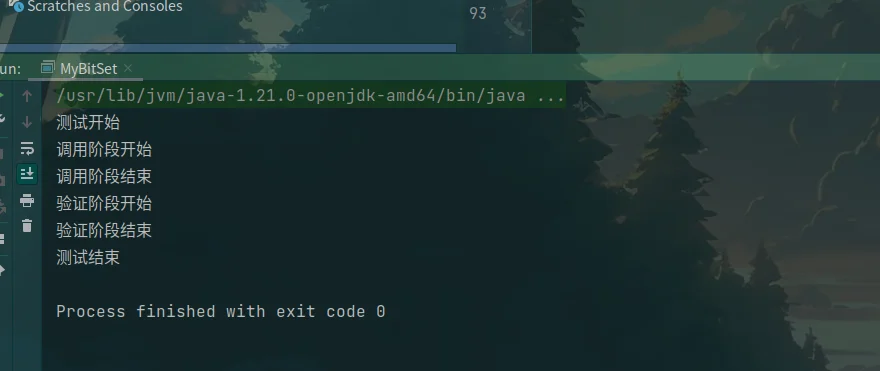

+++
title = "位图的原理"
date = 2026-05-25T23:37:02+08:00
weight = 10
tags = ["Java", "算法", "数据结构"]
summary = "从零理解数据结构：位图（Bitmap / BitSet）原理与 Java 实现"
+++

## 一、初识位图

### 1. 为什么需要位图

#### 1.1 需求设计

假设有这样一个需求：

1. 判断海量数据中某个数字是否存在
2. 海量数据去重（电话号码……）
3. 签到系统

关于这些需求，我们发现有一个共同点：都只存在两种状态——有 or 无。那我们应该怎么解决这样的问题呢？

#### 1.2 常规做法

最常规的做法：使用 `HashSet` 可以达到去重效果（最简单）。

```java
HashSet<Integer> set = new HashSet<>();
// 添加数字
set.add(45);
// 判断数字是否存在
if (set.contains(45)) {
    System.out.println("存在");
}
// 删除数字
set.remove(45);
```

这样做有什么缺陷呢？当遇到海量数据时，对象的内存开销将会特别恐怖。

`HashSet` 一个元素大约的内存：40～80 byte（因为有实例对象占用内存）。

假如有 1000 万个数字，每一个数字都需要存入 `set`，那么占用的内存大小就是：`10000000 x 4 = 40000000 byte = 38M`。这里只简单地算了 int 本身的内存大小，如果算上 set 对象的大小，内存占用更大，服务器压力也很大。

为了解决这个问题，我们引出了**位图**。

### 2. 位图的核心思想

#### 2.1 核心思想

核心：**使用二进制位（0/1）表示一个数字是否存在。**

只有两种状态：0 表示不存在，1 表示存在，所以完全可以节省大量的内存损耗。

我们知道 1 个 int 是 4 字节 = 32 位（为了后续简化，我们简写成 8 位）`00000000`。如果是这样的状态，我们完全可以**用 1 个 int 数来表示 32 个数是否存在**。

#### 2.2 可视化位图

例如：

```java
int set = 0;
```

set 的二进制：`00000000 00000000 00000000 00000000`

现在我们插入一个数字：5。那我们就可以让 set 的**第五位二进制**变为 1，则说明 5 已存在。

二进制则变为：`00000000 00000000 00000000 00100000`。若下次再检验 5 时，我们只需要观察该位是否为 1，若为 1，则说明已存在，这样就可以实现检验是否存在的效果。

#### 2.3 内存计算

和常规做法相比：我们用一个数，就可以表示 32 个数的状态。

- 1 个数字 = 1 bit
- `10000000 / 32 x 4 = 1250000 byte = 1.2M`

可以看到，这样的内存差距可以极大地减轻服务器的压力。

## 二、位图的实现

### 1. 设计思想

#### 1.1 初始化

思考：如果有海量的数据需要位图表示，用一个 int 或者 long 类型的数字肯定不能表示。我们可以使用数组来表示，但是这个数组需要多大呢？

假设表示 0～60 的数，我们需要用多少个 int 呢？1 个 int 可以表示 32 个，则需要 2 个 int 我们就可以表示了。怎么计算的呢？`60 / 32` 向上取整即可。

```java
public int[] set;

// 如果存在的数最大为 n，意味着只需要 n 位二进制数即可表示
// int 是 32 位，则只需要可以包含 n/32 的最小整数即可，即向上取整
public Bitset(int n) {
    // 向上取整
    // a/b 如果结果想向上取整，可以写成：(a + b - 1) / b
    set = new int[(n + 31) / 32];
}
```

#### 1.2 位编号

位运算中最右边是 0 位，即表示第一位数。

例如：

> 二进制：`1 0 1 1 0`
> 编　号：`4 3 2 1 0`

#### 1.3 定位

思考：如何定位一个数在哪个位置？比如 45 这个数我应该插入哪个位置？

定位分为两步：

1. 定位在数组中的位置：`45 / 32 = 1`，则说明它在数组中为 `set[1]`。这也很好理解，我需要找到容量 > 45 的最小位置。
2. 定位二进制位：当我们确定在数组的位置后 `set[1]`，我们需要确定修改哪个二进制位。`num % 32`：`45 % 32 = 13`，所以我们需要修改第 13 位的二进制。

### 2. 基本功能实现

#### 2.1 增加元素

```java
public void add(int num) {
    // 思路：先确定在数组中的位置，再找到二进制位
    // 数组中的位置：num/32，当找到位置时，需要将 0 --> 1
    set[num / 32] = set[num / 32] | 1 << (num % 32);
}
```

#### 2.2 删除元素

```java
public void remove(int num) {
    // 将二进制 1 --> 0
    set[num / 32] = set[num / 32] & ~(1 << (num % 32));
}
```

#### 2.3 修改元素

```java
// 反转：如果该数存在则删除，若不存在则添加
public void reverse(int num) {
    // 异或
    set[num / 32] = set[num / 32] ^ 1 << (num % 32);
}
```

#### 2.4 查询元素

```java
// 判断某个数是否存在
public boolean contains(int num) {
    return ((set[num / 32] >> (num % 32)) & 1) == 1;
}
```

#### 2.5 时间复杂度

全部都是位运算，复杂度基本为 O(1)。

| 操作       | 时间复杂度 |
| -------- | ----- |
| add      | O(1)  |
| remove   | O(1)  |
| contains | O(1)  |
| reverse  | O(1)  |

### 3. 对数器实现

思路：和传统的 `HashSet` 进行比较。

```java
// 对数器测试
public static void main(String[] args) {
    int n = 1000;
    int testTimes = 10000;
    System.out.println("测试开始");
    // 实现的位图结构
    Bitset bitSet = new Bitset(n);
    // 直接用 HashSet 做对比测试
    HashSet<Integer> hashSet = new HashSet<>();
    System.out.println("调用阶段开始");
    for (int i = 0; i < testTimes; i++) {
        double decide = Math.random();
        // number -> 0 ~ n-1，等概率得到
        int number = (int) (Math.random() * n);
        if (decide < 0.333) {
            bitSet.add(number);
            hashSet.add(number);
        } else if (decide < 0.666) {
            bitSet.remove(number);
            hashSet.remove(number);
        } else {
            bitSet.reverse(number);
            if (hashSet.contains(number)) {
                hashSet.remove(number);
            } else {
                hashSet.add(number);
            }
        }
    }
    System.out.println("调用阶段结束");
    System.out.println("验证阶段开始");
    for (int i = 0; i < n; i++) {
        if (bitSet.contains(i) != hashSet.contains(i)) {
            System.out.println("出错了!");
        }
    }
    System.out.println("验证阶段结束");
    System.out.println("测试结束");
}
```



## 三、位图的经典应用

### 1. 布隆过滤器

本质：使用 **Bitmap** + 多个 Hash 函数实现“超大规模存在性判断”。

```java
public class BloomFilter {

    private int[] bitmap = new int[1000];

    // hash 函数
    private int hash1(String s) {
        return Math.abs(s.hashCode()) % 32000;
    }

    private int hash2(String s) {
        return Math.abs((s + "salt").hashCode()) % 32000;
    }

    // 添加
    public void add(String s) {
        setBit(hash1(s));
        setBit(hash2(s));
    }

    // 判断
    public boolean contains(String s) {
        return getBit(hash1(s)) && getBit(hash2(s));
    }

    private void setBit(int num) {
        bitmap[num / 32] |= (1 << (num % 32));
    }

    private boolean getBit(int num) {
        return ((bitmap[num / 32] >> (num % 32)) & 1) == 1;
    }
}
```

为什么要进行多次 hash？防止误判，因为不同元素的 hash 可能相同。

### 2. 用户签到系统

```java
public class CheckIn {

    private int[] data = new int[12];

    // 签到
    public void sign(int day) {
        data[day / 32] |= (1 << (day % 32));
    }

    // 查询
    public boolean checked(int day) {
        return ((data[day / 32] >> (day % 32)) & 1) == 1;
    }

    // 连续签到统计
    public int continuousDays() {
        int count = 0;
        for (int day = 0; day < 365; day++) {
            if (checked(day)) {
                count++;
            } else {
                break;
            }
        }
        return count;
    }
}
```

## 四、总结

- 优点：用 bit 位代替了对象，大量节省了内存。
- 缺点：存储的数字不能太分散，需要具备一定的连续性。因为位图的大小是按最大值计算的，如果分布太散可能造成大量空间浪费。
